# DEMO – End-to-End Durchlauf der Datamesh-Plattform

Dieses Dokument zeigt, **wie das Gesamtsystem in unter 30 Minuten demonstriert werden kann** – vom Hochfahren des Stacks über einen kompletten Geschäftsfall (Partner → Produkt → Police → Schaden → Rechnung) bis zur analytischen Auswertung auf dem Iceberg-Lakehouse.

Alle Screenshots wurden gegen einen frisch hochgefahrenen Stack (`podman compose up -d`) mit dem Seed-Skript `scripts/seed-test-data.sh` aufgenommen.

> **Ergänzung zu [`GUIDE.md`](GUIDE.md):** Der Guide zeigt die Bedienung Klick-für-Klick, dieses Dokument zeigt die *Demo-Story* mit visuellen Belegen.

---

## Inhalt

1. [Voraussetzungen & Setup](#1-voraussetzungen--setup)
2. [Demo-Szenario im Überblick](#2-demo-szenario-im-überblick)
3. [Stack starten](#3-stack-starten)
4. [Testdaten laden (Seed)](#4-testdaten-laden-seed)
5. [Domain-UIs vorführen](#5-domain-uis-vorführen)
6. [Event-Fluss in Kafka zeigen (ADR-009 PII-Verschlüsselung)](#6-event-fluss-in-kafka-zeigen-adr-009-pii-verschlüsselung)
7. [Iceberg-Lakehouse – Parquet auf MinIO](#7-iceberg-lakehouse--parquet-auf-minio)
8. [SQLMesh Silver / Gold Transformationen](#8-sqlmesh-silver--gold-transformationen)
9. [Superset Dashboard – Cross-Domain-Analytics](#9-superset-dashboard--cross-domain-analytics)
10. [OpenMetadata – Governance & Lineage](#10-openmetadata--governance--lineage)
11. [End-to-End-Lineage (Raw → Silver → Gold → Dashboard)](#11-end-to-end-lineage-raw--silver--gold--dashboard)
12. [Reset für eine neue Demo](#12-reset-für-eine-neue-demo)

---

## 1. Voraussetzungen & Setup

| Voraussetzung | Version |
|---|---|
| Java | 25 (virtual threads) |
| Maven | 3.9+ |
| Podman / Podman-Compose | 4.x |
| Python | 3.12+ (nur für OpenMetadata-Ingestion) |

Einmalige Vorbereitung:

```bash
cp .env.example .env        # DB-Passwörter setzen
./build.sh                   # alle Java-Module bauen + Container-Images erzeugen
```

---

## 2. Demo-Szenario im Überblick

Das Seed-Skript erzeugt folgenden Datenbestand, der die komplette Event-Kette durch alle Domains auslöst:

| Domain | Datensätze |
|---|---|
| **Partner** | 22 Personen (Hans Müller, Anna Steiner, …) – PII crypto-shredded via Vault |
| **Product** | 5 Produkte (Hausrat, Haftpflicht, Motor, Reise, Rechtsschutz) |
| **Policy** | 15 Policen – 14 aktiv, 1 storniert, 19 Coverages |
| **Claims** | 8 Schäden – 3 SETTLED, 2 IN_REVIEW, 2 OPEN, 1 REJECTED |
| **Billing** | 15 Rechnungen – 6 PAID, 2 OVERDUE (Mahnstufe 1 & 2), 6 OPEN |
| **HR-System** | 4 Mitarbeiter, 4 Org-Einheiten (OData → Kafka via Camel) |

Die Events fliessen durch folgenden Pfad:

```
Domain-UI → Postgres + Outbox → Debezium CDC → Kafka → (Consumer-Read-Models | Iceberg-Sink)
                                                           ↓
                                              Parquet auf MinIO → Trino → SQLMesh → Superset
```

---

## 3. Stack starten

```bash
podman compose up -d
```

Der Stack startet **30+ Container** in Abhängigkeitsreihenfolge: DBs → Kafka → Schema-Registry → Debezium → Keycloak → Domain-Services → Lakehouse (MinIO/Nessie/Trino/Superset) → Observability.

Status prüfen:

```bash
podman ps --format "{{.Names}} {{.Status}}"
```

Alle Services sollten nach ~2 Minuten `(healthy)` melden.

**Service-Karte** (siehe [README.md](README.md#dev-mode--service-urls) für die vollständige Liste):

| Layer | URL |
|---|---|
| Partner-UI | http://localhost:9080/persons |
| Product-UI | http://localhost:9081/products |
| Policy-UI | http://localhost:9082/policies |
| Claims-UI | http://localhost:9083/claims |
| Billing-UI | http://localhost:9084/billing |
| HR-System-UI | http://localhost:9085/mitarbeiter |
| Kafka-Browser (AKHQ) | http://localhost:8085 |
| MinIO-Console | http://localhost:9001 (`minioadmin/minioadmin`) |
| Superset | http://localhost:8088 (`admin/admin`) |
| OpenMetadata | http://localhost:8585 (`admin@open-metadata.org/admin`) |
| Keycloak | http://localhost:8280 (`admin/admin`) |

---

## 4. Testdaten laden (Seed)

```bash
./scripts/seed-test-data.sh
```

Das Skript holt ein OIDC-Token von Keycloak, erzeugt **Partner → Produkte → Policen → Schäden → Rechnungen** per REST in korrekter Reihenfolge und wartet zwischendurch, damit Kafka-Consumer (Read-Model-Projektionen) Events konsumieren können, bevor die nächste Domain aufsetzt.

Beispiel-Output:

```
╔══════════════════════════════════════════════════════════════════════╗
║                    ✓  Test Data Seeding Complete                    ║
║  Persons   22  │  Products 5  │  Policies 15  │  Claims 8         ║
║  Invoices 15  (6 PAID, 2 OVERDUE/dunning, 6 OPEN, 1 CANCELLED)    ║
╚══════════════════════════════════════════════════════════════════════╝
```

Danach einmalig die **SQLMesh-Modelle** bauen, damit die Silver/Gold-Tabellen für Superset existieren, und OpenMetadata mit Services/Metadaten/Lineage füttern:

```bash
podman compose --profile tools run --rm sqlmesh-init
./scripts/refresh-superset-datasets.sh

podman start datamesh-openmetadata-ingestion-1
./scripts/init-openmetadata.sh          # Services, Ingestion, Lineage, PII-Tags
```

---

## 5. Domain-UIs vorführen

Alle UIs sind durch Keycloak geschützt. Login: **admin / admin**.

### 5.1 Partner (http://localhost:9080/persons)

Zeigt Versicherungsnehmer im Klartext – hier liegen die PII auf der **ownenden Domain** (ADR-009). Die grünen VN-Badges (`VN-00000001`…) markieren Personen, die eine Police haben; Partner ohne Police sind Prospects.

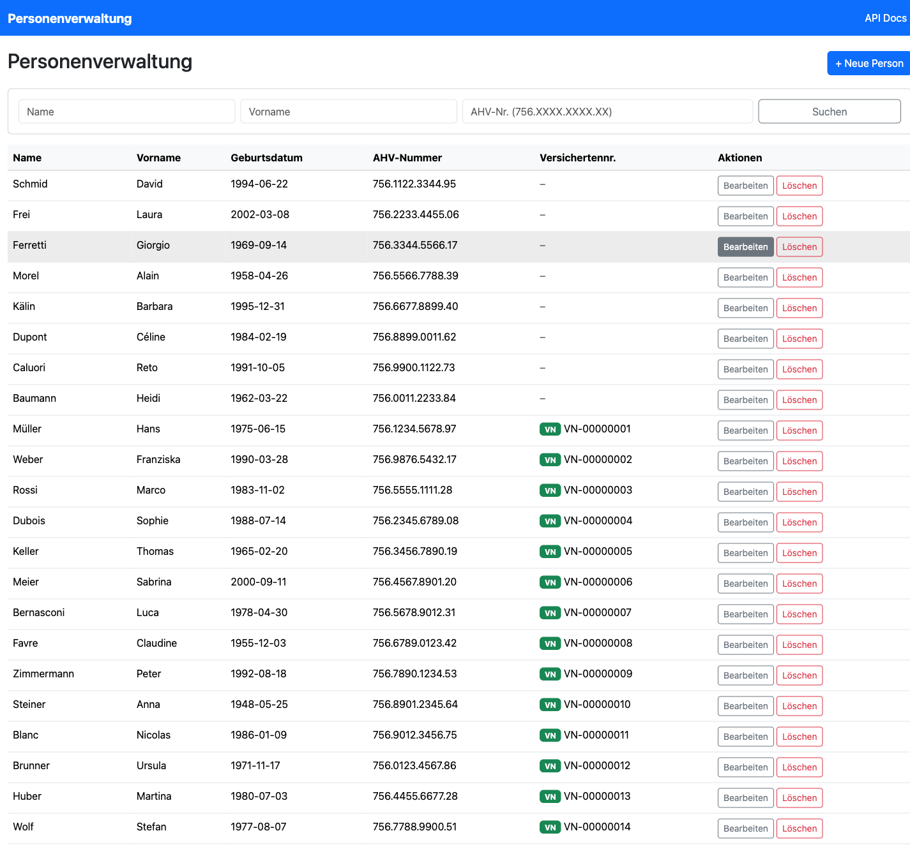

### 5.2 Produkt (http://localhost:9081/products)

Die 5 aktiven Produkte mit Basisprämien (CHF), Sparten (`HOUSEHOLD_CONTENTS`, `LIABILITY`, `MOTOR_VEHICLE`, `TRAVEL`, `LEGAL_EXPENSES`). Status-Wechsel `ACTIVE → DEPRECATED` erzeugt ein `product.v1.deprecated`-Event.

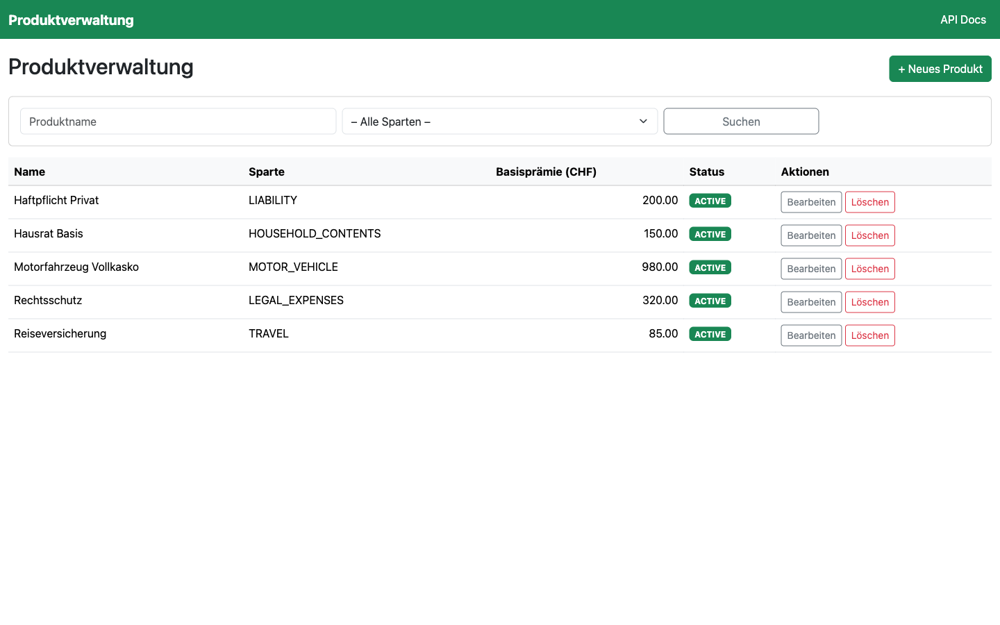

### 5.3 Policy (http://localhost:9082/policies)

Hier zeigt sich **ADR-009 in Aktion**: Policy hat die PII *nicht* selbst, sondern nur die Vault-verschlüsselten Werte aus `person.v1.state` konsumiert. Der Versicherungsnehmer-Name erscheint im UI als `vault:v1:…`-Token. Nur beim Rendern für berechtigte Rollen entschlüsselt der Service die Felder on-demand.

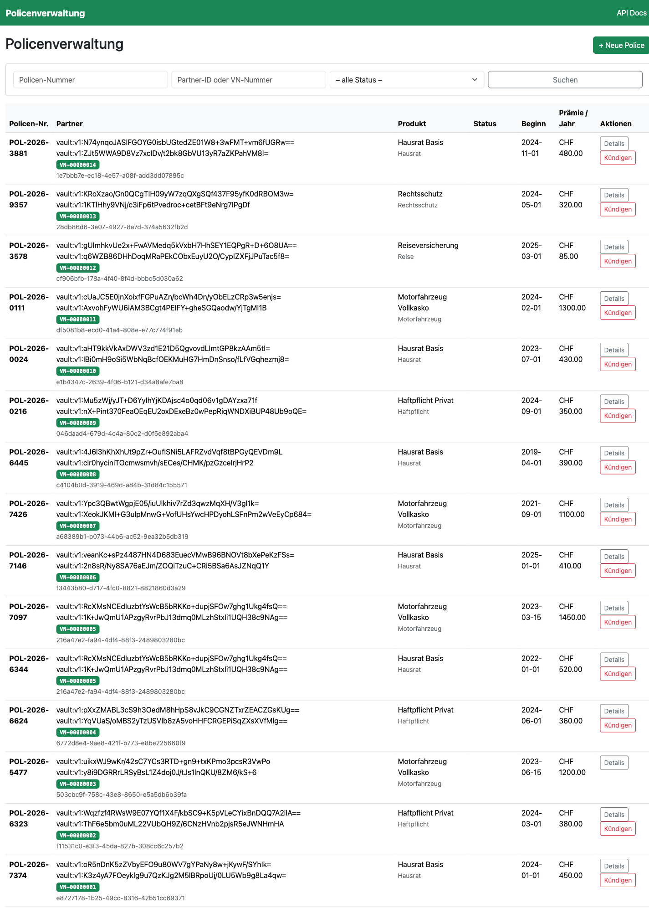

### 5.4 Claims (http://localhost:9083/claims)

Schadenmanagement mit State-Machine: `OPEN → IN_REVIEW → SETTLED / REJECTED`. Die Deckungsprüfung läuft **lokal** gegen das `policy_snapshot`-Read-Model (ADR-008), ohne REST/gRPC zum Policy-Service.

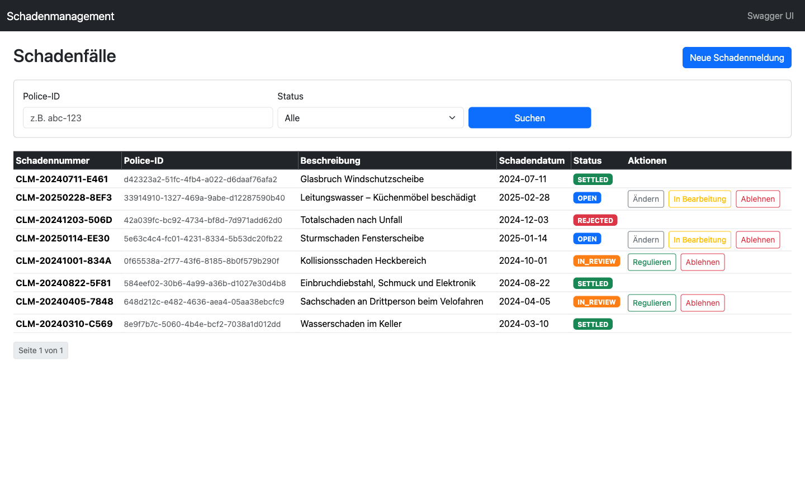

### 5.5 Billing (http://localhost:9084/billing)

Rechnungen werden automatisch erzeugt, wenn `policy.v1.issued` eintrifft – der User erzeugt keine Rechnung von Hand. Drei Statusklassen sichtbar: **PAID** (grün), **OPEN** (blau), **OVERDUE** (rot, Mahnwesen aktiv), **CANCELLED** (grau, aus stornierter Police).

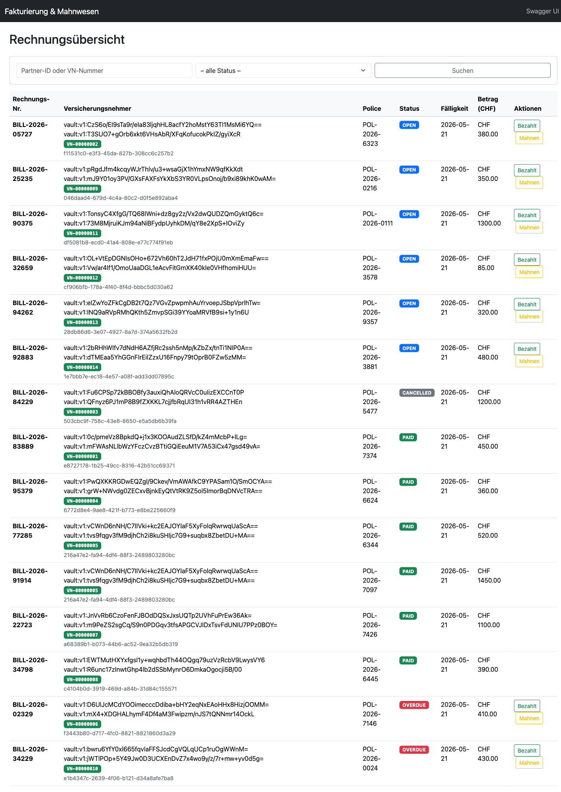

### 5.6 HR-System (http://localhost:9085/mitarbeiter)

Simuliert ein externes COTS-HR-System. Hat **keine** hexagonale Architektur, keine OIDC, eigenes Postgres – bewusst „legacy-like“. Integration erfolgt über das **hr-integration**-Camel-Bridge (Port 9086), das den OData-Feed alle N Sekunden pollt und Delta- + State-Events auf Kafka publisht.

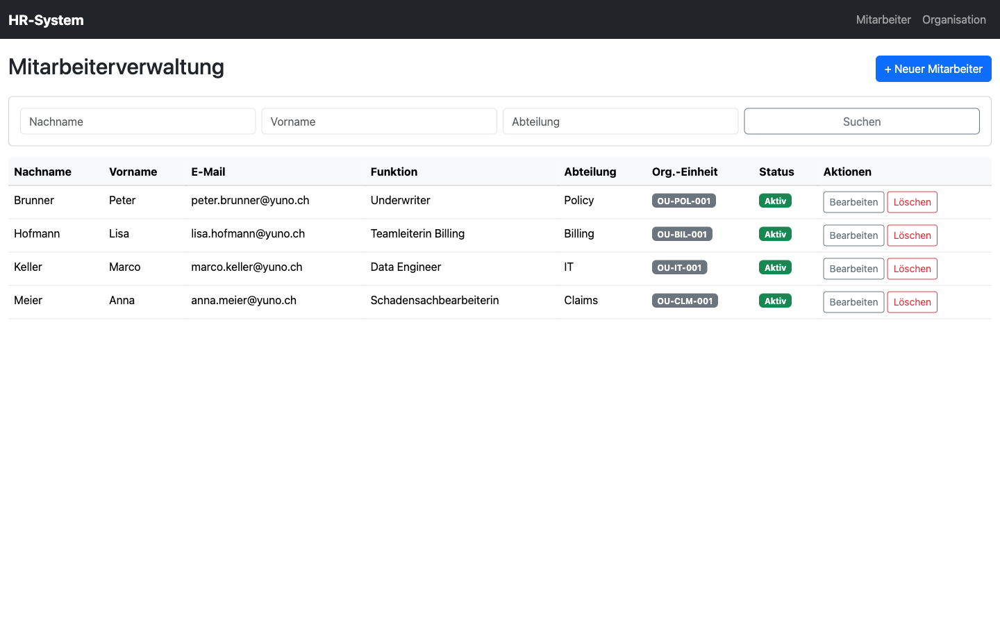

---

## 6. Event-Fluss in Kafka zeigen (ADR-009 PII-Verschlüsselung)

### 6.1 Topic-Übersicht (AKHQ)

http://localhost:8085 – alle Domain-Topics sind **pre-created** mit korrekter Partition/Compaction-Policy. State-Topics (`*.v1.state`) sind compacted, Change-Topics sind retention-based.

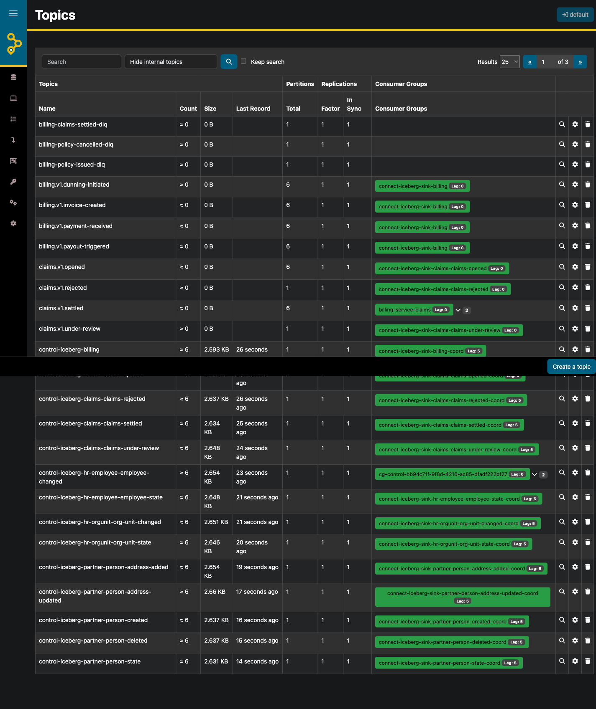

### 6.2 `person.v1.state` – Vault-encrypted ECST

Öffnet man einen Record aus `person.v1.state`, sieht man das Event-Carried State Transfer (ECST) Pattern: pro Person-ID genau ein aktueller State-Record (durch Compaction), und jedes PII-Feld ist ein **Vault-Transit-Ciphertext** (`vault:v1:…`). `insuredNumber` bleibt Klartext (ADR-009: nicht PII).

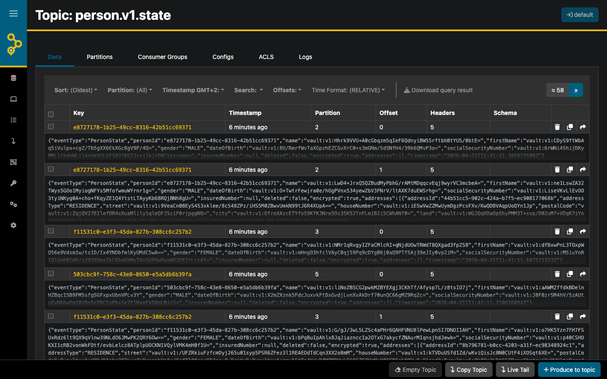

Konsumenten müssen das Flag `"encrypted": true` prüfen und Felder on-demand via Vault-Transit entschlüsseln. Ein **Right-to-Erasure** löscht den Vault-Key → alle historischen Ciphertexte werden unlesbar (*Crypto-Shredding*), ohne ein einziges Kafka-Topic zu reorg'en.

---

## 7. Iceberg-Lakehouse – Parquet auf MinIO

Der **Iceberg-Sink-Connector** im Debezium-Connect-Worker konsumiert alle Domain-Topics und schreibt sie als Apache-Iceberg-Tables (Parquet auf MinIO, Katalog in Nessie) unter dem Bucket `warehouse`. Pro Domain existiert ein eigenes `*_raw`-Schema.

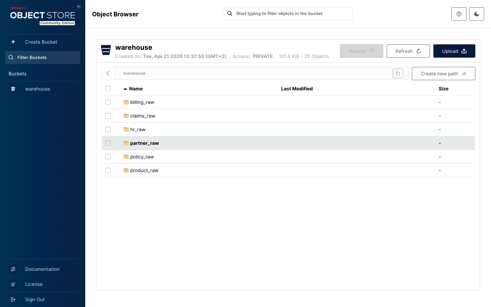

Query-Beispiel gegen Trino (http://localhost:8086):

```sql
SHOW SCHEMAS FROM iceberg;
-- partner_raw, product_raw, policy_raw, claims_raw, billing_raw, hr_raw
-- partner_silver, product_silver, policy_silver, claims_silver, billing_silver, hr_silver
-- partner_gold,   policy_gold,   billing_gold,   claims_gold,   hr_gold
-- analytics

SELECT * FROM iceberg.policy_silver.policy WHERE policy_status = 'ACTIVE';
```

---

## 8. SQLMesh Silver / Gold Transformationen

SQLMesh baut aus den `*_raw` Event-Streams **inkrementelle Silver-Modelle** (aktueller Zustand pro Entity) und darauf **Gold-Modelle** (angereichert, aggregiert, entschlüsselt).

```bash
# Einmal-Bootstrap der silver/gold-Modelle
podman compose --profile tools run --rm sqlmesh-init
```

Output zeigt die 17 Modellbatches:

```
[1/1] partner_silver.partner            [insert/update rows (22 rows)]
[1/1] billing_silver.invoice            [insert/update rows (15 rows)]
[1/1] policy_silver.policy              [insert/update rows (15 rows)]
[1/1] partner_gold.partner_decrypted    [full refresh (22 rows)]
[1/1] billing_gold.financial_summary    [full refresh (15 rows)]
[1/1] analytics.management_kpi          [full refresh (1 row)]
[1/1] policy_gold.policy_detail         [full refresh (15 rows)]
[1/1] policy_gold.portfolio_summary     [full refresh (1 row)]
```

Im Produktionsbetrieb läuft derselbe Container als **Long-running Scheduler** (siehe Commit `d3b2451` – near-realtime silver/gold).

---

## 9. Superset Dashboard – Cross-Domain-Analytics

http://localhost:8088 – Login `admin/admin`. Der Superset-init-Container legt beim Hochfahren Trino als Datasource, 8 Datasets und das Dashboard **Datamesh Platform – Übersicht** an.

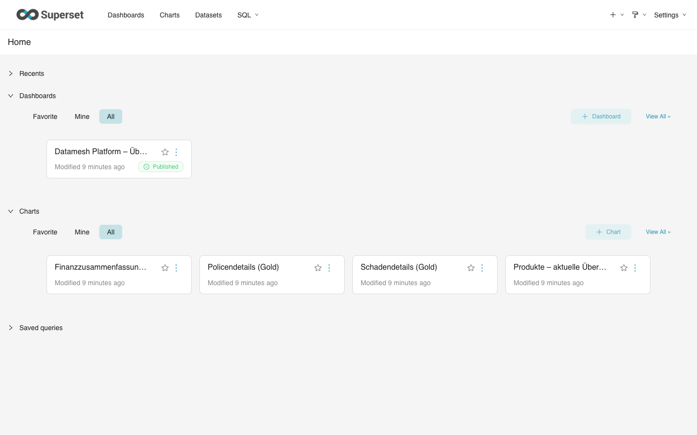

Das zentrale Dashboard bündelt Gold-Layer-Modelle aus **allen fünf Domains** auf einer Seite – Policen nach Status, Schäden nach Status, Rechnungen nach Status, Partner-Segmentierung, Policen-Details und Finanzzusammenfassung:

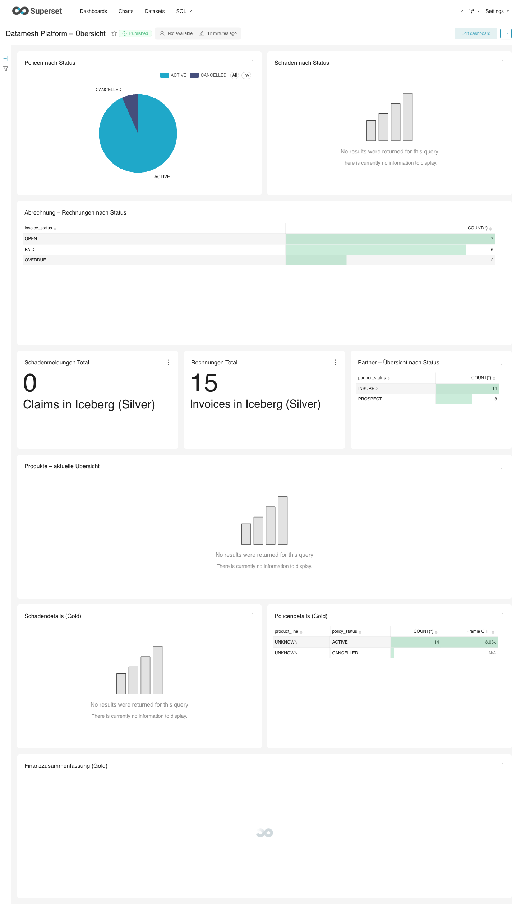

Die Zahlen stimmen exakt mit dem Seed überein:
- **14 aktive Policen**, 1 storniert
- **15 Rechnungen** total (7 OPEN, 6 PAID, 2 OVERDUE)
- **14 INSURED Partner**, 8 PROSPECT

---

## 10. OpenMetadata – Governance & Lineage

http://localhost:8585 – Login `admin@open-metadata.org / admin`. Der OpenMetadata-Server katalogisiert die Kafka-Topics (via Schema-Registry) und die Iceberg-Tables (via Trino) alle 6 Stunden per Airflow-Ingestion-Pipeline.

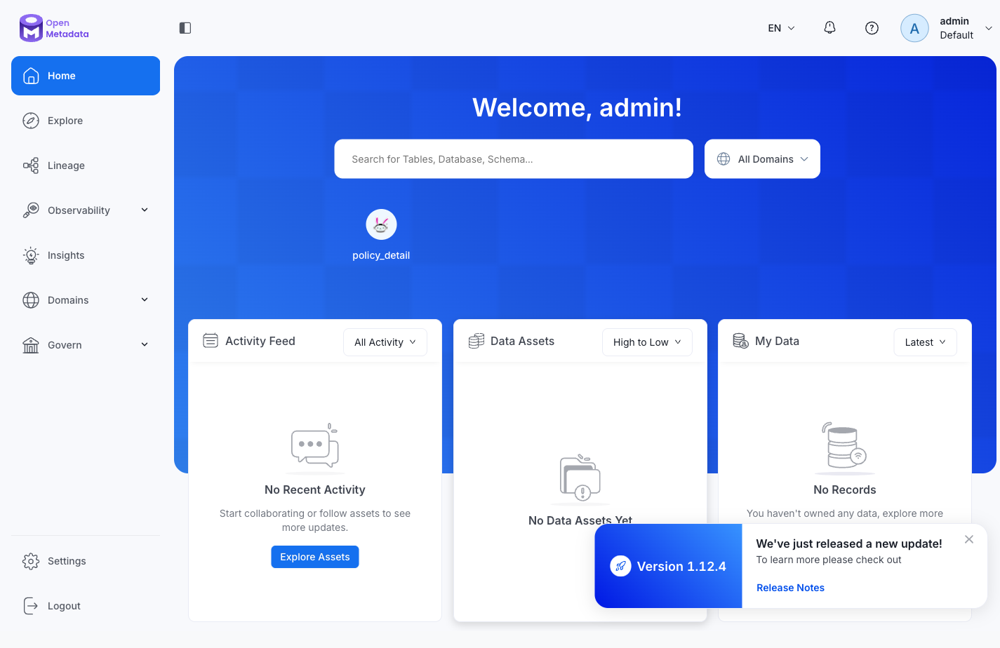

Unter *Explore → Data Assets* erscheinen PII-Tags (`PII.NonSensitive`, `PersonalData.SpecialCategory`), Ownership und Glossar-Referenzen. Diese Tags kommen aus den Open Data Contracts (ODCs) der Domains:

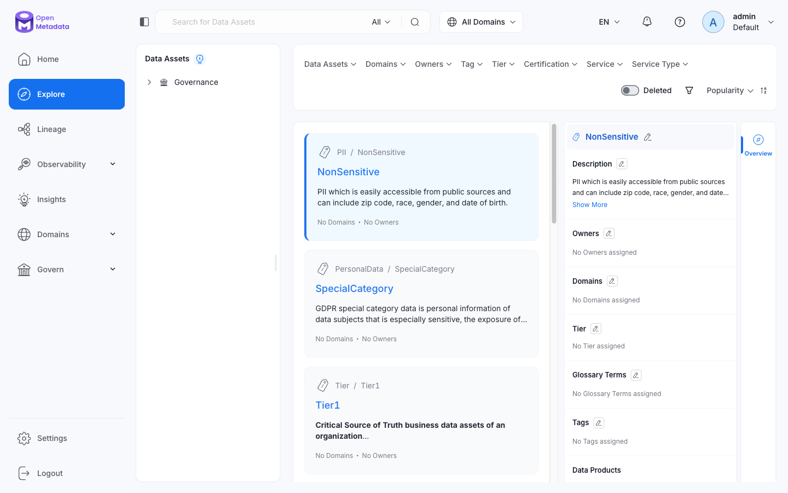

Eine komplette Initialisierung (Services registrieren, Metadaten-Ingestion ausführen, PII-Tags anlegen, SQLMesh- und Superset-Lineage exportieren) übernimmt ein einziges Skript:

```bash
./scripts/init-openmetadata.sh
```

Das Skript deckt vier Dinge ab:
1. **Services registrieren** (Kafka, Trino, Superset).
2. **Metadaten-Ingestion starten** via Airflow-Pipelines (OpenMetadata-Ingestion-Container muss laufen: `podman start datamesh-openmetadata-ingestion-1`).
3. **Lineage exportieren** – SQLMesh-Modell-Dependencies und Superset-Chart-Bindings:
   ```bash
   ./scripts/export-sqlmesh-lineage.sh     # 28 Edges: raw → silver → gold → analytics
   ./scripts/export-superset-lineage.sh    # Gold → Charts → Dashboards
   ```
4. **Airflow-Schedules** für wiederkehrende Ingestions alle 6 Stunden deployen.

---

## 11. End-to-End-Lineage (Raw → Silver → Gold → Dashboard)

Der eigentliche Governance-Mehrwert von OpenMetadata wird sichtbar, sobald man ein beliebiges Gold-Modell öffnet und den **Lineage**-Tab aufruft. Die Edges kommen aus zwei Quellen:
- **SQLMesh-Modell-Dependencies** (`./scripts/export-sqlmesh-lineage.sh` – 28 Edges)
- **Superset-Chart-Dataset-Bindings** (`./scripts/export-superset-lineage.sh` – Gold → Dashboard)

### 11.1 `billing_gold.financial_summary` – Lineage einer Gold-Tabelle

Das Modell hinter den Finanz-KPIs im Dashboard liest aus zwei Silver-Tabellen (Policy + Invoice), die wiederum aus ihren Raw-Events gespeist werden. Rechts hängt das Superset-Dashboard dran:

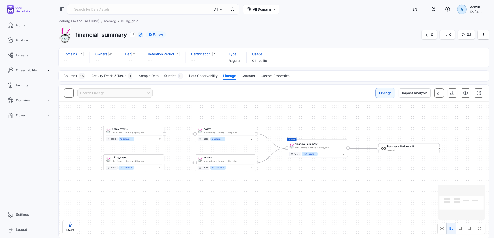

Sichtbar wird hier der komplette **4-Schichten-Pfad**:

```
policy_raw.policy_events    ┐
                            ├── policy_silver.policy   ┐
billing_raw.billing_events  ┘                          ├── billing_gold.financial_summary ── Datamesh Platform – Übersicht
                            ┌── billing_silver.invoice ┘
```

### 11.2 `policy_gold.policy_detail` – Cross-Domain-Lineage

Interessanter wird es beim `policy_detail`-Modell: es verbindet **drei Domains** (Partner, Product, Policy) zu einem angereicherten Gold-Dataset für Reporting. Die Lineage zeigt alle drei Raw-Quellen, ihre Silver-Projektionen und den zusammengeführten Gold-Knoten:

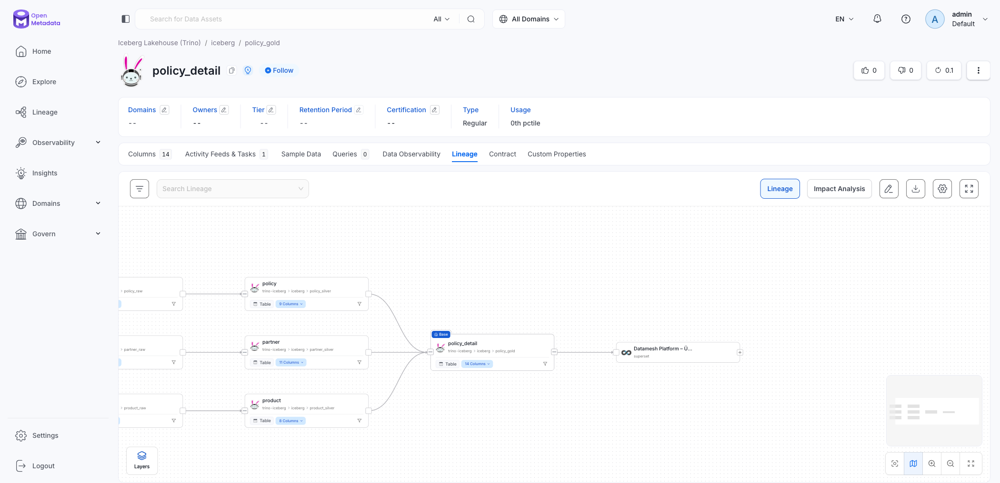

**Nutzen in der Demo:**
- **Impact Analysis**: Klick auf eine Raw-Tabelle → *Impact Analysis*-Tab zeigt, welche Gold-Modelle und Dashboards von einer Schema-Änderung betroffen wären.
- **PII-Tracing**: Die im Dashboard aggregierten Zahlen lassen sich bis zu den Vault-verschlüsselten Feldern in `partner_raw.person_events` zurückverfolgen.
- **Automatisch aktuell**: Die Airflow-Pipelines laufen alle 6 Stunden und re-ingesten sowohl Schemas als auch Lineage.

---

## 12. Reset für eine neue Demo

```bash
# Alles stoppen + Volumes löschen (DB, Kafka, MinIO, Nessie, Superset-Meta leer)
podman compose down -v

# Neu bauen & hochfahren
./build.sh -d --delete-volumes
./scripts/seed-test-data.sh
podman compose --profile tools run --rm sqlmesh-init
./scripts/refresh-superset-datasets.sh
```

Nach ca. 3–5 Minuten ist die Demo wieder vollständig verfügbar.

---

## Weiterführende Dokumente

- [`README.md`](README.md) – Architektur & vollständige Service-Liste
- [`GUIDE.md`](GUIDE.md) – Klick-für-Klick-Anleitung für alle Use Cases
- [`specs/arc42.md`](specs/arc42.md) – Vollständige Architekturdokumentation (arc42)
- [`docs/tutorial_de.md`](docs/tutorial_de.md) – Konzept-Tutorial (DDD, Data Mesh, Event-Patterns)
- [`docs/services-overview.md`](docs/services-overview.md) – Container-für-Container-Beschreibung
