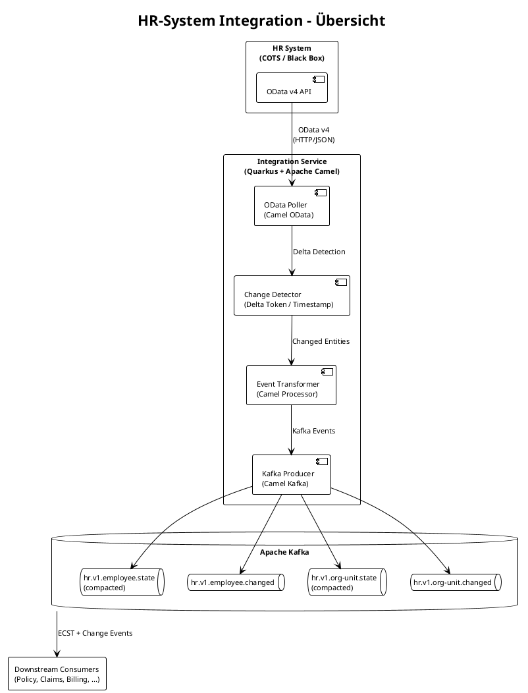
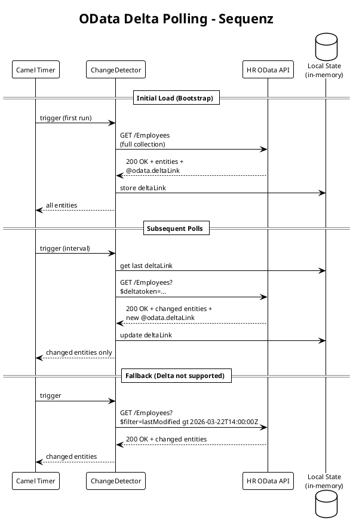
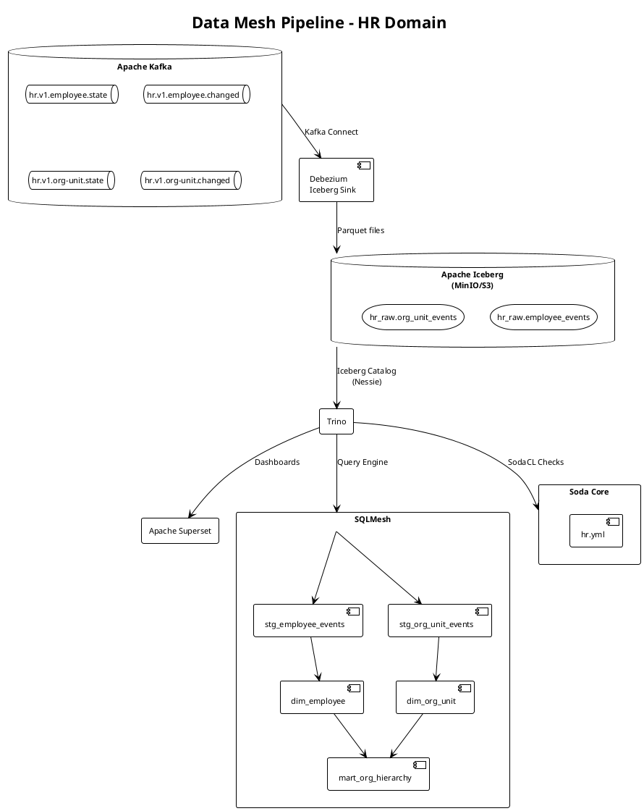
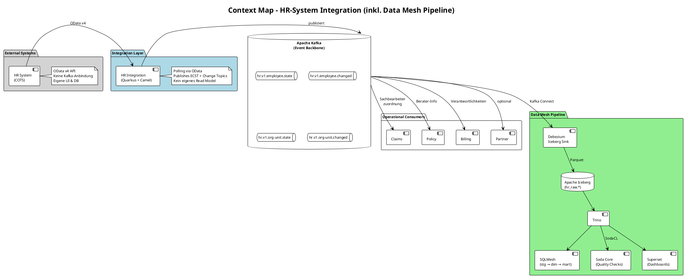

# Umsetzungsplan: HR-System Integration via Apache Camel

> **Version:** 1.0.0 · **Datum:** 2026-03-22
> **Kontext:** Integration eines eingekauften HR-Systems (CRUD für Mitarbeiter & Organisationsstruktur) in die Sachversicherungs-Plattform
> **Pattern:** External System Integration via Apache Camel (Quarkus) → Kafka (ECST + Change Topics)

---

## 1. Systemübersicht & Designentscheide

### 1.1 Ausgangslage

Das HR-System ist eine **eingekaufte Standardsoftware** (COTS – Commercial Off-The-Shelf) und wird als **Black Box** behandelt. Es stellt ausschliesslich eine **OData v4 API** bereit und verwaltet:

- **Mitarbeiter (Employee):** Stammdaten der Versicherungsmitarbeitenden (Name, Funktion, Abteilung, Eintrittsdatum, etc.)
- **Organisationsstruktur (OrganizationUnit):** Hierarchische Gliederung (Abteilungen, Teams, Bereiche)

Das System folgt **nicht** der internen Hexagonal-Architektur (keine `domain/`, `infrastructure/`-Packages) – es ist ein Fremdsystem mit externer API.

### 1.2 Integrationsstrategie



### 1.3 Designentscheide

| Entscheidung | Begründung |
|---|---|
| **Apache Camel (Quarkus Extension)** | Bewährtes Integrations-Framework mit OData-Connector; vermeidet Custom-HTTP-Code; Quarkus-nativ via `camel-quarkus-olingo4` |
| **Polling statt Push** | OData v4 bietet keinen nativen Webhook/Push-Mechanismus; Delta-Token-basiertes Polling ist der OData-Standardansatz |
| **Zwei Topic-Typen pro Entity** | **State (compacted):** Aktueller Zustand für Read-Model-Bootstrap (ECST-Pattern). **Changed:** Einzelne Änderungsereignisse für reaktive Downstream-Logik |
| **Kein Outbox-Pattern** | Das HR-System hat keine eigene DB in unserer Plattform. Camel publiziert direkt nach Kafka. Idempotenz via `eventId` (deterministic UUID aus Entity-ID + Version) |
| **Keine UI** | Das HR-System hat eine eigene UI (eingekauft). Die Integration ist headless |
| **Separate Quarkus-Applikation** | Klare Abgrenzung vom bestehenden Partner-Service; eigener Lifecycle und Deployment |

---

## 2. Topic-Design & Data Contracts

### 2.1 Topic-Übersicht

| Topic | Typ | Key | Retention | Zweck |
|---|---|---|---|---|
| `hr.v1.employee.state` | Compacted | `employeeId` | Log Compaction (∞) | ECST – aktueller Mitarbeiter-Zustand |
| `hr.v1.employee.changed` | Event | `employeeId` | 90 Tage | Änderungsereignisse (created, updated, deleted) |
| `hr.v1.org-unit.state` | Compacted | `orgUnitId` | Log Compaction (∞) | ECST – aktuelle Organisationseinheit |
| `hr.v1.org-unit.changed` | Event | `orgUnitId` | 90 Tage | Änderungsereignisse (created, updated, deleted) |

### 2.2 Employee State Payload

```json
{
  "employeeId": "550e8400-e29b-41d4-a716-446655440000",
  "externalId": "HR-EMP-00123",
  "firstName": "Anna",
  "lastName": "Meier",
  "email": "anna.meier@yuno.ch",
  "jobTitle": "Schadensachbearbeiterin",
  "department": "Claims",
  "orgUnitId": "OU-CLM-001",
  "entryDate": "2023-06-01",
  "exitDate": null,
  "active": true,
  "deleted": false,
  "version": 5,
  "timestamp": "2026-03-22T14:30:00Z"
}
```

### 2.3 Employee Changed Payload

```json
{
  "eventId": "a3f1b2c4-...",
  "eventType": "employee.updated",
  "employeeId": "550e8400-...",
  "externalId": "HR-EMP-00123",
  "changedFields": ["department", "orgUnitId"],
  "before": {
    "department": "Policy",
    "orgUnitId": "OU-POL-001"
  },
  "after": {
    "department": "Claims",
    "orgUnitId": "OU-CLM-001"
  },
  "timestamp": "2026-03-22T14:30:00Z"
}
```

### 2.4 OrganizationUnit State Payload

```json
{
  "orgUnitId": "OU-CLM-001",
  "externalId": "HR-OU-042",
  "name": "Schadenabwicklung",
  "parentOrgUnitId": "OU-VER-001",
  "managerEmployeeId": "550e8400-...",
  "level": 3,
  "active": true,
  "deleted": false,
  "version": 2,
  "timestamp": "2026-03-22T14:30:00Z"
}
```

---

## 3. Phasenübersicht

| Phase | Beschreibung | Aufwand | Abhängigkeiten |
|---|---|---|---|
| **1** | HR-System Stub (OData Mock-Server) | ~4h | – |
| **2** | Quarkus Camel Integration Service (Grundgerüst) | ~3h | – |
| **3** | OData Polling & Delta Detection | ~4h | Phase 1, 2 |
| **4** | Event Transformation & Kafka Producer | ~4h | Phase 3 |
| **5** | ODC Contracts & Kafka Topic Setup | ~2h | Phase 4 |
| **6** | Data Mesh Pipeline (Iceberg Sink, SQLMesh, Soda) | ~5h | Phase 5 |
| **7** | Tests (Unit + Integration) | ~4h | Phase 3, 4 |
| **8** | Monitoring, Error Handling & DLQ | ~2h | Phase 4 |
| | **Total** | **~28h** | |

---

## 4. Phase 1: HR-System Stub (OData Mock-Server)

Da das HR-System eingekauft ist, benötigen wir einen **lokalen Stub** für Entwicklung und Tests. Dieser simuliert die OData v4 API.

### 4.1 Projektstruktur

```text
hr-system/
├── pom.xml                          <-- Quarkus + Apache Olingo Server
├── src/main/java/ch/yuno/hr/
│   ├── ODataServlet.java            <-- Apache Olingo OData v4 Servlet
│   ├── model/
│   │   ├── Employee.java            <-- JPA Entity
│   │   └── OrganizationUnit.java    <-- JPA Entity
│   ├── edm/
│   │   └── HrEdmProvider.java       <-- OData Entity Data Model
│   ├── processor/
│   │   ├── EmployeeProcessor.java   <-- CRUD Handler für /Employees
│   │   └── OrgUnitProcessor.java    <-- CRUD Handler für /OrganizationUnits
│   └── data/
│       └── TestDataInitializer.java  <-- Seed Data (Startup Event)
├── src/main/resources/
│   ├── application.properties
│   ├── import.sql                   <-- Initial Testdaten
│   └── db/migration/
│       └── V1__create_hr_tables.sql
└── src/test/
```

**Wichtig:** Dieses Modul folgt **bewusst nicht** der Hexagonal-Architektur. Es simuliert ein Fremdsystem mit flacher Package-Struktur.

### 4.2 OData Entity Data Model

```java
// HrEdmProvider.java – definiert das OData Schema
public class HrEdmProvider extends CsdlAbstractEdmProvider {

    public static final String NAMESPACE = "ch.yuno.hr";
    public static final String CONTAINER_NAME = "HrService";

    // EntityType: Employee
    // Properties: employeeId (Edm.Guid, Key), firstName, lastName,
    //             email, jobTitle, department, orgUnitId,
    //             entryDate (Edm.Date), exitDate, active (Edm.Boolean),
    //             version (Edm.Int64), lastModified (Edm.DateTimeOffset)

    // EntityType: OrganizationUnit
    // Properties: orgUnitId (Edm.String, Key), name, parentOrgUnitId,
    //             managerEmployeeId, level (Edm.Int32), active,
    //             version (Edm.Int64), lastModified (Edm.DateTimeOffset)

    // Navigation: Employee -> OrganizationUnit (orgUnit)
    // Navigation: OrganizationUnit -> OrganizationUnit (parent)
    // Navigation: OrganizationUnit -> Employee (manager)
}
```

### 4.3 Flyway-Migration

**Datei:** `hr-system/src/main/resources/db/migration/V1__create_hr_tables.sql`

```sql
CREATE TABLE employee
(
    employee_id   UUID         NOT NULL PRIMARY KEY,
    first_name    VARCHAR(255) NOT NULL,
    last_name     VARCHAR(255) NOT NULL,
    email         VARCHAR(255),
    job_title     VARCHAR(255),
    department    VARCHAR(255),
    org_unit_id   VARCHAR(50),
    entry_date    DATE         NOT NULL,
    exit_date     DATE,
    active        BOOLEAN      NOT NULL DEFAULT TRUE,
    version       BIGINT       NOT NULL DEFAULT 1,
    last_modified TIMESTAMP    NOT NULL DEFAULT now()
);

CREATE TABLE organization_unit
(
    org_unit_id         VARCHAR(50)  NOT NULL PRIMARY KEY,
    name                VARCHAR(255) NOT NULL,
    parent_org_unit_id  VARCHAR(50),
    manager_employee_id UUID,
    level               INT          NOT NULL DEFAULT 1,
    active              BOOLEAN      NOT NULL DEFAULT TRUE,
    version             BIGINT       NOT NULL DEFAULT 1,
    last_modified       TIMESTAMP    NOT NULL DEFAULT now(),
    CONSTRAINT fk_parent FOREIGN KEY (parent_org_unit_id) REFERENCES organization_unit (org_unit_id)
);
```

### 4.4 Testdaten (Seed)

```sql
-- Organisationsstruktur
INSERT INTO organization_unit VALUES ('OU-ROOT', 'Yuno Versicherung AG', NULL, NULL, 1, true, 1, now());
INSERT INTO organization_unit VALUES ('OU-VER-001', 'Versicherungsbetrieb', 'OU-ROOT', NULL, 2, true, 1, now());
INSERT INTO organization_unit VALUES ('OU-POL-001', 'Policenverwaltung', 'OU-VER-001', NULL, 3, true, 1, now());
INSERT INTO organization_unit VALUES ('OU-CLM-001', 'Schadenabwicklung', 'OU-VER-001', NULL, 3, true, 1, now());
INSERT INTO organization_unit VALUES ('OU-BIL-001', 'Inkasso/Exkasso', 'OU-VER-001', NULL, 3, true, 1, now());
INSERT INTO organization_unit VALUES ('OU-SAL-001', 'Vertrieb', 'OU-ROOT', NULL, 2, true, 1, now());
INSERT INTO organization_unit VALUES ('OU-IT-001', 'IT & Daten', 'OU-ROOT', NULL, 2, true, 1, now());

-- Mitarbeiter
INSERT INTO employee VALUES (gen_random_uuid(), 'Anna', 'Meier', 'anna.meier@yuno.ch', 'Schadensachbearbeiterin', 'Claims', 'OU-CLM-001', '2023-06-01', NULL, true, 1, now());
INSERT INTO employee VALUES (gen_random_uuid(), 'Peter', 'Brunner', 'peter.brunner@yuno.ch', 'Underwriter', 'Policy', 'OU-POL-001', '2021-03-15', NULL, true, 1, now());
INSERT INTO employee VALUES (gen_random_uuid(), 'Lisa', 'Hofmann', 'lisa.hofmann@yuno.ch', 'Teamleiterin Billing', 'Billing', 'OU-BIL-001', '2019-01-10', NULL, true, 1, now());
INSERT INTO employee VALUES (gen_random_uuid(), 'Marco', 'Keller', 'marco.keller@yuno.ch', 'Data Engineer', 'IT', 'OU-IT-001', '2024-09-01', NULL, true, 1, now());
```

---

## 5. Phase 2: Quarkus Camel Integration Service

### 5.1 Projektstruktur

```text
hr-integration/
├── pom.xml                                      <-- Quarkus + Camel Extensions
├── src/main/java/ch/yuno/hrintegration/
│   ├── route/
│   │   ├── EmployeeSyncRoute.java               <-- Camel Route: OData → Kafka
│   │   └── OrgUnitSyncRoute.java                <-- Camel Route: OData → Kafka
│   ├── processor/
│   │   ├── EmployeeEventProcessor.java          <-- OData JSON → Kafka Event
│   │   ├── OrgUnitEventProcessor.java           <-- OData JSON → Kafka Event
│   │   └── ChangeDetector.java                  <-- Delta Detection Logic
│   ├── model/
│   │   ├── EmployeeEvent.java                   <-- Event Record (Java Record)
│   │   └── OrgUnitEvent.java                    <-- Event Record (Java Record)
│   └── config/
│       └── HrIntegrationConfig.java             <-- Polling Interval, Base URL, etc.
├── src/main/resources/
│   ├── application.properties
│   └── contracts/
│       ├── hr.v1.employee.state.odcontract.yaml
│       ├── hr.v1.employee.changed.odcontract.yaml
│       ├── hr.v1.org-unit.state.odcontract.yaml
│       └── hr.v1.org-unit.changed.odcontract.yaml
└── src/test/java/ch/yuno/hrintegration/
    ├── route/
    │   ├── EmployeeSyncRouteTest.java
    │   └── OrgUnitSyncRouteTest.java
    └── processor/
        ├── EmployeeEventProcessorTest.java
        └── OrgUnitEventProcessorTest.java
```

**Wichtig:** Auch dieses Modul folgt **nicht** der strengen Hexagonal-Architektur. Es ist ein reiner **Integration Adapter** ohne eigene Domänenlogik – Camel-Routes sind der natürliche Strukturierungsansatz.

### 5.2 Maven Dependencies

```xml
<dependencies>
    <!-- Quarkus Camel Core -->
    <dependency>
        <groupId>org.apache.camel.quarkus</groupId>
        <artifactId>camel-quarkus-core</artifactId>
    </dependency>

    <!-- OData v4 Client (Apache Olingo via Camel) -->
    <dependency>
        <groupId>org.apache.camel.quarkus</groupId>
        <artifactId>camel-quarkus-olingo4</artifactId>
    </dependency>

    <!-- Kafka Producer -->
    <dependency>
        <groupId>org.apache.camel.quarkus</groupId>
        <artifactId>camel-quarkus-kafka</artifactId>
    </dependency>

    <!-- JSON Processing -->
    <dependency>
        <groupId>org.apache.camel.quarkus</groupId>
        <artifactId>camel-quarkus-jackson</artifactId>
    </dependency>

    <!-- Scheduler (Polling Timer) -->
    <dependency>
        <groupId>org.apache.camel.quarkus</groupId>
        <artifactId>camel-quarkus-timer</artifactId>
    </dependency>

    <!-- Health & Metrics -->
    <dependency>
        <groupId>org.apache.camel.quarkus</groupId>
        <artifactId>camel-quarkus-microprofile-health</artifactId>
    </dependency>
</dependencies>
```

### 5.3 Konfiguration

**Datei:** `hr-integration/src/main/resources/application.properties`

```properties
# === HR OData Connection ===
hr.odata.base-url=http://hr-system:9090/odata
hr.odata.polling-interval=60000
hr.odata.connect-timeout=5000
hr.odata.read-timeout=30000

# === Kafka Producer ===
camel.component.kafka.brokers=kafka:9092

# === Quarkus ===
quarkus.http.port=9090
quarkus.application.name=hr-integration

# === Logging ===
quarkus.log.category."ch.yuno.hrintegration".level=DEBUG
quarkus.log.category."org.apache.camel".level=INFO
```

---

## 6. Phase 3: OData Polling & Delta Detection

### 6.1 Polling-Strategie

OData v4 unterstützt **Delta Links** (`$deltatoken`) für inkrementelle Abfragen. Der Ablauf:



### 6.2 Employee Sync Route

```java
@ApplicationScoped
public class EmployeeSyncRoute extends RouteBuilder {

    @ConfigProperty(name = "hr.odata.base-url")
    String odataBaseUrl;

    @ConfigProperty(name = "hr.odata.polling-interval", defaultValue = "60000")
    long pollingInterval;

    @Override
    public void configure() {
        // Error handling: DLQ for failed messages
        errorHandler(deadLetterChannel("kafka:hr-integration-dlq")
            .maximumRedeliveries(3)
            .redeliveryDelay(5000)
            .retryAttemptedLogLevel(LoggingLevel.WARN));

        // Main polling route
        from("timer:employee-sync?period=" + pollingInterval)
            .routeId("employee-sync")
            .log(LoggingLevel.DEBUG, "Polling HR system for employee changes...")
            .to("direct:fetch-employees")
            .split(body())                              // Split collection into individual entities
                .process("employeeEventProcessor")       // Transform to Kafka event
                .multicast()
                    .to("direct:employee-state")         // → compacted state topic
                    .to("direct:employee-changed")       // → change event topic
                .end()
            .end()
            .log(LoggingLevel.INFO, "Employee sync completed. ${header.CamelSplitSize} entities processed.");

        // OData fetch with delta detection
        from("direct:fetch-employees")
            .routeId("fetch-employees")
            .process("changeDetector")                   // Sets OData URL (delta or full)
            .toD("olingo4://read/${header.ODataResourcePath}"
                + "?serviceUri=" + odataBaseUrl
                + "&contentType=application/json")
            .process("changeDetector");                  // Extracts & stores new deltaLink

        // Kafka: compacted state topic
        from("direct:employee-state")
            .routeId("employee-state-producer")
            .setHeader(KafkaConstants.KEY, simple("${header.employeeId}"))
            .marshal().json()
            .to("kafka:hr.v1.employee.state");

        // Kafka: change event topic
        from("direct:employee-changed")
            .routeId("employee-changed-producer")
            .setHeader(KafkaConstants.KEY, simple("${header.employeeId}"))
            .marshal().json()
            .to("kafka:hr.v1.employee.changed");
    }
}
```

### 6.3 ChangeDetector Processor

```java
@ApplicationScoped
@Named("changeDetector")
public class ChangeDetector implements Processor {

    private final Map<String, String> deltaLinks = new ConcurrentHashMap<>();
    private final Map<String, Instant> lastPolled = new ConcurrentHashMap<>();

    @Override
    public void process(Exchange exchange) {
        var routeId = exchange.getFromRouteId();
        var entitySet = resolveEntitySet(routeId); // "Employees" or "OrganizationUnits"

        if (exchange.getIn().getBody() != null && containsDeltaLink(exchange)) {
            // Post-fetch: extract and store the new delta link
            var newDeltaLink = extractDeltaLink(exchange);
            deltaLinks.put(entitySet, newDeltaLink);
            lastPolled.put(entitySet, Instant.now());
            return;
        }

        // Pre-fetch: set the OData resource path
        if (deltaLinks.containsKey(entitySet)) {
            // Incremental: use delta link
            exchange.getIn().setHeader("ODataResourcePath", entitySet + "?" + deltaLinks.get(entitySet));
        } else {
            // Bootstrap: full collection
            exchange.getIn().setHeader("ODataResourcePath", entitySet);
        }
    }
}
```

---

## 7. Phase 4: Event Transformation

### 7.1 Employee Event Processor

```java
@ApplicationScoped
@Named("employeeEventProcessor")
public class EmployeeEventProcessor implements Processor {

    @Override
    public void process(Exchange exchange) {
        var odataEntity = exchange.getIn().getBody(Map.class);

        var employeeId = determineEmployeeId(odataEntity);
        var externalId = (String) odataEntity.get("employeeId");

        // State event (ECST)
        var stateEvent = new EmployeeEvent.State(
            employeeId,
            externalId,
            (String) odataEntity.get("firstName"),
            (String) odataEntity.get("lastName"),
            (String) odataEntity.get("email"),
            (String) odataEntity.get("jobTitle"),
            (String) odataEntity.get("department"),
            (String) odataEntity.get("orgUnitId"),
            parseDate(odataEntity.get("entryDate")),
            parseDate(odataEntity.get("exitDate")),
            (Boolean) odataEntity.getOrDefault("active", true),
            isDeleted(odataEntity),
            ((Number) odataEntity.get("version")).longValue(),
            Instant.now()
        );

        // Changed event
        var changeEvent = new EmployeeEvent.Changed(
            generateDeterministicEventId(employeeId, stateEvent.version()),
            resolveEventType(odataEntity),
            employeeId,
            externalId,
            Instant.now()
        );

        exchange.getIn().setHeader("employeeId", employeeId);
        exchange.getIn().setHeader("stateEvent", stateEvent);
        exchange.getIn().setHeader("changeEvent", changeEvent);
        exchange.getIn().setBody(stateEvent);
    }

    private UUID generateDeterministicEventId(String employeeId, long version) {
        return UUID.nameUUIDFromBytes((employeeId + ":" + version).getBytes(UTF_8));
    }
}
```

### 7.2 Event Records

```java
public sealed interface EmployeeEvent {

    record State(
        String employeeId,
        String externalId,
        String firstName,
        String lastName,
        String email,
        String jobTitle,
        String department,
        String orgUnitId,
        LocalDate entryDate,
        LocalDate exitDate,
        boolean active,
        boolean deleted,
        long version,
        Instant timestamp
    ) implements EmployeeEvent {}

    record Changed(
        UUID eventId,
        String eventType,   // "employee.created", "employee.updated", "employee.deleted"
        String employeeId,
        String externalId,
        Instant timestamp
    ) implements EmployeeEvent {}
}
```

```java
public sealed interface OrgUnitEvent {

    record State(
        String orgUnitId,
        String externalId,
        String name,
        String parentOrgUnitId,
        String managerEmployeeId,
        int level,
        boolean active,
        boolean deleted,
        long version,
        Instant timestamp
    ) implements OrgUnitEvent {}

    record Changed(
        UUID eventId,
        String eventType,
        String orgUnitId,
        String externalId,
        Instant timestamp
    ) implements OrgUnitEvent {}
}
```

---

## 8. Phase 5: ODC Contracts

### 8.1 Employee State Contract

**Datei:** `hr-integration/src/main/resources/contracts/hr.v1.employee.state.odcontract.yaml`

```yaml
apiVersion: v2.2.2
kind: DataContract
metadata:
  name: hr-employee-state
  version: 1.0.0
  domain: hr
  owner: team-platform@yuno.ch
  description: >
    Compacted state topic containing the current state of all employees
    from the external HR system. Materialized via OData polling by the
    hr-integration Camel service.
  tags:
    - pii
    - hr
    - ecst

infrastructure:
  platform: kafka
  topic: hr.v1.employee.state
  format: json
  compaction: true
  retention: infinite

schema:
  fields:
    - name: employeeId
      type: string
      description: Internal UUID, deterministic from externalId
      nullable: false
      primaryKey: true
    - name: externalId
      type: string
      description: Original ID from the HR system
      nullable: false
    - name: firstName
      type: string
      nullable: false
      pii: true
    - name: lastName
      type: string
      nullable: false
      pii: true
    - name: email
      type: string
      nullable: true
      pii: true
    - name: jobTitle
      type: string
      nullable: true
    - name: department
      type: string
      nullable: true
    - name: orgUnitId
      type: string
      nullable: true
    - name: entryDate
      type: date
      nullable: false
    - name: exitDate
      type: date
      nullable: true
    - name: active
      type: boolean
      nullable: false
    - name: deleted
      type: boolean
      nullable: false
      description: Tombstone marker for GDPR deletion
    - name: version
      type: long
      nullable: false
    - name: timestamp
      type: timestamp
      nullable: false

sla:
  freshness: 5m
  availability: 99.5%
```

### 8.2 OrganizationUnit State Contract

**Datei:** `hr-integration/src/main/resources/contracts/hr.v1.org-unit.state.odcontract.yaml`

```yaml
apiVersion: v2.2.2
kind: DataContract
metadata:
  name: hr-org-unit-state
  version: 1.0.0
  domain: hr
  owner: team-platform@yuno.ch
  description: >
    Compacted state topic for organizational units from the external HR system.
  tags:
    - hr
    - ecst

infrastructure:
  platform: kafka
  topic: hr.v1.org-unit.state
  format: json
  compaction: true
  retention: infinite

schema:
  fields:
    - name: orgUnitId
      type: string
      nullable: false
      primaryKey: true
    - name: externalId
      type: string
      nullable: false
    - name: name
      type: string
      nullable: false
    - name: parentOrgUnitId
      type: string
      nullable: true
    - name: managerEmployeeId
      type: string
      nullable: true
    - name: level
      type: integer
      nullable: false
    - name: active
      type: boolean
      nullable: false
    - name: deleted
      type: boolean
      nullable: false
    - name: version
      type: long
      nullable: false
    - name: timestamp
      type: timestamp
      nullable: false

sla:
  freshness: 5m
  availability: 99.5%
```

> **Hinweis:** Die Data-Quality-Checks (SodaCL) werden bewusst **nicht** in den ODC Contracts definiert, sondern auf der Kafka→Iceberg→Trino-Seite via Soda Core ausgeführt (siehe Phase 6).

---

## 9. Phase 6: Data Mesh Pipeline (Iceberg Sink → SQLMesh → Soda)

Die Datenqualitätssicherung und analytische Aufbereitung startet **ab Kafka** – nicht auf der OData-Seite. Die HR-Topics werden via Debezium Iceberg Sink Connector nach Apache Iceberg materialisiert, via SQLMesh in Staging/Mart-Modelle transformiert und via Soda Core qualitätsgeprüft.

### 9.1 Architektur-Übersicht



### 9.2 Debezium Iceberg Sink Connector

**Datei:** `infra/debezium/iceberg-sink-hr.json`

Analog zu `iceberg-sink-partner.json` – fängt alle `hr.v1.*` Topics ab und schreibt nach `hr_raw`.

```json
{
  "name": "iceberg-sink-hr",
  "config": {
    "connector.class": "org.apache.iceberg.connect.IcebergSinkConnector",
    "tasks.max": "1",
    "topics.regex": "hr\\.v1\\..*",
    "iceberg.catalog.type": "nessie",
    "iceberg.catalog.uri": "http://nessie:19120/api/v2",
    "iceberg.catalog.ref": "main",
    "iceberg.catalog.warehouse": "s3://warehouse/",
    "iceberg.catalog.s3.endpoint": "http://minio:9000",
    "iceberg.catalog.s3.access-key-id": "minioadmin",
    "iceberg.catalog.s3.secret-access-key": "minioadmin",
    "iceberg.catalog.s3.path-style-access": "true",
    "iceberg.catalog.io-impl": "org.apache.iceberg.aws.s3.S3FileIO",
    "iceberg.catalog.s3.region": "us-east-1",
    "iceberg.tables": "hr_raw.employee_events,hr_raw.org_unit_events",
    "iceberg.tables.auto-create-enabled": "true",
    "iceberg.tables.evolve-schema-enabled": "true",
    "iceberg.control.commit.interval-ms": "10000",
    "iceberg.tables.route-field": "topic",
    "key.converter": "org.apache.kafka.connect.storage.StringConverter",
    "value.converter": "org.apache.kafka.connect.json.JsonConverter",
    "value.converter.schemas.enable": "false"
  }
}
```

**Topic-Routing:**

| Topic Pattern | Iceberg Table |
| --- | --- |
| `hr.v1.employee.*` | `hr_raw.employee_events` |
| `hr.v1.org-unit.*` | `hr_raw.org_unit_events` |

### 9.3 SQLMesh Staging Models

**Datei:** `infra/sqlmesh/models/staging/stg_employee_events.sql`

```sql
MODEL (
    name analytics.stg_employee_events,
    kind VIEW,
    description 'Staging model: parse raw HR employee JSON payload into typed columns. One row per event.'
);

SELECT
    id                                                              AS surrogate_key,
    json_extract_scalar(payload, '$.employeeId')                    AS employee_id,
    json_extract_scalar(payload, '$.externalId')                    AS external_id,
    topic,
    json_extract_scalar(payload, '$.firstName')                     AS first_name,
    json_extract_scalar(payload, '$.lastName')                      AS last_name,
    json_extract_scalar(payload, '$.email')                         AS email,
    json_extract_scalar(payload, '$.jobTitle')                      AS job_title,
    json_extract_scalar(payload, '$.department')                    AS department,
    json_extract_scalar(payload, '$.orgUnitId')                     AS org_unit_id,
    CAST(json_extract_scalar(payload, '$.entryDate') AS DATE)       AS entry_date,
    CAST(json_extract_scalar(payload, '$.exitDate') AS DATE)        AS exit_date,
    CAST(json_extract_scalar(payload, '$.active') AS BOOLEAN)       AS active,
    CAST(json_extract_scalar(payload, '$.deleted') AS BOOLEAN)      AS deleted,
    CAST(json_extract_scalar(payload, '$.version') AS BIGINT)       AS version,
    CAST(json_extract_scalar(payload, '$.timestamp') AS TIMESTAMP)  AS event_at,
    consumed_at
FROM iceberg.hr_raw.employee_events
WHERE json_extract_scalar(payload, '$.employeeId') IS NOT NULL
```

**Datei:** `infra/sqlmesh/models/staging/stg_org_unit_events.sql`

```sql
MODEL (
    name analytics.stg_org_unit_events,
    kind VIEW,
    description 'Staging model: parse raw HR organization unit JSON payload into typed columns.'
);

SELECT
    id                                                              AS surrogate_key,
    json_extract_scalar(payload, '$.orgUnitId')                     AS org_unit_id,
    json_extract_scalar(payload, '$.externalId')                    AS external_id,
    topic,
    json_extract_scalar(payload, '$.name')                          AS name,
    json_extract_scalar(payload, '$.parentOrgUnitId')               AS parent_org_unit_id,
    json_extract_scalar(payload, '$.managerEmployeeId')             AS manager_employee_id,
    CAST(json_extract_scalar(payload, '$.level') AS INTEGER)        AS level,
    CAST(json_extract_scalar(payload, '$.active') AS BOOLEAN)       AS active,
    CAST(json_extract_scalar(payload, '$.deleted') AS BOOLEAN)      AS deleted,
    CAST(json_extract_scalar(payload, '$.version') AS BIGINT)       AS version,
    CAST(json_extract_scalar(payload, '$.timestamp') AS TIMESTAMP)  AS event_at,
    consumed_at
FROM iceberg.hr_raw.org_unit_events
WHERE json_extract_scalar(payload, '$.orgUnitId') IS NOT NULL
```

### 9.4 SQLMesh Mart Models

**Datei:** `infra/sqlmesh/models/marts/dim_employee.sql`

```sql
MODEL (
    name analytics.dim_employee,
    kind FULL,
    cron '@hourly',
    description 'Latest known state of every employee. Last-write-wins by event_at.'
);

WITH ranked AS (
    SELECT
        employee_id,
        external_id,
        first_name,
        last_name,
        TRIM(first_name || ' ' || last_name)  AS full_name,
        email,
        job_title,
        department,
        org_unit_id,
        entry_date,
        exit_date,
        active,
        deleted,
        event_at                               AS last_event_at,
        ROW_NUMBER() OVER (
            PARTITION BY employee_id
            ORDER BY event_at DESC NULLS LAST, consumed_at DESC
        )                                      AS rn
    FROM analytics.stg_employee_events
)

SELECT
    employee_id,
    external_id,
    first_name,
    last_name,
    full_name,
    email,
    job_title,
    department,
    org_unit_id,
    entry_date,
    exit_date,
    active,
    deleted,
    CASE
        WHEN deleted THEN 'DELETED'
        WHEN NOT active THEN 'INACTIVE'
        WHEN exit_date IS NOT NULL AND exit_date <= CURRENT_DATE THEN 'EXITED'
        ELSE 'ACTIVE'
    END AS employment_status,
    last_event_at
FROM ranked
WHERE rn = 1
```

**Datei:** `infra/sqlmesh/models/marts/dim_org_unit.sql`

```sql
MODEL (
    name analytics.dim_org_unit,
    kind FULL,
    cron '@hourly',
    description 'Latest known state of every organizational unit from the HR system.'
);

WITH ranked AS (
    SELECT
        org_unit_id,
        external_id,
        name,
        parent_org_unit_id,
        manager_employee_id,
        level,
        active,
        deleted,
        event_at                               AS last_event_at,
        ROW_NUMBER() OVER (
            PARTITION BY org_unit_id
            ORDER BY event_at DESC NULLS LAST, consumed_at DESC
        )                                      AS rn
    FROM analytics.stg_org_unit_events
)

SELECT
    org_unit_id,
    external_id,
    name,
    parent_org_unit_id,
    manager_employee_id,
    level,
    active,
    deleted,
    last_event_at
FROM ranked
WHERE rn = 1
```

**Datei:** `infra/sqlmesh/models/marts/mart_org_hierarchy.sql`

```sql
MODEL (
    name analytics.mart_org_hierarchy,
    kind FULL,
    cron '@hourly',
    description 'Flattened organizational hierarchy with employee counts per unit.'
);

SELECT
    ou.org_unit_id,
    ou.name                                     AS org_unit_name,
    ou.level,
    parent.name                                 AS parent_name,
    mgr.full_name                               AS manager_name,
    COUNT(emp.employee_id)                      AS employee_count,
    COUNT(CASE WHEN emp.employment_status = 'ACTIVE' THEN 1 END)  AS active_employee_count
FROM analytics.dim_org_unit ou
LEFT JOIN analytics.dim_org_unit parent
    ON ou.parent_org_unit_id = parent.org_unit_id
LEFT JOIN analytics.dim_employee mgr
    ON ou.manager_employee_id = mgr.employee_id
LEFT JOIN analytics.dim_employee emp
    ON emp.org_unit_id = ou.org_unit_id
    AND NOT emp.deleted
WHERE NOT ou.deleted
GROUP BY
    ou.org_unit_id, ou.name, ou.level,
    parent.name, mgr.full_name
```

### 9.5 Soda Core Quality Checks

**Datei:** `infra/soda/checks/hr.yml`

Die Qualitätsprüfungen laufen auf den **Iceberg-Tabellen via Trino** – nicht auf der OData-API.

```yaml
# === Raw Layer: Iceberg tables populated by Debezium Kafka Connect ===

checks for hr_raw.employee_events:
  - row_count > 0:
      name: HR employee events exist
  - missing_count(employee_id) = 0:
      name: No null employee_id in raw events
  - freshness(consumed_at) < 24h:
      name: HR employee events are fresh (< 24h)

checks for hr_raw.org_unit_events:
  - row_count > 0:
      name: HR org unit events exist
  - missing_count(org_unit_id) = 0:
      name: No null org_unit_id in raw events
  - freshness(consumed_at) < 24h:
      name: HR org unit events are fresh (< 24h)

# === Mart Layer: SQLMesh transformed models ===

checks for analytics.dim_employee:
  - row_count > 0:
      name: dim_employee is not empty
  - duplicate_count(employee_id) = 0:
      name: No duplicate employee_id in dim_employee
  - missing_count(last_name) = 0:
      name: Every employee has a last_name
  - missing_count(entry_date) = 0:
      name: Every employee has an entry_date
  - invalid_count(employment_status) = 0:
      name: employment_status has valid values
      valid: [ACTIVE, INACTIVE, EXITED, DELETED]
  - invalid_count(email) = 0:
      name: Employee emails match expected format
      valid regex: "^[\\w.+-]+@[\\w-]+\\.[\\w.-]+$"
      filter: email IS NOT NULL

checks for analytics.dim_org_unit:
  - row_count > 0:
      name: dim_org_unit is not empty
  - duplicate_count(org_unit_id) = 0:
      name: No duplicate org_unit_id in dim_org_unit
  - missing_count(name) = 0:
      name: Every org unit has a name
  - values in (level) must be >= 1:
      name: Org unit level is at least 1
      fail condition: level < 1

checks for analytics.mart_org_hierarchy:
  - row_count > 0:
      name: mart_org_hierarchy is not empty
  - active_employee_count >= 0:
      name: No negative active employee counts
```

### 9.6 SQLMesh Test Assertions

**Datei:** `infra/sqlmesh/models/tests/assert_no_orphan_employees.sql`

```sql
-- Assertion: every employee references an existing org unit (or has NULL).
-- Orphan references indicate a sync ordering issue between Employee and OrgUnit topics.
MODEL (
    name analytics.assert_no_orphan_employees,
    kind VIEW,
    description 'Test assertion: no employee references a non-existent org unit.'
);

SELECT
    emp.employee_id,
    emp.org_unit_id
FROM analytics.dim_employee emp
LEFT JOIN analytics.dim_org_unit ou
    ON emp.org_unit_id = ou.org_unit_id
WHERE emp.org_unit_id IS NOT NULL
  AND ou.org_unit_id IS NULL
  AND NOT emp.deleted
```

---

## 10. Phase 7: Tests

### 10.1 Teststrategie

| Testtyp | Scope | Tooling |
|---|---|---|
| **Unit** | EmployeeEventProcessor, OrgUnitEventProcessor, ChangeDetector | JUnit 5, Mockito |
| **Integration** | Camel Route End-to-End (OData Mock → Kafka) | `@QuarkusTest`, Camel Test Support, Testcontainers (Kafka) |
| **Contract** | ODC YAML Validierung | DataContractVerificationTest |

### 10.2 Unit Test: EmployeeEventProcessor

```java
@ExtendWith(MockitoExtension.class)
class EmployeeEventProcessorTest {

    private final EmployeeEventProcessor processor = new EmployeeEventProcessor();

    @Test
    void shouldTransformODataEntityToStateEvent() {
        var exchange = createExchangeWithEmployee(Map.of(
            "employeeId", "HR-EMP-001",
            "firstName", "Anna",
            "lastName", "Meier",
            "email", "anna.meier@yuno.ch",
            "jobTitle", "Sachbearbeiterin",
            "department", "Claims",
            "orgUnitId", "OU-CLM-001",
            "entryDate", "2023-06-01",
            "active", true,
            "version", 1
        ));

        processor.process(exchange);

        var state = (EmployeeEvent.State) exchange.getIn().getBody();
        assertThat(state.firstName()).isEqualTo("Anna");
        assertThat(state.lastName()).isEqualTo("Meier");
        assertThat(state.department()).isEqualTo("Claims");
        assertThat(state.active()).isTrue();
        assertThat(state.deleted()).isFalse();
    }

    @Test
    void shouldGenerateDeterministicEventId() {
        // Same employeeId + version → same eventId (idempotent)
        var id1 = processor.generateDeterministicEventId("EMP-001", 5);
        var id2 = processor.generateDeterministicEventId("EMP-001", 5);
        assertThat(id1).isEqualTo(id2);

        // Different version → different eventId
        var id3 = processor.generateDeterministicEventId("EMP-001", 6);
        assertThat(id1).isNotEqualTo(id3);
    }
}
```

### 10.3 Integration Test: Camel Route

```java
@QuarkusTest
class EmployeeSyncRouteTest {

    @Inject
    CamelContext camelContext;

    @Inject
    ProducerTemplate producerTemplate;

    // WireMock for OData API
    @InjectWireMock
    WireMockServer wireMock;

    @Test
    void shouldPollODataAndProduceKafkaEvents() {
        // Given: OData returns two employees
        wireMock.stubFor(get(urlPathEqualTo("/odata/Employees"))
            .willReturn(okJson("""
                {
                  "value": [
                    {"employeeId": "HR-001", "firstName": "Anna", "lastName": "Meier", ...},
                    {"employeeId": "HR-002", "firstName": "Peter", "lastName": "Brunner", ...}
                  ]
                }
                """)));

        // When: trigger the route
        producerTemplate.sendBody("direct:fetch-employees", null);

        // Then: Kafka receives state + change events
        // (verify via Camel MockEndpoint or Testcontainers Kafka consumer)
    }
}
```

---

## 11. Phase 8: Monitoring & Error Handling

### 11.1 Health Checks

```java
@Readiness
@ApplicationScoped
public class HrODataHealthCheck implements HealthCheck {

    @ConfigProperty(name = "hr.odata.base-url")
    String odataBaseUrl;

    @Override
    public HealthCheckResponse call() {
        try {
            // Probe OData service document
            var response = HttpClient.newHttpClient()
                .send(HttpRequest.newBuilder(URI.create(odataBaseUrl)).GET().build(),
                       HttpResponse.BodyHandlers.ofString());

            return HealthCheckResponse.named("hr-odata")
                .status(response.statusCode() == 200)
                .withData("url", odataBaseUrl)
                .build();
        } catch (Exception e) {
            return HealthCheckResponse.named("hr-odata").down().build();
        }
    }
}
```

### 11.2 Metriken

| Metrik | Typ | Beschreibung |
|---|---|---|
| `hr_sync_employees_total` | Counter | Anzahl synchronisierter Mitarbeiter |
| `hr_sync_orgunits_total` | Counter | Anzahl synchronisierter Org-Einheiten |
| `hr_sync_errors_total` | Counter | Fehler bei OData-Abfragen |
| `hr_sync_duration_seconds` | Histogram | Dauer eines Polling-Zyklus |
| `hr_odata_response_time_ms` | Histogram | Antwortzeit der OData API |

### 11.3 Error Handling

| Fehlertyp | Behandlung |
|---|---|
| OData nicht erreichbar | Retry 3x mit 5s Delay, dann Skip + Alert (nächster Poll versucht es erneut) |
| Einzelne Entity fehlerhaft | DLQ (`hr-integration-dlq`), restliche Entities werden weiter verarbeitet |
| Kafka nicht erreichbar | Camel Circuit Breaker, Backpressure via `maxInFlightExchanges` |
| Delta Token abgelaufen | Fallback auf Full-Reload (Reset des `deltaLinks`-Eintrags) |

---

## 12. Downstream-Integration (Beispiel)

Sobald die HR-Topics publiziert sind, können bestehende Services diese konsumieren und lokale Read-Models aufbauen – genau wie beim bestehenden `person.v1.state`-Pattern.

### Beispiel: Claims-Service konsumiert Sachbearbeiter-Daten

```properties
# claims/src/main/resources/application.properties
mp.messaging.incoming.hr-employee-state-in.connector=smallrye-kafka
mp.messaging.incoming.hr-employee-state-in.topic=hr.v1.employee.state
mp.messaging.incoming.hr-employee-state-in.value.deserializer=org.apache.kafka.common.serialization.StringDeserializer
mp.messaging.incoming.hr-employee-state-in.group.id=claims-service-hr
mp.messaging.incoming.hr-employee-state-in.auto.offset.reset=earliest
mp.messaging.incoming.hr-employee-state-in.failure-strategy=dead-letter-queue
```

```java
// Claims: EmployeeViewConsumer.java – builds local read model of employees
@ApplicationScoped
public class EmployeeViewConsumer {

    @Inject
    EntityManager em;

    @Incoming("hr-employee-state-in")
    @Transactional
    public void consume(String payload) {
        // Parse, translate (ACL), upsert into local employee_view table
        // Pattern identical to existing PersonStateConsumer
    }
}
```

---

## 13. Architektur-Einordnung (Context Map)



---

## 14. Zusammenfassung

| Aspekt | Detail |
|---|---|
| **HR System** | Eingekaufte COTS-Software, OData v4 API, eigene UI, Black Box |
| **Integration** | Quarkus + Apache Camel (`camel-quarkus-olingo4` + `camel-quarkus-kafka`) |
| **Interne Schnittstelle** | 4 Kafka Topics: 2× ECST (compacted), 2× Change Events |
| **Data Mesh Pipeline** | Kafka → Debezium Iceberg Sink → Trino → SQLMesh (Staging + Marts) → Soda Core (Quality) |
| **Entities** | Employee (Mitarbeiter), OrganizationUnit (Organisationsstruktur) |
| **Architektur** | Flat Package Structure (kein Hexagonal – bewusste Abweichung für Integrations-Adapter) |
| **Sync-Mechanismus** | OData Delta Token Polling (Fallback: Timestamp-Filter) |
| **Idempotenz** | Deterministic UUID aus Entity-ID + Version |
| **Aufwand Total** | ~28h über 8 Phasen |
