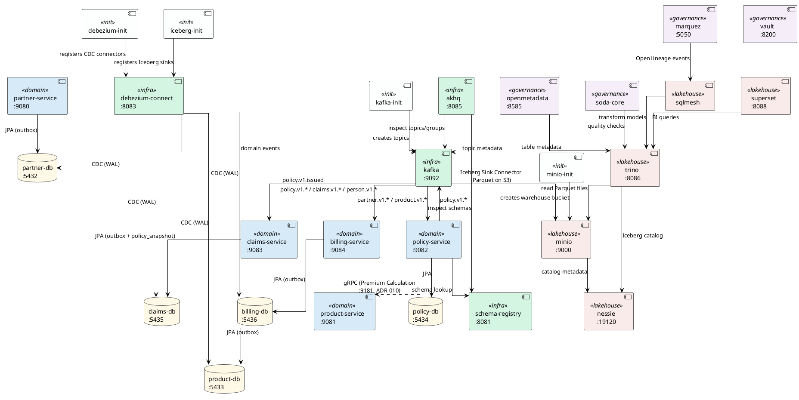

# Services Overview

## Service Descriptions

### Infrastructure

| Service | Port | Purpose |
|---|---|---|
| **kafka** | 9092 | Central event broker running in KRaft mode (no ZooKeeper). Every domain integration is asynchronous and exclusively via Kafka topics — direct service-to-service calls are forbidden (ADR-001). Topics use 6 partitions and 7-year retention for full auditability. |
| **schema-registry** | 8081 | Confluent Schema Registry that stores and versions Avro/Protobuf schemas for every Kafka topic. Producers validate their message against the registered schema before publishing; consumers use it to deserialise. Prevents silent schema-breaking changes across domain boundaries. |
| **akhq** | 8085 | Web UI for Kafka operations — browse topics, inspect messages, monitor consumer group lag, and view registered schemas. Dev/ops tooling only; not part of the data flow. |
| **debezium-connect** | 8083 | Kafka Connect worker with the Debezium PostgreSQL connector and the Iceberg Sink Connector. Debezium tails the PostgreSQL WAL (Change Data Capture) and reliably forwards outbox rows to Kafka. The Iceberg Sink Connector writes Kafka events as Iceberg tables on MinIO. |

### Init Jobs

| Service | Purpose |
|---|---|
| **kafka-init** | Runs once at startup to pre-create required Kafka topics with the correct partition count, replication factor, and cleanup policy. |
| **debezium-init** | Runs once after `debezium-connect` is healthy and registers the outbox connector configurations for all domains via the Kafka Connect REST API. |
| **minio-init** | Runs once after MinIO is healthy. Creates the `warehouse` bucket used by Iceberg for Parquet file storage. |
| **iceberg-init** | Runs once after Debezium, MinIO, and Nessie are healthy. Registers the Iceberg Sink Connector configurations for all domain topics. |
| **superset-init** | Runs once to bootstrap Superset: database migration, admin user creation, and Trino datasource registration. |

### Databases

| Service | Port | Purpose |
|---|---|---|
| **partner-db** | 5432 | Dedicated PostgreSQL instance owned exclusively by `partner-service`. WAL logical replication is enabled for Debezium CDC. |
| **product-db** | 5433 | Dedicated PostgreSQL instance owned exclusively by `product-service`. Same WAL configuration as `partner-db`. |
| **policy-db** | 5434 | Dedicated PostgreSQL instance owned exclusively by `policy-service`. |
| **claims-db** | 5435 | Dedicated PostgreSQL instance owned exclusively by `claims-service`. WAL logical replication enabled for Debezium CDC (outbox pattern). |
| **billing-db** | 5436 | Dedicated PostgreSQL instance owned exclusively by `billing-service`. WAL logical replication enabled for Debezium CDC. |
| **superset-db** | — | Dedicated PostgreSQL instance for Apache Superset metadata (dashboards, users, datasource configs). |
| **openmetadata-db** | — | Dedicated PostgreSQL instance for OpenMetadata server metadata. |
| **marquez-db** | — | Dedicated PostgreSQL instance for Marquez lineage data. |

### Domain Services

| Service | Port | Purpose |
|---|---|---|
| **partner-service** | 9080 | Bounded context for natural persons (Versicherungsnehmer). Manages the lifecycle of person records. Writes domain events to its outbox table; Debezium picks them up and publishes to `partner.v1.*` topics. |
| **product-service** | 9081 (REST), 9181 (gRPC) | Bounded context for insurance product definitions. Publishes `product.v1.*` events via the outbox. Exposes gRPC endpoint for synchronous premium calculation (ADR-010). |
| **policy-service** | 9082 | Bounded context for the insurance contract lifecycle. Consumes partner and product events, publishes `policy.v1.*` events directly to Kafka. |
| **claims-service** | 9083 | Bounded context for FNOL and claim lifecycle. Consumes `policy.v1.issued` for local read model. Publishes `claims.v1.*` via outbox + Debezium CDC. |
| **billing-service** | 9084 | Bounded context for invoicing, payments, dunning, and payouts. Consumes policy and claims events. Publishes `billing.v1.*` via outbox + Debezium CDC. |

### Lakehouse Foundation (Phase 1)

| Service | Port | Purpose |
|---|---|---|
| **minio** | 9000 (API), 9001 (Console) | S3-compatible object store. Stores all Iceberg Parquet files in the `warehouse` bucket. Replaces `platform-db` as the analytical storage layer. |
| **nessie** | 19120 | Git-like catalog for Apache Iceberg tables. Provides branching, tagging, and time-travel capabilities for the data lakehouse. |
| **trino** | 8086 | Distributed SQL query engine. Reads from Iceberg tables via the Nessie catalog on MinIO. Replaces direct SQL on `platform-db`. |
| **superset** | 8088 | Self-Service BI dashboards. Connects to Trino via `sqlalchemy-trino`. Supports Keycloak SSO (OIDC) and Row-Level Security for PII. Replaces the custom Flask `portal`. |

### Transformation Layer (Phase 2)

| Service | Purpose |
|---|---|
| **sqlmesh** | Incremental model transforms on Iceberg via Trino. Replaces `dbt` + Airflow scheduling. Models include dim_partner, dim_product, fact_policies, fact_invoices, and cross-domain marts. Runs in the `tools` profile. |

### Governance & Compliance (Phase 3)

| Service | Port | Purpose |
|---|---|---|
| **openmetadata-server** | 8585 | Unified metadata catalog for data discovery, PII tagging, and retention policies. Replaces DataHub + custom portal. |
| **openmetadata-ingestion** | — | Ingestion service for OpenMetadata. Connects to Kafka topics, Iceberg tables, and ODC contracts. |
| **openmetadata-elasticsearch** | 9200 | Elasticsearch instance for OpenMetadata search and indexing. |
| **marquez** | 5050 (API), 5051 (Admin) | OpenLineage-compatible lineage server. Tracks end-to-end lineage from CDC → Kafka → Iceberg → SQLMesh marts. |
| **marquez-web** | 3001 | Web UI for Marquez lineage visualization. |
| **vault** | 8200 | HashiCorp Vault for Crypto-Shredding (ADR-009). Manages per-entity AES-256 encryption keys for GDPR/nDSG right-to-erasure. Dev mode for local development. |
| **soda-core** | — | Data quality / contract testing. Runs SodaCL checks (null rates, duplicates, freshness) derived from ODC contracts against Iceberg tables via Trino. Runs in the `tools` profile. Replaces the custom `governance` container. |

### Observability

| Service | Port | Purpose |
|---|---|---|
| **prometheus** | 9090 | Metrics collection for all Quarkus services. |
| **grafana** | 3000 | Dashboards and alerting on Prometheus metrics. |

---

## Architecture Diagram

