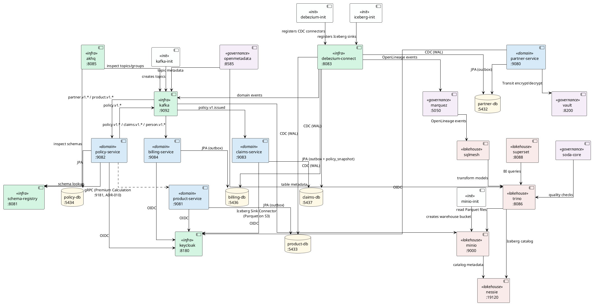

# Services Overview

## Service Descriptions

### Infrastructure

| Service | Port | Purpose |
|---|---|---|
| **kafka** | 9092 | Central event broker running in KRaft mode (no ZooKeeper). All domain integration is asynchronous and exclusively via Kafka topics — direct service-to-service DB access is forbidden (ADR-001). Uses `confluentinc/cp-kafka:7.5.0`. Listens internally on `29092` (inter-broker) and externally on `9092` (host). Resource limits: 1 CPU, 1.5 GB. |
| **schema-registry** | 8081 | Confluent Schema Registry (`confluentinc/cp-schema-registry:7.5.0`). Stores and versions Avro schemas for every Kafka topic. Producers validate messages against the registered schema before publishing; consumers use it to deserialise. Prevents silent schema-breaking changes across domain boundaries. |
| **akhq** | 8085 | Kafka management UI (`tchiotludo/akhq:0.25.1`). Browse topics, inspect individual messages, monitor consumer group lag, view registered schemas, and manage ACLs. Dev/ops tooling only; not part of the data flow. Connected to `frontend` network only. |
| **debezium-connect** | 8083 | Kafka Connect worker built from a custom Dockerfile (`infra/debezium/Dockerfile`). Bundles three connector types: (1) **Debezium PostgreSQL** (`2.5.4`) — tails the PostgreSQL WAL (Change Data Capture) on each domain database and forwards outbox rows to Kafka; (2) **Avro Converter** (`7.5.0`) — Schema Registry-aware serialisation; (3) **Iceberg Sink Connector** — writes Kafka events as Apache Iceberg tables into MinIO. Emits OpenLineage events to Marquez (`OPENLINEAGE_URL`). Uses `EnvVarConfigProvider` to inject DB passwords at runtime. Resource limits: 1 CPU, 1.5 GB. |
| **keycloak** | 8180 | Identity Provider (`quay.io/keycloak/keycloak:24.0`). Runs in dev mode with a pre-imported realm (`infra/keycloak/yuno-realm.json`). Provides OIDC tokens for all five domain services and Superset. Defines roles `UNDERWRITER`, `CLAIMS_AGENT`, `BROKER`, `ADMIN`. All Quarkus services validate JWTs against this instance. |

### Init Jobs

| Service | Purpose |
|---|---|
| **kafka-init** | One-shot job (`restart: no`). Waits for Kafka to be healthy, then pre-creates all required topics: compacted state topics (`person.v1.state`, `product.v1.state` — 6 partitions, `cleanup.policy=compact`), domain event topics (`billing.v1.*`, `claims.v1.*` — 6 partitions each), and DLQ topics for every consumer (`*-dlq` — 1 partition). |
| **debezium-init** | One-shot job (`curlimages/curl`). Waits for the Connect REST API, then registers the five Debezium outbox connectors (`partner-outbox-connector`, `product-outbox-connector`, `policy-outbox-connector`, `billing-outbox-connector`, `claims-outbox-connector`) via `PUT /connectors/{name}/config`. Each connector tails the `public.outbox` table and routes events by `event_type`. |
| **iceberg-init** | One-shot job (`curlimages/curl`). Waits for Debezium, MinIO, and Nessie to be healthy. Registers five Iceberg Sink Connector configurations (one per domain) that consume from `{domain}.v1.*` topics and write Parquet files into per-domain raw schemas (`partner_raw.person_events`, `product_raw.product_events`, etc.) on MinIO via the Nessie catalog. |
| **minio-init** | One-shot job (`minio/mc`). Waits for MinIO to be healthy, then creates the `warehouse` S3 bucket used by Iceberg for Parquet file storage and by Nessie for catalog metadata. |
| **superset-init** | One-shot job (`apache/superset`). Runs `superset db upgrade`, creates the admin user (`admin/admin`), registers the Trino datasource (`trino://trino@trino:8086/iceberg`), and calls `superset init` to seed default roles and permissions. |
| **openmetadata-migrate** | One-shot job (`openmetadata/server:1.6.13`). Runs `/opt/openmetadata/bootstrap/openmetadata-ops.sh migrate` against the OpenMetadata database to apply schema migrations before the server starts. Required because the server image does not auto-migrate on boot. |
| **vault-init** | One-shot job (`hashicorp/vault`). Waits for Vault to be healthy, then enables the **Transit** secrets engine (`vault secrets enable transit`). The Transit engine provides the AES-256 encryption keys used for crypto-shredding (ADR-009). |

### Databases

| Service | Port | Purpose |
|---|---|---|
| **partner-db** | 5432 | PostgreSQL 16 instance owned exclusively by `partner-service`. Configured with `wal_level=logical`, `max_replication_slots=5`, `max_wal_senders=5` to support Debezium CDC on the outbox table. Volume: `partner-db-data`. |
| **product-db** | 5433 | PostgreSQL 16 instance owned exclusively by `product-service`. Same WAL configuration as `partner-db` for Debezium CDC. |
| **policy-db** | 5434 | PostgreSQL 16 instance owned exclusively by `policy-service`. WAL logical replication enabled. Policy publishes events directly to Kafka (SmallRye Reactive Messaging), but CDC is configured for outbox consistency. |
| **claims-db** | 5437 | PostgreSQL 16 instance owned exclusively by `claims-service`. WAL logical replication enabled for Debezium CDC. Additionally holds a `policy_snapshot` projection table consumed from `policy.v1.issued` events. |
| **billing-db** | 5436 | PostgreSQL 16 instance owned exclusively by `billing-service`. WAL logical replication enabled for Debezium CDC on the outbox table. |
| **superset-db** | — | PostgreSQL 16 instance for Apache Superset internal metadata (dashboards, saved queries, datasource configs, user sessions). Not exposed externally. |
| **openmetadata-db** | — | PostgreSQL 16 instance for OpenMetadata server metadata and (in a separate `airflow` database created by `init-airflow-db.sql`) for the Airflow scheduler/webserver state used by the ingestion container. |
| **marquez-db** | — | PostgreSQL 16 instance for Marquez lineage data (namespaces, jobs, runs, datasets, lineage edges). Not exposed externally. |

### Domain Services

| Service | Port | Purpose |
|---|---|---|
| **partner-service** | 9080 | Bounded Context for natural persons (Versicherungsnehmer). Quarkus service (`yuno/partner-service`). Manages the full lifecycle of person records (create, update, add address). Writes domain events (`person.v1.created`, `person.v1.updated`, `person.v1.address-added`) to its outbox table; Debezium picks them up and publishes to Kafka. Integrates with **Vault** for crypto-shredding of PII fields (ADR-009). Authenticates via Keycloak OIDC. Debug port: 5005. |
| **product-service** | 9081 (REST), 9181 (gRPC) | Bounded Context for insurance product definitions. Quarkus service (`yuno/product-service`). Manages product lifecycle (define, update, deprecate). Publishes `product.v1.*` events via outbox + Debezium. Exposes a **gRPC endpoint** on port 9181 for synchronous premium calculation (`PremiumCalculation` — ADR-010), consumed by `policy-service` with Circuit Breaker. Debug port: 5006. |
| **policy-service** | 9082 | Bounded Context for the insurance contract lifecycle. Quarkus service (`yuno/policy-service`). **Consumes** `partner.v1.*` and `product.v1.*` events to build local read models. Publishes `policy.v1.*` events (`issued`, `cancelled`, `coverage-added`) directly to Kafka via SmallRye Reactive Messaging (not via outbox). Calls `product-service` over **gRPC** for premium calculation with mandatory Circuit Breaker, Timeout, and Retry (ADR-010). Depends on Schema Registry for Avro serialisation. Debug port: 5007. |
| **claims-service** | 9083 | Bounded Context for FNOL (First Notice of Loss) and claim lifecycle. Quarkus service (`yuno/claims-service`). **Consumes** `policy.v1.issued` to maintain a local policy snapshot (read model). Publishes `claims.v1.*` events (`opened`, `settled`) via outbox + Debezium CDC. Debug port: 5008. |
| **billing-service** | 9084 | Bounded Context for invoicing, payments, dunning, and payouts. Quarkus service (`yuno/billing-service`). **Consumes** `policy.v1.*`, `claims.v1.*`, and `person.v1.*` events for billing triggers. Publishes `billing.v1.*` events (`invoice-created`, `payment-received`, `dunning-initiated`, `payout-triggered`) via outbox + Debezium CDC. Debug port: 5009. |

### Lakehouse Foundation (Phase 1)

| Service | Port | Purpose |
|---|---|---|
| **minio** | 9000 (API), 9001 (Console) | S3-compatible object store (`minio/minio`). Stores all Iceberg Parquet files in the `warehouse` bucket. Serves as the durable storage layer for the analytical lakehouse. Console UI on port 9001 provides bucket browsing and file inspection. Credentials: `minioadmin/minioadmin`. |
| **nessie** | 19120 | Git-like catalog for Apache Iceberg tables (`projectnessie/nessie:0.76.0`). Provides branching, tagging, and time-travel capabilities for the data lakehouse. Runs with `IN_MEMORY` version store (sufficient for dev). Trino and the Iceberg Sink Connector both register tables through Nessie's REST API (`/api/v2`). |
| **trino** | 8086 | Distributed SQL query engine (`trinodb/trino`). Federates queries across all Iceberg tables via the Nessie catalog on MinIO. Configured with a single `iceberg` catalog (`infra/trino/catalog/iceberg.properties`) using native S3 file system, Parquet format, and path-style access. JVM: 1 GB heap, G1GC. Resource limits: 2 CPUs, 2 GB. Used by SQLMesh (transformations), Superset (BI), Soda Core (quality checks), and OpenMetadata (metadata ingestion). |
| **superset** | 8088 | Self-Service BI platform (`apache/superset`). Connects to Trino via `sqlalchemy-trino` for ad-hoc queries and dashboards on Iceberg tables. Configured for Keycloak SSO (OIDC) and Row-Level Security for PII protection (`infra/superset/superset_config.py`). Stores metadata in `superset-db`. Credentials: `admin/admin`. |

### Transformation Layer (Phase 2)

| Service | Purpose |
|---|---|
| **sqlmesh** | Incremental model transformations on Iceberg via Trino. Built from `infra/sqlmesh/Dockerfile` (Python 3.12 + `sqlmesh[trino]`). Runs in the `tools` profile (`--profile tools`). Configuration in `infra/sqlmesh/config.yaml`: gateway points at `trino:8086`, catalog `iceberg`, schema `analytics`. Models (`infra/sqlmesh/models/`) include `dim_partner`, `dim_product`, `fact_policies`, `fact_invoices`, and cross-domain marts. Runs on an `@hourly` cron. Emits **OpenLineage** events to Marquez for end-to-end lineage tracking. Replaces the earlier dbt + Airflow approach. |

### Governance & Compliance (Phase 3)

| Service | Port | Purpose |
|---|---|---|
| **openmetadata-server** | 8585 | Unified metadata catalog (`openmetadata/server:1.6.13`). Provides data discovery, search, PII tagging, data quality dashboards, and retention policy management. Stores metadata in `openmetadata-db`, search index in OpenSearch. Exposes REST API on port 8585 (admin healthcheck on 8586). Connects to the ingestion container for Airflow pipeline orchestration (`PIPELINE_SERVICE_CLIENT_ENDPOINT`). Configured with `SEARCH_TYPE=opensearch` for OpenSearch 2.11.1 compatibility. |
| **openmetadata-ingestion** | — | Airflow-based ingestion orchestrator (`openmetadata/ingestion:1.6.13`). Runs both `airflow scheduler` and `airflow webserver` (port 8080) as supervised background processes. Uses a dedicated `airflow` database (separate from the OM server DB) with `LocalExecutor`. Hosts two scheduled ingestion pipelines: **kafka-metadata-ingestion** (discovers all `*.v1.*` topics every 6 hours) and **trino-metadata-ingestion** (discovers Iceberg tables in all raw schemas + analytics every 6 hours). Automatically picks up new topics, schema changes, and new tables. Mounts ODC contract directories from all five domains. Resource limits: 1.5 CPUs, 3 GB. |
| **openmetadata-elasticsearch** | 9200 | OpenSearch 2.11.1 instance (`opensearchproject/opensearch:2.11.1`) used by OpenMetadata for full-text search and indexing. Pinned to 2.11.1 for aarch64/Apple Silicon compatibility (later versions crash with JVM SIGILL). Runs in single-node mode with security disabled. JVM: 512 MB heap. |
| **marquez** | 5050 (API), 5051 (Admin) | OpenLineage-compatible lineage server (`marquezproject/marquez`). Receives lineage events from Debezium Connect (`OPENLINEAGE_URL`) and SQLMesh. Tracks end-to-end data lineage from CDC source tables through Kafka topics to Iceberg tables to SQLMesh analytical marts. Stores lineage graph in `marquez-db`. |
| **marquez-web** | 3001 | Web UI for Marquez lineage visualization (`marquezproject/marquez-web`). Displays interactive lineage graphs showing how data flows from source databases through CDC, Kafka, Iceberg, and transformations. Connected to `frontend` network for browser access. |
| **vault** | 8200 | HashiCorp Vault (`hashicorp/vault`) for crypto-shredding (ADR-009). Runs in **dev mode** with root token `dev-root-token`. The **Transit** secrets engine (enabled by `vault-init`) manages per-entity AES-256 encryption keys. When a GDPR/nDSG right-to-erasure request is received, the corresponding Transit key is destroyed, rendering all encrypted PII fields permanently unreadable. `partner-service` integrates directly with Vault for encrypt/decrypt operations. |
| **soda-core** | — | Data quality and contract testing engine. Built from `infra/soda/Dockerfile` (Python 3.12 + `soda-core-trino`). Runs in the `tools` profile. Executes SodaCL checks (`infra/soda/checks/`) against Iceberg tables via Trino: null rates, duplicate detection, row count thresholds, and freshness assertions (e.g., `freshness < 24h` on `partner_raw.person_events`). Validates that data products meet their ODC contract guarantees. |

### Observability

| Service | Port | Purpose |
|---|---|---|
| **prometheus** | 9090 | Metrics collection server (`prom/prometheus:v2.48.0`). Scrapes Quarkus Micrometer metrics endpoints (`/q/metrics`) from all five domain services. Configuration in `infra/prometheus/prometheus.yml`. |
| **grafana** | 3000 | Dashboard and alerting platform (`grafana/grafana:10.2.0`). Pre-provisioned with Prometheus datasource and a `datamesh-overview` dashboard (`infra/grafana/dashboards/datamesh-overview.json`). Credentials: `admin/admin`. |

---

## Architecture Diagram

