# Services Overview

## Service Descriptions

### Infrastructure

| Service | Port | Purpose |
|---|---|---|
| **kafka** | 9092 | Central event broker running in KRaft mode (no ZooKeeper). Every domain integration is asynchronous and exclusively via Kafka topics — direct service-to-service calls are forbidden (ADR-001). Topics use 6 partitions and 7-year retention for full auditability. |
| **schema-registry** | 8081 | Confluent Schema Registry that stores and versions Avro/Protobuf schemas for every Kafka topic. Producers validate their message against the registered schema before publishing; consumers use it to deserialise. Prevents silent schema-breaking changes across domain boundaries. |
| **akhq** | 8085 | Web UI for Kafka operations — browse topics, inspect messages, monitor consumer group lag, and view registered schemas. Dev/ops tooling only; not part of the data flow. |
| **debezium-connect** | 8083 | Kafka Connect worker with the Debezium PostgreSQL connector. Instead of services writing directly to Kafka (dual-write risk), they write domain events into a transactional outbox table in their own DB. Debezium tails the PostgreSQL WAL (Change Data Capture) and reliably forwards those rows to Kafka — guaranteeing at-least-once delivery without distributed transactions. Currently active for `partner-db` and `product-db`. |

### Init Jobs

| Service | Purpose |
|---|---|
| **kafka-init** | Runs once at startup to pre-create required Kafka topics (e.g. `person.v1.state`) with the correct partition count, replication factor, and cleanup policy (compaction for state topics). Without this, topics would be auto-created with wrong defaults on first publish. |
| **debezium-init** | Runs once after `debezium-connect` is healthy and registers the two outbox connector configurations (`partner-outbox-connector`, `product-outbox-connector`) via the Kafka Connect REST API. Idempotent — silently skips registration if the connector already exists. |

### Databases

| Service | Port | Purpose |
|---|---|---|
| **partner-db** | 5432 | Dedicated PostgreSQL instance owned exclusively by `partner-service`. WAL logical replication is enabled (`wal_level=logical`) so Debezium can read the outbox table via CDC. No other service may query this database directly (ADR-004). |
| **product-db** | 5433 | Dedicated PostgreSQL instance owned exclusively by `product-service`. Same WAL configuration as `partner-db` for Debezium CDC. |
| **policy-db** | 5434 | Dedicated PostgreSQL instance owned exclusively by `policy-service`. Standard PostgreSQL — no CDC needed because `policy-service` publishes events directly to Kafka (no outbox via Debezium). |
| **claims-db** | 5435 | Dedicated PostgreSQL instance owned exclusively by `claims-service`. WAL logical replication enabled for Debezium CDC (outbox pattern). Contains `claim`, `policy_snapshot` (local read model), and `outbox` tables. |
| **billing-db** | 5436 | Dedicated PostgreSQL instance owned exclusively by `billing-service`. WAL logical replication enabled for Debezium CDC. |
| **platform-db** | 5437 | Shared analytics database that belongs to the data platform layer, not to any single domain. `platform-consumer` and `spark-streaming` write materialised read models here from Kafka events. `dbt` then transforms these raw tables into clean analytics models. The `portal` reads from here to surface cross-domain insights. |

### Domain Services

| Service | Port | Purpose |
|---|---|---|
| **partner-service** | 9080 | Bounded context for natural persons (Versicherungsnehmer). Manages the lifecycle of person records — create, update, address changes. On every state change it writes a domain event to its outbox table; Debezium picks it up and publishes it to `partner.v1.*` topics. Other domains (e.g. policy) consume these events to build local read models instead of calling partner-service directly. |
| **product-service** | 9081 | Bounded context for insurance product definitions — what can be insured, which coverages are available, and at what premium rates. Publishes `product.v1.*` events via the outbox whenever a product or coverage definition changes. `policy-service` consumes these to always have a local, up-to-date copy of valid products without a synchronous dependency. |
| **policy-service** | 9082 | Bounded context for the insurance contract lifecycle — issuing, amending, and cancelling policies (Policen). Consumes `partner.v1.*` and `product.v1.*` events to maintain local read models (no cross-DB joins). Publishes `policy.v1.*` events (e.g. `policy.v1.issued`) directly to Kafka using schema-registry-validated Avro. Downstream services such as Billing and Claims will consume these events. |
| **claims-service** | 9083 | Bounded context for First Notice of Loss (FNOL) and claim lifecycle management (OPEN → IN_REVIEW → SETTLED / REJECTED). Consumes `policy.v1.issued` to materialise a local `policy_snapshot` read model, which is used for the coverage check during FNOL — no synchronous REST call to `policy-service` needed (ADR-008). Publishes `claims.v1.opened` and `claims.v1.settled` via the Transactional Outbox Pattern + Debezium CDC from `claims-db`. UI at `:9083/claims`. |
| **billing-service** | 9084 | Bounded context for the financial lifecycle of insurance contracts — invoicing (Fakturierung), payment recording (Zahlungseingang), dunning (Mahnwesen), and claim payouts (Auszahlungen). Consumes `policy.v1.issued` to auto-create premium invoices and `policy.v1.cancelled` to cancel open invoices. Materialises a local `PolicyholderView` from `person.v1.state` (ECST). Publishes `billing.v1.*` events via the Transactional Outbox Pattern + Debezium CDC from `billing-db`. UI at `:9084/billing`. |

### Analytics

| Service | Purpose |
| --- | --- |
| **platform-consumer** | A lightweight Python Kafka consumer that runs continuously (`restart: unless-stopped`). It subscribes to all domain event topics and writes the raw event payloads into `platform-db`. This is the landing zone — data arrives here unmodified, ready for dbt to transform. |
| **spark-streaming** | Apache Spark Structured Streaming job for complex, stateful analytics that are too heavy for SQL alone — e.g. rolling premium aggregations, fraud-pattern detection, or time-windowed claims statistics. Reads from Kafka, writes results to the Spark warehouse and optionally to `platform-db`. |
| **dbt** | Runs once at startup (`restart: "no"`) and executes SQL transformations on `platform-db`. It reads the raw event tables written by `platform-consumer` and builds analytics-ready models — for example a fact table of all issued policies with their premiums, or a dimension table of all active partners. In production this would be triggered periodically by a scheduler (Cron, Airflow, dbt Cloud) rather than only at container start. |

### Scheduling

| Service | Port | Purpose |
| --- | --- | --- |
| **airflow-webserver** | 8091 | Apache Airflow web UI. Provides DAG management, manual trigger, run history, and log inspection. In this setup Airflow orchestrates periodic dbt runs and data quality checks — replacing the one-shot `dbt` container pattern for production-grade scheduling. |
| **airflow-scheduler** | — | Airflow scheduler process. Continuously parses DAG files, schedules task runs, and submits them to the LocalExecutor. Depends on `airflow-db` (metadata store), `platform-db`, and Kafka being healthy before starting. |
| **airflow-db** | — | Dedicated PostgreSQL instance used exclusively by Airflow as its metadata database (DAG state, task instances, XComs). Isolated from all domain databases per ADR-004. |
| **airflow-init** | — | One-shot init container that runs `airflow db migrate` to create or upgrade the Airflow metadata schema on first start. Exits 0 on success; `airflow-webserver` and `airflow-scheduler` depend on its successful completion. |

### Governance

| Service | Port | Purpose |
| --- | --- | --- |
| **governance** | — | One-shot quality gate (`restart: "no"`) that runs three checks: (1) lints all ODC YAML contracts for required fields and valid structure, (2) validates that registered Avro schemas in the Schema Registry are backwards-compatible with their previous version, (3) checks that event topics have seen recent data (freshness). Fails the compose startup if any contract is invalid — enforcing ADR-002. |
| **portal** | 8090 | Data Product Portal — a web UI for data consumers (analysts, downstream teams). Displays the ODC contracts from all three domains, shows schema versions from the Schema Registry, and surfaces analytics data from `platform-db`. Serves as the single entry point for discovering what data products exist and how to consume them. |

---

## Architecture Diagram

```plantuml
@startuml
!theme plain
skinparam linetype ortho
skinparam nodesep 60
skinparam ranksep 80

skinparam component {
  BackgroundColor<<domain>> #D6EAF8
  BackgroundColor<<infra>> #D5F5E3
  BackgroundColor<<analytics>> #F9EBEA
  BackgroundColor<<governance>> #F5EEF8
  BackgroundColor<<init>> #FDFEFE
  BorderColor #555
}

skinparam database {
  BackgroundColor #FEF9E7
  BorderColor #555
}

' ── Infrastructure ────────────────────────────────────────────────────
component "kafka\n:9092"           <<infra>>      as KAFKA
component "schema-registry\n:8081" <<infra>>      as SR
component "akhq\n:8085"            <<infra>>      as AKHQ
component "debezium-connect\n:8083" <<infra>>     as DBZ

' ── Init Jobs ─────────────────────────────────────────────────────────
component "kafka-init"    <<init>> as KINIT
component "debezium-init" <<init>> as DINIT

' ── Databases ─────────────────────────────────────────────────────────
database "partner-db\n:5432"  as PDB
database "product-db\n:5433"  as PRDB
database "policy-db\n:5434"   as POLDB
database "claims-db\n:5435"   as CLMDB
database "billing-db\n:5436"  as BILDB
database "platform-db\n:5437" as PLATDB

' ── Domain Services ───────────────────────────────────────────────────
component "partner-service\n:9080" <<domain>> as PS
component "product-service\n:9081" <<domain>> as PRS
component "policy-service\n:9082"  <<domain>> as POLS
component "claims-service\n:9083"  <<domain>> as CLMS
component "billing-service\n:9084" <<domain>> as BILS

' ── Analytics ─────────────────────────────────────────────────────────
component "platform-consumer" <<analytics>> as PC
component "spark-streaming"   <<analytics>> as SPARK
component "dbt"               <<analytics>> as DBT
component "airflow-webserver\n:8091" <<analytics>> as AIRFLOW_WEB
component "airflow-scheduler"        <<analytics>> as AIRFLOW_SCH

' ── Governance & Portal ───────────────────────────────────────────────
component "governance" <<governance>> as GOV
component "portal\n:8090" <<governance>> as PORTAL

' ── Init dependencies ─────────────────────────────────────────────────
KINIT --> KAFKA  : creates topics
DINIT --> DBZ    : registers connectors (REST)

' ── Domain → DB ───────────────────────────────────────────────────────
PS   --> PDB   : JPA (outbox)
PRS  --> PRDB  : JPA (outbox)
POLS --> POLDB : JPA
CLMS --> CLMDB : JPA (outbox + policy_snapshot)
BILS --> BILDB : JPA (outbox)

' ── CDC: DB → Kafka via Debezium ──────────────────────────────────────
DBZ --> PDB   : CDC (WAL)
DBZ --> PRDB  : CDC (WAL)
DBZ --> CLMDB : CDC (WAL)
DBZ --> BILDB : CDC (WAL)
DBZ --> KAFKA : partner.v1.* / product.v1.*\nclaims.v1.* / billing.v1.*

' ── Policy publishes directly ─────────────────────────────────────────
POLS --> KAFKA : policy.v1.*

' ── Domain ← Kafka (consumed events) ─────────────────────────────────
KAFKA --> POLS : partner.v1.* / product.v1.*
KAFKA --> CLMS : policy.v1.issued (policy_snapshot)
KAFKA --> BILS : policy.v1.issued/cancelled\nclaims.v1.settled\nperson.v1.state

' ── Schema Registry ───────────────────────────────────────────────────
POLS --> SR   : schema lookup

' ── Analytics layer ───────────────────────────────────────────────────
KAFKA  --> PC    : all domain events
KAFKA  --> SPARK : all domain events
PC     --> PLATDB : write read models
SPARK  --> PLATDB : write aggregations
DBT    --> PLATDB : transform models
AIRFLOW_SCH --> KAFKA   : reads topic metadata
AIRFLOW_SCH --> PLATDB  : reads/writes platform_db

' ── Governance ────────────────────────────────────────────────────────
GOV    --> SR    : schema compat check
PORTAL --> SR    : schema metadata
PORTAL --> PLATDB : analytics data

' ── AKHQ observability ────────────────────────────────────────────────
AKHQ --> KAFKA : inspect topics/groups
AKHQ --> SR    : inspect schemas

@enduml
```

