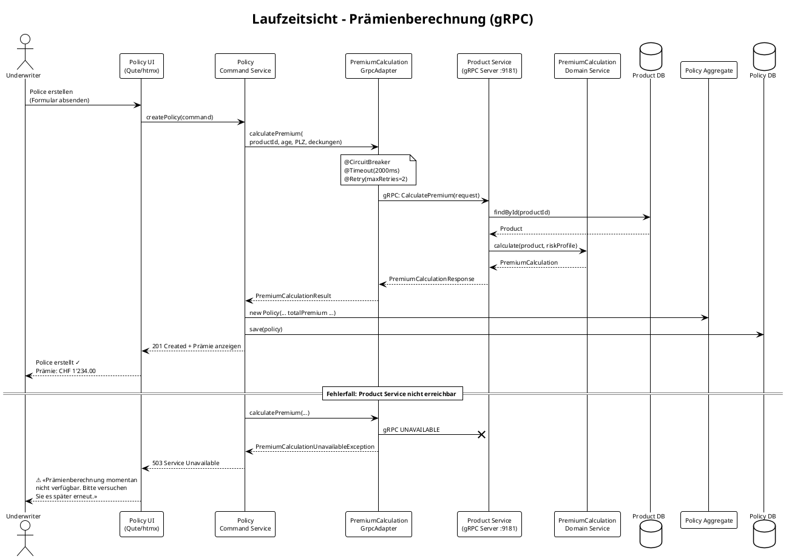

# Plan: gRPC-basierte Prämienberechnung (Policy → Product)

> **Version:** 1.0.0 · **Erstellt:** 2026-03-22  
> **Status:** Draft  
> **Scope:** Product Service (gRPC Server), Policy Service (gRPC Client), Architektur-Docs

---

## 1. Übersicht

### 1.1 Anforderung

Der Policy-Service benötigt bei der Policen-Erstellung und -Änderung eine **synchrone Prämienberechnung**, die der Product-Service bereitstellt. Die Berechnung basiert auf:

- **Produktkonfiguration** (Basis-Prämie, Produktlinie)
- **Individuelle Risikodaten** (Wohnort/PLZ, Alter des Versicherungsnehmers)

### 1.2 Architektur-Entscheidung

- **Protokoll:** gRPC (nicht REST), da binäres Protobuf effizienter ist und Quarkus erstklassigen gRPC-Support bietet
- **Graceful Degradation:** Ist der gRPC-Service nicht erreichbar, wird die Policen-Operation abgebrochen mit Benutzerhinweis *«Prämienberechnung momentan nicht verfügbar. Versuchen Sie es später.»*
- **Circuit Breaker:** MicroProfile Fault Tolerance (`@CircuitBreaker`, `@Timeout`, `@Retry`) auf dem gRPC-Client im Policy-Service
- **Neuer ADR-010:** Dokumentiert gRPC als erlaubtes Protokoll für synchrone Spezialfälle

### 1.3 Warum synchron?

Die Prämie **muss vor dem Speichern** einer Police berechnet werden – der Benutzer muss die berechnete Prämie sehen und bestätigen. Ein asynchrones Pattern (Event → warten auf Antwort-Event) wäre UX-technisch inakzeptabel und überengineered für eine einfache Query.

---

## 2. Phasen-Übersicht

| Phase | Beschreibung | Geschätzte Dauer |
|-------|-------------|------------------|
| **Phase 1** | Proto-Definition & Shared Contract | 0.5 Tage |
| **Phase 2** | Product Service – gRPC Server (Domain + Infra) | 2 Tage |
| **Phase 3** | Policy Service – gRPC Client (Port + Adapter + Degradation) | 2 Tage |
| **Phase 4** | Dokumentations-Updates (arc42, datamesh-spec, CLAUDE.md, etc.) | 1.5 Tage |
| **Phase 5** | Testing (Unit, Integration, Contract) | 2 Tage |
| **Phase 6** | Infrastruktur (Docker Compose, Health Checks, Observability) | 1 Tag |
| **Total** | | **~9 Tage** |

---

## 3. Phase 1 – Proto-Definition & Shared Contract

### 3.1 Aufgabe

Definition des gRPC-Service-Contracts als Protobuf `.proto`-Datei. Beide Services (Product = Server, Policy = Client) generieren daraus ihre Stubs.

### 3.2 Dateien

| Aktion | Datei | Beschreibung |
|--------|-------|-------------|
| **NEU** | `product/src/main/proto/premium_calculation.proto` | gRPC Service-Definition |
| **NEU** | `policy/src/main/proto/premium_calculation.proto` | Identische Kopie (Quarkus generiert Client-Stubs) |

### 3.3 Proto-Design

```protobuf
syntax = "proto3";

package ch.yuno.product.grpc;

option java_package = "ch.yuno.product.grpc";
option java_outer_classname = "PremiumCalculationProto";

service PremiumCalculationService {
  // Calculate the premium for a given product configuration and risk profile
  rpc CalculatePremium (PremiumCalculationRequest) returns (PremiumCalculationResponse);
}

message PremiumCalculationRequest {
  string product_id = 1;         // UUID of the product
  string product_line = 2;       // e.g. HAUSRAT, HAFTPFLICHT
  int32  age = 3;                // Age of the policyholder
  string postal_code = 4;        // Swiss postal code (PLZ)
  string canton = 5;             // Swiss canton code (optional, derived from PLZ)
  repeated string coverage_types = 6;  // Selected coverage types
}

message PremiumCalculationResponse {
  string base_premium = 1;       // Base premium from product (decimal as string)
  string risk_surcharge = 2;     // Surcharge based on age/location
  string coverage_surcharge = 3; // Surcharge based on selected coverages
  string discount = 4;           // Any applicable discounts
  string total_premium = 5;      // Final calculated premium
  string currency = 6;           // Always "CHF"
  string calculation_id = 7;     // Unique ID for audit trail
}
```

### 3.4 Entscheidungen

- **Decimal als String:** Protobuf hat keinen nativen `BigDecimal`-Typ. Strings vermeiden Rundungsfehler.
- **`calculation_id`:** Ermöglicht Audit-Trail und Nachvollziehbarkeit der Prämienberechnung.
- **Kein Streaming:** Einfacher Unary-RPC reicht, da eine Berechnung < 100ms dauern sollte.

---

## 4. Phase 2 – Product Service: gRPC Server

### 4.1 Hexagonale Architektur

```
Product Service
├── domain/
│   ├── model/
│   │   └── PremiumCalculation.java       ← Value Object (reines Java)
│   │   └── RiskProfile.java              ← Value Object (reines Java)
│   └── service/
│       └── PremiumCalculationService.java ← Domain Service (reine Business-Logik)
├── infrastructure/
│   └── grpc/
│       └── PremiumCalculationGrpcService.java ← gRPC Adapter (Driving Adapter)
```

**Regel:** Die Domain-Schicht (`domain/`) hat **keine** gRPC-, Protobuf- oder Framework-Abhängigkeiten. Der gRPC-Adapter übersetzt zwischen Protobuf-Messages und Domain-Objekten.

### 4.2 Neue Dateien – Product Service

| Aktion | Datei | Beschreibung |
|--------|-------|-------------|
| **NEU** | `product/src/main/proto/premium_calculation.proto` | Protobuf-Definition (s. Phase 1) |
| **NEU** | `product/src/main/java/ch/yuno/product/domain/model/RiskProfile.java` | Value Object: Alter, PLZ, Kanton |
| **NEU** | `product/src/main/java/ch/yuno/product/domain/model/PremiumCalculation.java` | Value Object: Berechnungsergebnis |
| **NEU** | `product/src/main/java/ch/yuno/product/domain/service/PremiumCalculationService.java` | Domain Service: reine Berechnungslogik |
| **NEU** | `product/src/main/java/ch/yuno/product/infrastructure/grpc/PremiumCalculationGrpcService.java` | gRPC Server-Adapter |
| **ÄNDERN** | `product/pom.xml` | Dependency `quarkus-grpc` hinzufügen |
| **ÄNDERN** | `product/src/main/resources/application.yaml` | gRPC-Server-Port konfigurieren (z.B. 9181) |

### 4.3 Domain Model Details

#### `RiskProfile.java` (Value Object, reines Java)

```java
// Kein Framework-Import!
public record RiskProfile(
    int age,
    String postalCode,
    String canton,
    List<String> coverageTypes
) {
    public RiskProfile {
        if (age < 0 || age > 150) throw new IllegalArgumentException("Invalid age: " + age);
        Objects.requireNonNull(postalCode, "postalCode must not be null");
    }
}
```

#### `PremiumCalculation.java` (Value Object, reines Java)

```java
public record PremiumCalculation(
    String calculationId,
    BigDecimal basePremium,
    BigDecimal riskSurcharge,
    BigDecimal coverageSurcharge,
    BigDecimal discount,
    BigDecimal totalPremium,
    String currency
) {}
```

#### `PremiumCalculationService.java` (Domain Service)

Reine Geschäftslogik, kein Framework:

```java
public class PremiumCalculationService {

    public PremiumCalculation calculate(Product product, RiskProfile riskProfile) {
        BigDecimal base = product.getBasePremium();
        BigDecimal riskSurcharge = calculateRiskSurcharge(base, riskProfile);
        BigDecimal coverageSurcharge = calculateCoverageSurcharge(base, riskProfile.coverageTypes());
        BigDecimal discount = calculateDiscount(base, riskProfile);
        BigDecimal total = base.add(riskSurcharge).add(coverageSurcharge).subtract(discount);
        
        return new PremiumCalculation(
            UUID.randomUUID().toString(),
            base, riskSurcharge, coverageSurcharge, discount,
            total.max(BigDecimal.ZERO),  // Prämie kann nicht negativ sein
            "CHF"
        );
    }
    
    // Risikozuschläge basierend auf Alter und Region
    private BigDecimal calculateRiskSurcharge(BigDecimal base, RiskProfile profile) { ... }
    
    // Zuschläge basierend auf gewählten Deckungen
    private BigDecimal calculateCoverageSurcharge(BigDecimal base, List<String> coverageTypes) { ... }
    
    // Rabatte (z.B. Junge-Leute-Rabatt, Bündelrabatt)
    private BigDecimal calculateDiscount(BigDecimal base, RiskProfile profile) { ... }
}
```

#### `PremiumCalculationGrpcService.java` (Infrastructure Adapter)

```java
@GrpcService  // Quarkus gRPC annotation
public class PremiumCalculationGrpcService 
    extends PremiumCalculationServiceGrpc.PremiumCalculationServiceImplBase {

    @Inject PremiumCalculationService domainService;
    @Inject ProductRepository productRepository;

    @Override
    public void calculatePremium(PremiumCalculationRequest request,
                                  StreamObserver<PremiumCalculationResponse> responseObserver) {
        // 1. Lookup product
        // 2. Map request → RiskProfile (domain value object)
        // 3. Call domainService.calculate(product, riskProfile)
        // 4. Map PremiumCalculation → PremiumCalculationResponse (protobuf)
        // 5. responseObserver.onNext() + onCompleted()
    }
}
```

### 4.4 pom.xml Änderungen – Product Service

```xml
<!-- gRPC -->
<dependency>
    <groupId>io.quarkus</groupId>
    <artifactId>quarkus-grpc</artifactId>
</dependency>
```

### 4.5 application.yaml Änderungen – Product Service

```yaml
quarkus:
  grpc:
    server:
      port: 9181           # Separater gRPC-Port
      health:
        enabled: true      # gRPC Health Check für Circuit Breaker
```

---

## 5. Phase 3 – Policy Service: gRPC Client

### 5.1 Hexagonale Architektur

```
Policy Service
├── domain/
│   └── port/
│       └── out/
│           └── PremiumCalculationPort.java  ← Outbound Port (Interface, reines Java)
├── infrastructure/
│   └── grpc/
│       └── PremiumCalculationGrpcAdapter.java ← gRPC Client-Adapter (Driven Adapter)
```

### 5.2 Neue Dateien – Policy Service

| Aktion | Datei | Beschreibung |
|--------|-------|-------------|
| **NEU** | `policy/src/main/proto/premium_calculation.proto` | Protobuf-Definition (Kopie, s. Phase 1) |
| **NEU** | `policy/src/main/java/ch/yuno/policy/domain/model/PremiumCalculationResult.java` | Domain Value Object für Berechnungsergebnis |
| **NEU** | `policy/src/main/java/ch/yuno/policy/domain/port/out/PremiumCalculationPort.java` | Outbound Port Interface |
| **NEU** | `policy/src/main/java/ch/yuno/policy/domain/service/PremiumCalculationUnavailableException.java` | Domain Exception |
| **NEU** | `policy/src/main/java/ch/yuno/policy/infrastructure/grpc/PremiumCalculationGrpcAdapter.java` | gRPC Client-Adapter mit Circuit Breaker |
| **ÄNDERN** | `policy/pom.xml` | Dependencies: `quarkus-grpc`, `quarkus-smallrye-fault-tolerance` |
| **ÄNDERN** | `policy/src/main/resources/application.yaml` | gRPC-Client-Config (Host, Port, Timeout) |
| **ÄNDERN** | `policy/src/main/java/ch/yuno/policy/domain/service/PolicyCommandService.java` | Premium-Berechnung bei `createPolicy` / `updatePolicyDetails` einbauen |
| **ÄNDERN** | `policy/src/main/java/ch/yuno/policy/infrastructure/web/PolicyUiController.java` | Error-Handling für `PremiumCalculationUnavailableException` |
| **ÄNDERN** | `policy/src/main/resources/templates/` | Fehlermeldung «Versuchen Sie es später» in Templates |

### 5.3 Domain Layer Details

#### `PremiumCalculationResult.java` (Value Object, reines Java)

```java
public record PremiumCalculationResult(
    String calculationId,
    BigDecimal basePremium,
    BigDecimal riskSurcharge,
    BigDecimal coverageSurcharge,
    BigDecimal discount,
    BigDecimal totalPremium,
    String currency
) {}
```

#### `PremiumCalculationPort.java` (Outbound Port, reines Java)

```java
/**
 * Outbound port for synchronous premium calculation.
 * Implemented by the gRPC adapter in the infrastructure layer.
 */
public interface PremiumCalculationPort {

    /**
     * Calculate the premium for a product with the given risk profile.
     *
     * @throws PremiumCalculationUnavailableException if the service is unreachable
     */
    PremiumCalculationResult calculatePremium(
        String productId,
        String productLine,
        int age,
        String postalCode,
        List<String> coverageTypes
    );
}
```

#### `PremiumCalculationUnavailableException.java`

```java
/**
 * Thrown when the premium calculation service is temporarily unavailable.
 * The policy operation must be retried later.
 */
public class PremiumCalculationUnavailableException extends RuntimeException {
    public PremiumCalculationUnavailableException(String message, Throwable cause) {
        super(message, cause);
    }
}
```

### 5.4 Infrastructure Layer Details

#### `PremiumCalculationGrpcAdapter.java`

```java
@ApplicationScoped
public class PremiumCalculationGrpcAdapter implements PremiumCalculationPort {

    @GrpcClient("premium-calculation")  // Quarkus gRPC client injection
    PremiumCalculationServiceGrpc.PremiumCalculationServiceBlockingStub client;

    @Override
    @CircuitBreaker(requestVolumeThreshold = 4, failureRatio = 0.5, delay = 10000)
    @Timeout(2000)    // 2 Sekunden Timeout
    @Retry(maxRetries = 2, delay = 500)
    public PremiumCalculationResult calculatePremium(
            String productId, String productLine,
            int age, String postalCode, List<String> coverageTypes) {
        try {
            var request = PremiumCalculationRequest.newBuilder()
                .setProductId(productId)
                .setProductLine(productLine)
                .setAge(age)
                .setPostalCode(postalCode)
                .addAllCoverageTypes(coverageTypes)
                .build();
            
            var response = client.calculatePremium(request);
            
            return new PremiumCalculationResult(
                response.getCalculationId(),
                new BigDecimal(response.getBasePremium()),
                new BigDecimal(response.getRiskSurcharge()),
                new BigDecimal(response.getCoverageSurcharge()),
                new BigDecimal(response.getDiscount()),
                new BigDecimal(response.getTotalPremium()),
                response.getCurrency()
            );
        } catch (StatusRuntimeException e) {
            throw new PremiumCalculationUnavailableException(
                "Premium calculation service unavailable", e);
        }
    }
}
```

### 5.5 PolicyCommandService Änderungen

Der `PolicyCommandService` wird um die `PremiumCalculationPort`-Injection ergänzt. Bei `createPolicy()` und `updatePolicyDetails()` wird vor dem Speichern die Prämie berechnet:

```java
@Inject
PremiumCalculationPort premiumCalculationPort;

@Transactional
public String createPolicy(String partnerId, String productId,
                           LocalDate coverageStartDate, LocalDate coverageEndDate,
                           int partnerAge, String postalCode,
                           List<String> coverageTypes) {
    // 1. Prämie berechnen (synchroner gRPC-Call)
    PremiumCalculationResult premium = premiumCalculationPort.calculatePremium(
        productId, /* productLine from ProductView */, partnerAge, postalCode, coverageTypes);
    
    // 2. Police erstellen mit berechneter Prämie
    String policyNumber = generatePolicyNumber();
    Policy policy = new Policy(policyNumber, partnerId, productId,
            coverageStartDate, coverageEndDate,
            premium.totalPremium(), BigDecimal.ZERO /* deductible */);
    // ...
}
```

### 5.6 UI Error Handling

Wenn `PremiumCalculationUnavailableException` geworfen wird:

- **PolicyUiController** fängt die Exception
- Rendert das Formular erneut mit einer **deutschen Fehlermeldung**:
  > *«Die Prämienberechnung ist momentan nicht verfügbar. Bitte versuchen Sie es später erneut.»*
- HTTP Status: **503 Service Unavailable**
- htmx: Fehlermeldung wird per `hx-swap` im Formular angezeigt

### 5.7 pom.xml Änderungen – Policy Service

```xml
<!-- gRPC Client -->
<dependency>
    <groupId>io.quarkus</groupId>
    <artifactId>quarkus-grpc</artifactId>
</dependency>

<!-- Fault Tolerance (Circuit Breaker, Retry, Timeout) -->
<dependency>
    <groupId>io.quarkus</groupId>
    <artifactId>quarkus-smallrye-fault-tolerance</artifactId>
</dependency>
```

### 5.8 application.yaml Änderungen – Policy Service

```yaml
quarkus:
  grpc:
    clients:
      premium-calculation:
        host: product-service    # Docker Compose service name
        port: 9181
```

---

## 6. Phase 4 – Dokumentations-Updates

### 6.1 Übersicht der zu ändernden Dateien

| Aktion | Datei | Änderung |
|--------|-------|----------|
| **ÄNDERN** | `specs/arc42.md` | ADR-010, Kontext-Diagramme, Bausteinsicht, Laufzeitsicht, Qualitätsbaum |
| **ÄNDERN** | `specs/datamesh-spec.md` | Lineage für synchrone Aufrufe |
| **ÄNDERN** | `CLAUDE.md` | gRPC als erlaubtes synchrones Protokoll |
| **ÄNDERN** | `README.md` | gRPC-Port in Service-Tabelle, Tech-Stack |
| **ÄNDERN** | `docs/services-overview.md` | Product-Service gRPC-Port, Architektur-Diagramm |
| **ÄNDERN** | `product/specs/business_spec.md` | Neue gRPC-Schnittstelle, Premium Calculation Service |
| **ÄNDERN** | `policy/specs/business_spec.md` | gRPC-Abhängigkeit, Graceful Degradation |

### 6.2 arc42.md – Änderungen im Detail

#### 6.2.1 Neuer ADR-010: gRPC für synchrone Spezialfälle

Einzufügen nach ADR-009 (Zeile ~1355):

```markdown
### ADR-010: gRPC für synchrone Domänen-Calls in Spezialfällen

**Status:** Accepted

**Kontext:** Die Prämienberechnung (Policy → Product) erfordert eine synchrone Antwort 
vor dem Speichern einer Police. Ein asynchrones Pattern (Event → Antwort-Event) ist für 
diesen Request-Reply-Use-Case überengineered und UX-inakzeptabel. REST wäre möglich, 
aber gRPC bietet binäres Protokoll (effizienter), Schema-First-Design (Protobuf) und 
erstklassigen Quarkus-Support.

**Entscheidung:** gRPC ist als synchrones Kommunikationsprotokoll für Spezialfälle 
erlaubt, wenn **alle** folgenden Bedingungen erfüllt sind:

1. **Request-Reply-Semantik zwingend** – der Aufrufer benötigt die Antwort vor dem 
   nächsten Verarbeitungsschritt (z.B. Prämie muss dem Benutzer angezeigt werden).
2. **Circuit Breaker & Timeout mandatory** – MicroProfile Fault Tolerance 
   (`@CircuitBreaker`, `@Timeout`, `@Retry`) auf jedem gRPC-Client.
3. **Graceful Degradation** – bei Nichterreichbarkeit wird der Use Case mit einer 
   benutzerfreundlichen Fehlermeldung abgebrochen (kein Fallback-Wert).
4. **Kein Write auf dem Server** – der gRPC-Call ist eine reine Query/Berechnung. 
   Schreibende Operationen laufen weiterhin über Kafka.
5. **Lineage-Registrierung** – jeder gRPC-Call wird als synchrone Datenfluss-Kante 
   in OpenLineage/Marquez erfasst.

**Anwendungsfälle:**

| Call | Client → Server | Protokoll | Bedingungen erfüllt |
|------|----------------|-----------|---------------------|
| Prämienberechnung | Policy → Product | gRPC | ✅ Query, CB+Timeout, Graceful Degradation |
| IAM-Authentifizierung | Alle → Keycloak | REST/OIDC | ✅ (ADR-003, bestehend) |

**Konsequenzen:**
- Product-Service exponiert gRPC-Server auf Port 9181 (zusätzlich zu REST auf 9081)
- Policy-Service hat eine Laufzeit-Abhängigkeit zum Product-Service für Prämienberechnung
- Bei Product-Service-Ausfall können keine neuen Policen erstellt werden (akzeptabler Tradeoff)
- Proto-Dateien müssen synchron in beiden Services gepflegt werden (kein Shared Module, 
  um SCS-Autonomie zu wahren)
```

#### 6.2.2 Technischer Kontext (Sektion 3.2) – Ergänzen

Ergänzung im PlantUML-Diagramm:

```
POLSVC ..> PRODSVC : gRPC (Prämienberechnung)
```

#### 6.2.3 Lösungsstrategie (Sektion 4.1) – Zeile anpassen

```markdown
| **Shared Nothing** | Keine geteilten Datenbanken; kein direkter Service-zu-Service-Aufruf (Ausnahme: gRPC für Berechnungen, s. ADR-010) |
| **gRPC für Spezialfälle** | Synchrone Berechnung (z.B. Prämie) via gRPC mit mandatorischem Circuit Breaker (ADR-010) |
```

#### 6.2.4 Bausteinsicht Policy (Sektion 5.2) – Ergänzen

Im PlantUML-Diagramm für Policy Management:
- Neuer Driven Adapter: `[gRPC Client\n(PremiumCalculation)]`
- Neuer Port: `interface "PremiumCalculationPort\n(Port)"`
- Neue Verbindung: `→ Product Service gRPC`

#### 6.2.5 Neue Laufzeitsicht (Sektion 6) – Neues Szenario

```markdown
### 6.x Szenario: Prämienberechnung bei Policen-Erstellung



#### 6.2.6 Qualitätsbaum (Sektion 10.1) – Ergänzen

- Unter **Resilienz**: `Circuit Breaker (gRPC)` hinzufügen neben `Circuit Breaker (REST)`

#### 6.2.7 Risiken (Sektion 11) – Neues Risiko

```markdown
| R-9 | **Synchrone Abhängigkeit Policy → Product (gRPC)** | Bei Product-Service-Ausfall können keine neuen Policen erstellt werden | Mitigiert durch ADR-010: Circuit Breaker + Timeout + Retry. Graceful Degradation mit Benutzerhinweis. Product-Service hat hohe Verfügbarkeit (>99.9%). |
```

### 6.3 datamesh-spec.md – Änderungen

#### 6.3.1 Neuer Abschnitt: Lineage für synchrone Aufrufe

Einzufügen nach Abschnitt 2 (Governance-Framework):

```markdown
## 2.1 Lineage-Tracking für synchrone Aufrufe (gRPC)

Neben der asynchronen Lineage (Kafka → Iceberg → SQLMesh) erfasst das Data Mesh 
auch **synchrone Datenflüsse** zwischen Domänen.

### Prinzip

Synchrone gRPC-Calls (z.B. Policy → Product für Prämienberechnung) werden als 
**OpenLineage RunEvents** in Marquez erfasst. Der gRPC-Client im aufrufenden 
Service emittiert ein OpenLineage-Event bei jedem Call.

### Erfasste Metadaten

| Feld | Wert (Beispiel) |
|------|-----------------|
| **producer** | `policy-service` |
| **job.name** | `policy.premium_calculation` |
| **input** | `product-service:grpc:PremiumCalculationService.CalculatePremium` |
| **output** | `policy-service:premium_calculation_result` |
| **facets** | `grpc.duration_ms`, `grpc.status_code`, `circuit_breaker.state` |

### Implementierung

1. **Interceptor-basiert:** Ein gRPC-ClientInterceptor im Policy-Service erfasst 
   automatisch jeden gRPC-Call und sendet ein OpenLineage-Event an Marquez.
2. **Marquez Job:** Der synchrone Call wird als eigener "Job" in Marquez modelliert 
   mit Input-Dataset (Product) und Output (berechnete Prämie).
3. **Visualisierung:** In der Marquez-Web-UI erscheint der synchrone Call als 
   Kante im Lineage-Graphen (Policy ──gRPC──► Product).

### Integration mit bestehendem Lineage-Flow

```
Partner → Kafka → Policy (Read Model)
Product → Kafka → Policy (Read Model)
Product ←──gRPC──── Policy (Prämienberechnung)  ← NEU
Policy  → Kafka → Billing
Policy  → Kafka → Claims
```
```

### 6.4 CLAUDE.md – Änderungen

#### 6.4.1 Tech Stack Tabelle – Ergänzen

```markdown
| **Synchrone Kommunikation** | gRPC (Quarkus gRPC) | Nur für ADR-010-konforme Spezialfälle (Berechnungen) |
```

#### 6.4.2 Architecture Constraints – Anpassen

Aktueller Text:
> **REST Exceptions:** Synchroner REST-Call nur für `Coverage Check` (Claims -> Policy) mit Mandatory Circuit Breaker.

Neuer Text:
> **Synchrone Ausnahmen (ADR-010):** gRPC-Calls sind erlaubt für reine Query-/Berechnungs-Use-Cases mit mandatorischem Circuit Breaker, Timeout und Graceful Degradation. Aktuell: Prämienberechnung (Policy → Product). REST nur für IAM (Keycloak).

#### 6.4.3 Directory Structure – Ergänzen

```
│   ├── infrastructure/
│   │   ├── persistence/       <-- JPA/Hibernate, Repositories
│   │   ├── messaging/         <-- Kafka Consumer/Producer (SmallRye)
│   │   ├── grpc/              <-- gRPC Server/Client Adapters (NEU)
│   │   └── web/               <-- JAX-RS Resources, Qute Controller, htmx
```

### 6.5 README.md – Änderungen

#### 6.5.1 Service-Tabelle – Product-Service ergänzen

```markdown
| Product (Insurance Products) | http://localhost:9081 | http://localhost:9081/swagger-ui | gRPC: 9181 | 5006 |
```

#### 6.5.2 Tech Stack – gRPC ergänzen

```markdown
| Sync Communication | gRPC (Quarkus gRPC, Protobuf) |
| Fault Tolerance | MicroProfile Fault Tolerance (SmallRye) |
```

#### 6.5.3 ADR-Tabelle – ADR-010 ergänzen

```markdown
| ADR-008 | Coverage check via local policy snapshot (no REST) – Claims fully autonomous |
| ADR-010 | gRPC for synchronous calculations (Policy→Product premium) with mandatory Circuit Breaker |
```

### 6.6 docs/services-overview.md – Änderungen

#### 6.6.1 Domain Services Tabelle – Product-Service ergänzen

```markdown
| **product-service** | 9081 (REST), 9181 (gRPC) | Bounded context for insurance product definitions. Publishes `product.v1.*` events via the outbox. Exposes gRPC endpoint for synchronous premium calculation (ADR-010). |
```

#### 6.6.2 Architecture Diagram – Ergänzen

Neue Verbindung im PlantUML:

```plantuml
POLS ..> PRS : gRPC (Premium Calculation\n:9181, ADR-010)
```

### 6.7 product/specs/business_spec.md – Änderungen

#### 6.7.1 Core Responsibilities – Ergänzen

```markdown
| **Premium calculation (gRPC)** | Calculate risk-adjusted premiums based on product config, age, and location (ADR-010) |
```

#### 6.7.2 Neuer Abschnitt: gRPC API

Einzufügen nach Abschnitt 5 (REST API):

```markdown
## 5.1 gRPC API (ADR-010)

The Product Service exposes a **synchronous gRPC endpoint** for premium calculation, 
consumed by the Policy Service during policy creation and updates.

| Service | Method | Port |
|---------|--------|------|
| `PremiumCalculationService` | `CalculatePremium` | 9181 |

**Proto definition:** `src/main/proto/premium_calculation.proto`

**Request fields:**
- `product_id` – UUID of the product
- `product_line` – Product line classification
- `age` – Policyholder age
- `postal_code` – Swiss postal code (PLZ)
- `coverage_types` – Selected coverage types

**Response fields:**
- `base_premium`, `risk_surcharge`, `coverage_surcharge`, `discount`, `total_premium`
- `currency` (always `CHF`)
- `calculation_id` (UUID for audit trail)

**Calculation rules:**
- Base premium from product definition
- Age surcharge: +10% for age < 25, +20% for age > 70
- Region surcharge: based on Swiss postal code risk zones
- Coverage surcharge: additive per selected coverage type
- Discounts: bundle discount for 3+ coverages
```

#### 6.7.3 Ubiquitous Language – Ergänzen

```markdown
| Prämienberechnung | premiumCalculation | The act of computing the risk-adjusted premium |
| Risikozuschlag | riskSurcharge | Additional premium charge based on age/location risk factors |
| Risikoprofil | riskProfile | Combination of age, postal code, and canton for risk assessment |
| Berechnungs-ID | calculationId | Unique identifier for a premium calculation (audit trail) |
```

### 6.8 policy/specs/business_spec.md – Änderungen

#### 6.8.1 Core Responsibilities – Ergänzen

```markdown
| **Premium calculation (sync)** | Request risk-adjusted premium from Product Service via gRPC before saving a policy (ADR-010) |
```

#### 6.8.2 Neuer Abschnitt: Synchrone gRPC-Abhängigkeit

Abschnitt 8 umbenennen und ergänzen:

```markdown
## 8. Synchronous Dependencies

### 8.1 Coverage Query (REST, ADR-003) – Inbound
[bestehender Text]

### 8.2 Premium Calculation (gRPC, ADR-010) – Outbound

The Policy Service calls the Product Service's gRPC endpoint to calculate the 
risk-adjusted premium before creating or updating a policy.

**Call flow:** Policy Service → `product-service:9181` → `PremiumCalculationService.CalculatePremium`

**Fault tolerance:**
- `@CircuitBreaker(requestVolumeThreshold=4, failureRatio=0.5, delay=10s)`
- `@Timeout(2000ms)`
- `@Retry(maxRetries=2, delay=500ms)`

**Graceful degradation:** If the Product Service is unreachable, the policy 
creation/update is aborted with a user-facing error message:
> «Die Prämienberechnung ist momentan nicht verfügbar. Bitte versuchen Sie es später erneut.»

**Data flow (Lineage):** This synchronous call is tracked in OpenLineage/Marquez 
as a direct dependency edge between the Policy and Product domains.
```

---

## 7. Phase 5 – Testing

### 7.1 Test-Strategie

| Test-Typ | Scope | Tool |
|----------|-------|------|
| **Unit Test** | `PremiumCalculationService` (Product Domain) | JUnit 5, reine Java-Tests |
| **Unit Test** | `PolicyCommandService` mit Mock-Port | JUnit 5, Mockito |
| **Integration Test** | gRPC Server (Product) | `@QuarkusTest`, Testcontainers |
| **Integration Test** | gRPC Client + Server (End-to-End) | `@QuarkusIntegrationTest`, Testcontainers |
| **Contract Test** | Proto-Kompatibilität | Buf / `protolock` |
| **Fault Tolerance Test** | Circuit Breaker, Timeout, Retry | `@QuarkusTest` mit WireMock/gRPC-Mock |

### 7.2 Neue Test-Dateien

| Datei | Beschreibung |
|-------|-------------|
| `product/src/test/java/.../domain/service/PremiumCalculationServiceTest.java` | Unit Tests für Berechnungslogik |
| `product/src/test/java/.../infrastructure/grpc/PremiumCalculationGrpcServiceTest.java` | Integration Test gRPC Server |
| `policy/src/test/java/.../infrastructure/grpc/PremiumCalculationGrpcAdapterTest.java` | Integration Test gRPC Client |
| `policy/src/test/java/.../domain/service/PolicyCommandServicePremiumTest.java` | Unit Test mit gemocktem Port |

### 7.3 Testszenarien

#### Unit Tests – PremiumCalculationService

| # | Szenario | Erwartetes Ergebnis |
|---|----------|---------------------|
| 1 | Basis-Berechnung (HAUSRAT, Alter 35, PLZ 8001) | basePremium + riskSurcharge + coverageSurcharge - discount = totalPremium |
| 2 | Junger Versicherungsnehmer (Alter 20) | +10% Risikozuschlag |
| 3 | Senior (Alter 75) | +20% Risikozuschlag |
| 4 | 3+ Deckungen (Bündelrabatt) | Discount > 0 |
| 5 | Ungültiges Alter (< 0) | `IllegalArgumentException` |
| 6 | Ungültige PLZ (null) | `NullPointerException` |
| 7 | Produkt mit basePremium = 0 | totalPremium = 0 |

#### Integration Tests – gRPC

| # | Szenario | Erwartetes Ergebnis |
|---|----------|---------------------|
| 1 | Erfolgreicher Call (Product existiert) | Response mit korrekter Prämie |
| 2 | Product nicht gefunden | gRPC Status `NOT_FOUND` |
| 3 | Circuit Breaker öffnet nach Fehlern | `PremiumCalculationUnavailableException` |
| 4 | Timeout (Server antwortet nicht) | Exception nach 2s |
| 5 | Retry bei temporärem Fehler | Erfolg nach Retry |

---

## 8. Phase 6 – Infrastruktur

### 8.1 Docker Compose Änderungen

| Datei | Änderung |
|-------|----------|
| `docker-compose.yaml` | Product-Service: Port `9181:9181` exponieren (gRPC) |
| `docker-compose.yaml` | Policy-Service: Environment-Variable `GRPC_PREMIUM_HOST=product-service` |

### 8.2 Health Checks

- **Product Service:** Quarkus gRPC Health Check automatisch aktiv (`quarkus.grpc.server.health.enabled=true`)
- **Policy Service:** gRPC-Client Health wird über den Circuit Breaker State reflektiert
- **Prometheus:** gRPC-Metriken via `quarkus-micrometer-registry-prometheus` (bereits vorhanden)

### 8.3 Observability

| Metrik | Quelle | Beschreibung |
|--------|--------|-------------|
| `grpc_server_calls_total` | Product Service | Anzahl gRPC-Calls |
| `grpc_server_calls_duration` | Product Service | Latenz der Prämienberechnung |
| `grpc_client_calls_total` | Policy Service | Anzahl ausgehender gRPC-Calls |
| `ft.circuitbreaker.state` | Policy Service | Circuit Breaker Status (CLOSED/OPEN/HALF_OPEN) |
| `ft.timeout.calls.total` | Policy Service | Timeout-Counter |
| `ft.retry.calls.total` | Policy Service | Retry-Counter |

### 8.4 Grafana Dashboard

Neues Panel im bestehenden Grafana-Dashboard für:
- gRPC Call Rate & Latenz (p50, p95, p99)
- Circuit Breaker State Timeline
- Error Rate (UNAVAILABLE, DEADLINE_EXCEEDED)

---

## 9. Zusammenfassung: Alle betroffenen Dateien

### Neue Dateien (14)

| # | Datei | Beschreibung |
|---|-------|-------------|
| 1 | `product/src/main/proto/premium_calculation.proto` | Protobuf Service-Definition |
| 2 | `policy/src/main/proto/premium_calculation.proto` | Protobuf (Client-Kopie) |
| 3 | `product/.../domain/model/RiskProfile.java` | Value Object |
| 4 | `product/.../domain/model/PremiumCalculation.java` | Value Object |
| 5 | `product/.../domain/service/PremiumCalculationService.java` | Domain Service |
| 6 | `product/.../infrastructure/grpc/PremiumCalculationGrpcService.java` | gRPC Server-Adapter |
| 7 | `policy/.../domain/model/PremiumCalculationResult.java` | Value Object |
| 8 | `policy/.../domain/port/out/PremiumCalculationPort.java` | Outbound Port |
| 9 | `policy/.../domain/service/PremiumCalculationUnavailableException.java` | Domain Exception |
| 10 | `policy/.../infrastructure/grpc/PremiumCalculationGrpcAdapter.java` | gRPC Client-Adapter |
| 11 | `product/src/test/.../PremiumCalculationServiceTest.java` | Unit Tests |
| 12 | `product/src/test/.../PremiumCalculationGrpcServiceTest.java` | Integration Tests |
| 13 | `policy/src/test/.../PremiumCalculationGrpcAdapterTest.java` | Integration Tests |
| 14 | `policy/src/test/.../PolicyCommandServicePremiumTest.java` | Unit Tests |

### Geänderte Dateien (13)

| # | Datei | Änderung |
|---|-------|----------|
| 1 | `product/pom.xml` | `quarkus-grpc` Dependency |
| 2 | `policy/pom.xml` | `quarkus-grpc`, `quarkus-smallrye-fault-tolerance` Dependencies |
| 3 | `product/src/main/resources/application.yaml` | gRPC Server Port 9181 |
| 4 | `policy/src/main/resources/application.yaml` | gRPC Client Config |
| 5 | `policy/.../domain/service/PolicyCommandService.java` | PremiumCalculationPort Integration |
| 6 | `policy/.../infrastructure/web/PolicyUiController.java` | Error Handling |
| 7 | `specs/arc42.md` | ADR-010, Diagramme, Risiken |
| 8 | `specs/datamesh-spec.md` | Synchrone Lineage |
| 9 | `CLAUDE.md` | gRPC in Tech Stack & Constraints |
| 10 | `README.md` | gRPC-Port, Tech Stack, ADR-Tabelle |
| 11 | `docs/services-overview.md` | Product gRPC-Port, Architektur-Diagramm |
| 12 | `product/specs/business_spec.md` | gRPC API, Premium Calculation |
| 13 | `policy/specs/business_spec.md` | gRPC-Abhängigkeit, Graceful Degradation |

---

## 10. Offene Fragen & Entscheidungen

| # | Frage | Vorschlag | Status |
|---|-------|-----------|--------|
| 1 | Sollen die Proto-Dateien in einem Shared Maven-Modul liegen? | **Nein** – jeder Service hat seine eigene Kopie (SCS-Prinzip, Autonomie). Sync via CI-Check. | Vorgeschlagen |
| 2 | Soll die Prämienberechnung als Kafka-Event geloggt werden? | **Ja** – jede Berechnung wird als `product.v1.premium-calculated` Event in die Outbox geschrieben (Audit Trail). | Offen |
| 3 | Braucht es ein Caching der Prämienberechnung im Policy-Service? | **Nein** – initialer Aufbau. Kann später ergänzt werden, wenn Latenz ein Problem wird. | Vorgeschlagen |
| 4 | Wie wird die PLZ → Risikozone Zuordnung gespeichert? | **Konfigurationsdatei** (CSV/JSON) im Product-Service, geladen beim Start. Keine externe DB-Abhängigkeit. | Vorgeschlagen |
| 5 | Soll der `docker-compose.yaml` den gRPC-Port für Product exponieren? | **Ja** – Port 9181 wird gemappt. Intern über Docker-Network erreichbar für Policy-Service. | Vorgeschlagen |

---

## 11. Abhängigkeiten & Reihenfolge

```
Phase 1 (Proto) ──► Phase 2 (Product gRPC Server)
                └──► Phase 3 (Policy gRPC Client)
                         └──► Phase 5 (Integration Tests)
Phase 4 (Docs) kann parallel zu Phase 2+3 laufen
Phase 6 (Infra) nach Phase 2+3
```

**Kritischer Pfad:** Phase 1 → Phase 2 → Phase 3 → Phase 5

