# arc42 Architekturdokumentation – Sachversicherung Datamesh

## 1. Einführung und Ziele

### 1.1 Aufgabenstellung

Aufbau einer modernen Versicherungsplattform für eine Sachversicherung auf Basis von:

- **Domain-Driven Design (DDD)** mit klar abgegrenzten Bounded Contexts
- **Hexagonal Architecture** (Ports & Adapters) pro Domäne
- **Self-Contained Systems (SCS)** – jede Domäne ist eine eigenständige Applikation
- **Data Mesh** – jede Domäne besitzt und publiziert ihre Daten als Produkt
- **Asynchrone Integration** via Apache Kafka als primäres Integrationsmuster

### 1.2 Qualitätsziele

| Priorität | Qualitätsmerkmal | Motivation |
|-----------|-----------------|------------|
| 1 | **Autonomie** | Teams entwickeln und deployen unabhängig voneinander |
| 2 | **Datensouveränität** | Jede Domäne ist Owner ihrer Daten (Data Mesh) |
| 3 | **Skalierbarkeit** | Kritische Domänen (Claims, Policy) skalieren unabhängig |
| 4 | **Ausfallsicherheit** | Ausfall einer Domäne beeinflusst andere minimal |
| 5 | **Nachvollziehbarkeit** | Vollständiger Audit-Trail aller Geschäftsvorfälle |

### 1.3 Stakeholder

| Stakeholder | Erwartung |
|-------------|-----------|
| Versicherungsnehmer | Einfache Antragstellung, transparente Schadensabwicklung |
| Underwriter | Risikobeurteilung und Vertragsführung |
| Schadensachbearbeiter | Effiziente Schadensabwicklung |
| IT-Architekten | Klare Schnittstellendefinitionen via ODC |
| Compliance | Vollständige Audit-Trails, DSGVO-Konformität |

---

## 2. Randbedingungen

### 2.1 Technische Randbedingungen

| Constraint | Beschreibung |
|------------|--------------|
| Java 21+ | Alle Services in Java 21 mit Virtual Threads |
| Quarkus | Micro-Framework für schnellen Start und geringen Footprint |
| Apache Kafka | Einziger Kanal für asynchrone Domänenintegration |
| REST | Synchrone Kommunikation nur wo zwingend nötig |
| PostgreSQL | Relationale Persistenz pro Domäne (eigene DB-Instanz) |
| Qute + Bootstrap + htmx | Server-seitige UIs, kein SPA-Overhead |
| Open Data Contract (ODC) | Formale Beschreibung aller publizierten Datensätze |
| Hibernate Envers | Versionierung und Audit-Trails für Entities |

---

### 2.2 Organisatorische Randbedingungen

- Ein autonomes Team pro Domäne (Conway's Law bewusst genutzt)
- Jede Domäne deployed unabhängig (kein gemeinsamer Release-Zug)
- Data Contracts sind verbindliche API-Verträge für Kafka-Topics

---

## 3. Kontextabgrenzung

> **Fachliche Spezifikationen der implementierten Services:**
> - Partner/Customer Service → [`partner/specs/business_spec.md`](../partner/specs/business_spec.md)
> - Product Management Service → [`product/specs/business_spec.md`](../product/specs/business_spec.md)
> - Policy Management Service → [`policy/specs/business_spec.md`](../policy/specs/business_spec.md)

### 3.1 Fachlicher Kontext (Context Map)

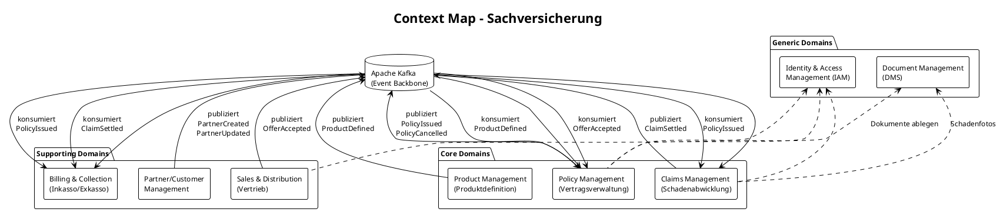

### 3.2 Technischer Kontext

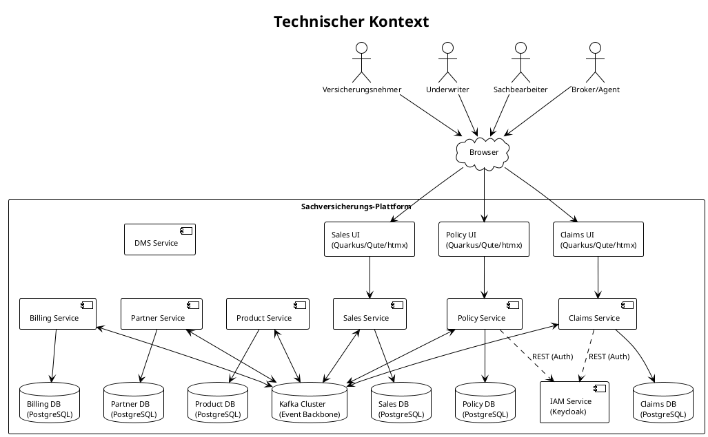

---

## 4. Lösungsstrategie

### 4.1 Architektur-Entscheidungen

| Entscheidung | Begründung |
|--------------|------------|
| **Self-Contained Systems** | Jede Domäne ist deploybar, testbar und skalierbar ohne andere Domänen |
| **Event-First (Kafka)** | Entkopplung in Raum und Zeit; natürliche Audit-Logs |
| **Data Mesh** | Domänen publishen Daten als Produkt mit Open Data Contract |
| **Hexagonal Architecture** | Domänenlogik ist unabhängig von Infrastruktur (DB, Kafka, UI) |
| **Shared Nothing** | Keine geteilten Datenbanken; kein direkter Service-zu-Service-Aufruf |
| **REST nur synchron** | Für zeitkritische Queries (z.B. IAM-Auth) als Ausnahme |

### 4.2 Data Mesh Prinzipien

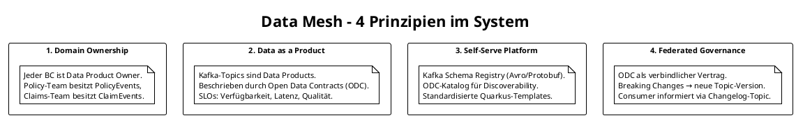

---

## 5. Bausteinsicht

> **Implementierte Services und ihre fachlichen Spezifikationen:**
>
> | Service | Fachspezifikation | Port |
> |---|---|---|
> | Partner/Customer Management | [`partner/specs/business_spec.md`](../partner/specs/business_spec.md) | 9080 |
> | Product Management | [`product/specs/business_spec.md`](../product/specs/business_spec.md) | 9081 |
> | Policy Management | [`policy/specs/business_spec.md`](../policy/specs/business_spec.md) | 9082 |

### 5.1 Ebene 1 – Systemübersicht

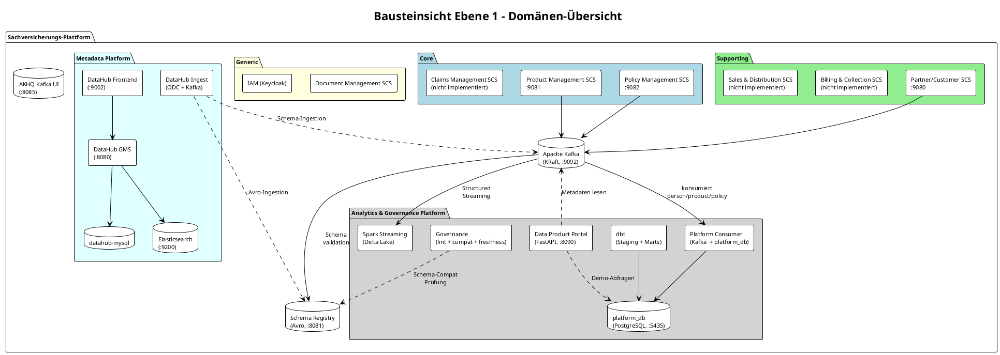

### 5.2 Ebene 2 – Policy Management SCS (Hexagonal)

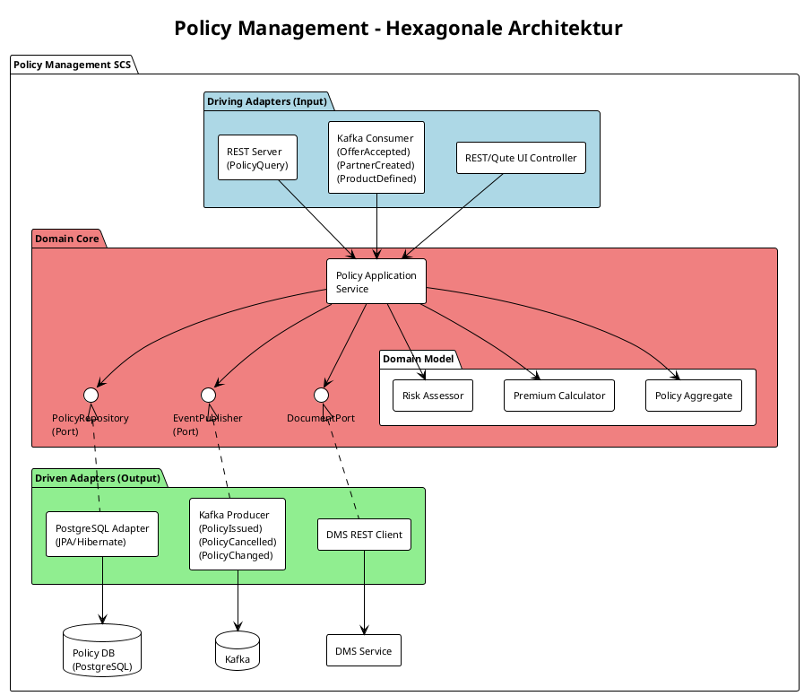

### 5.3 Ebene 2 – Claims Management SCS (Hexagonal)

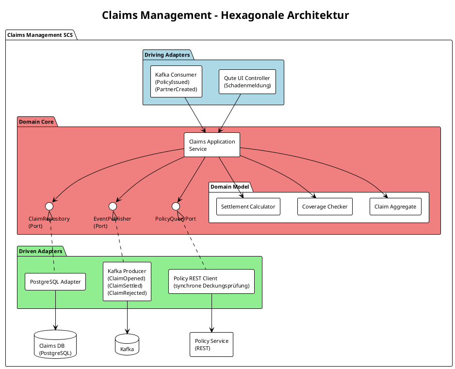

---

## 6. Laufzeitsicht

### 6.1 Szenario: Police ausstellen (Policy Issuance)

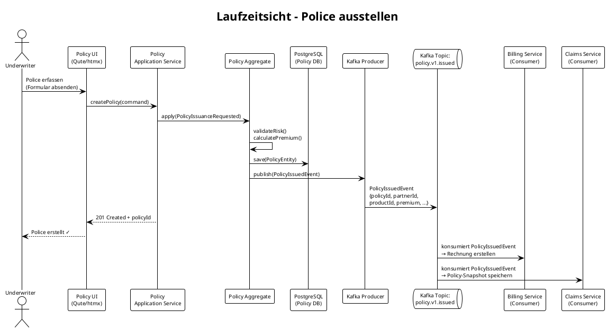

### 6.2 Szenario: Partner im Policy-Erfassungsformular suchen (Partner Picker)

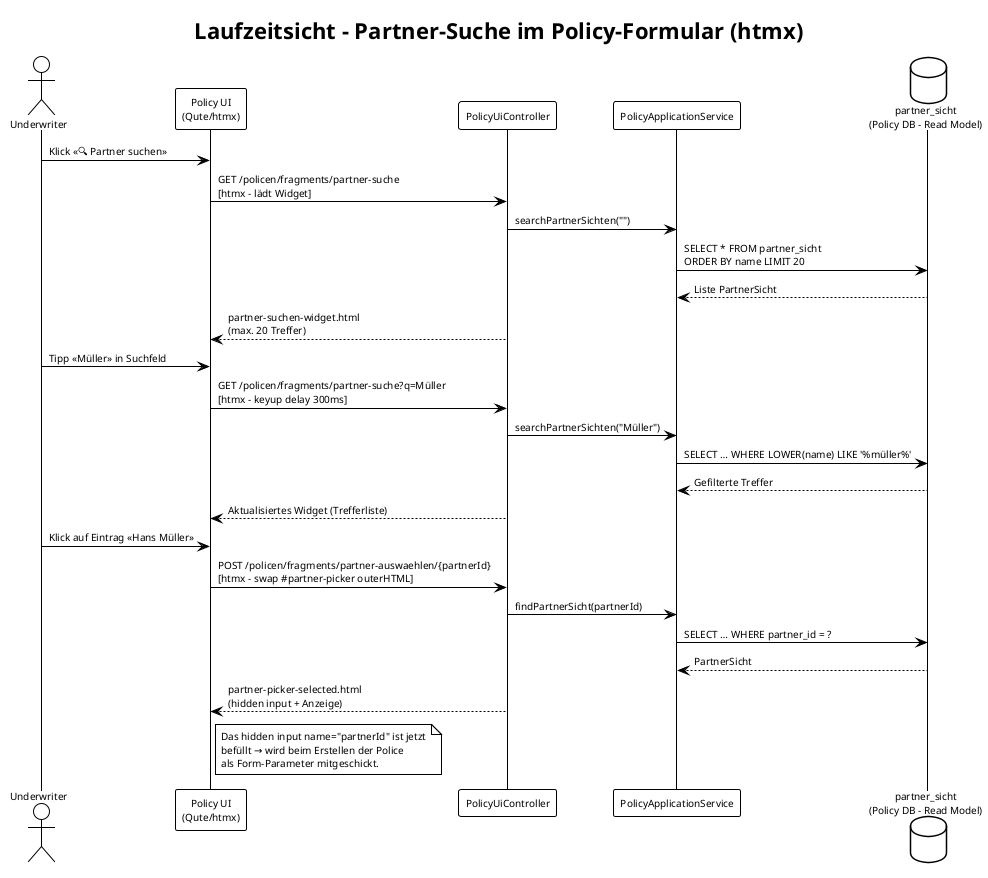

**Technische Umsetzung:**

| Schicht | Komponente | Verantwortung |
|---------|-----------|---------------|
| Port | `PartnerSichtRepository.search(nameQuery)` | Interface für Name-Suche (max 20 Treffer) |
| Adapter | `PartnerSichtJpaAdapter.search(nameQuery)` | JPA JPQL: `LOWER(name) LIKE :q` |
| Service | `PolicyApplicationService.searchPartnerSichten(q)` | Delegiert an Repository |
| Service | `PolicyApplicationService.findPartnerSicht(id)` | Lookup für Selektion |
| Controller | `GET /policen/fragments/partner-suche?q=` | Liefert Such-Widget (Qute-Fragment) |
| Controller | `POST /policen/fragments/partner-auswaehlen/{id}` | Liefert «Ausgewählt»-State des Pickers |
| Template | `partner-suchen-widget.html` | Live-Such-Panel mit Trefferliste |
| Template | `partner-picker-selected.html` | Picker im «Partner gewählt»-Zustand |

**Datenfluss (Data Mesh – keine direkte DB-Abhängigkeit):**  
Die `partner_sicht`-Tabelle im Policy-Service ist ein lokales Read Model, das ausschließlich durch Kafka-Events (`person.v1.created`, `person.v1.updated`) befüllt wird. Die Suche läuft vollständig gegen diese materialisierte Sicht – es gibt keine synchrone REST-Abhängigkeit zum Partner-Service (ADR-001).


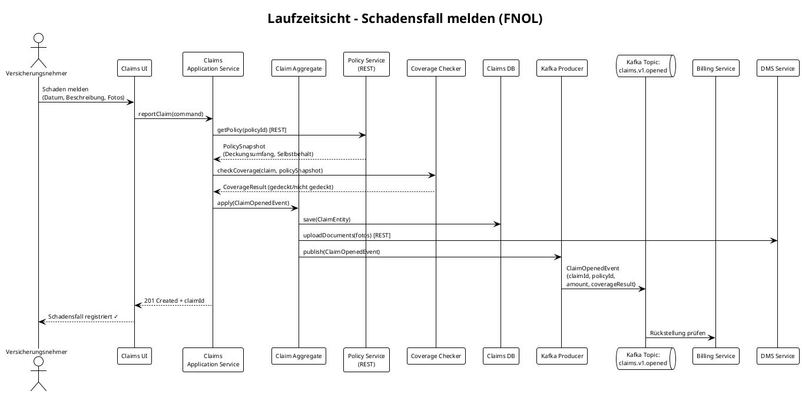

### 6.3 Szenario: Schadensfall abschliessen (Settlement)

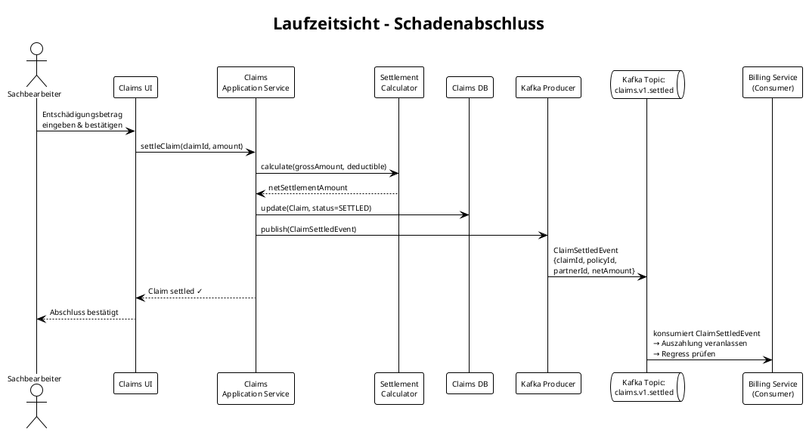

---

## 7. Verteilungssicht

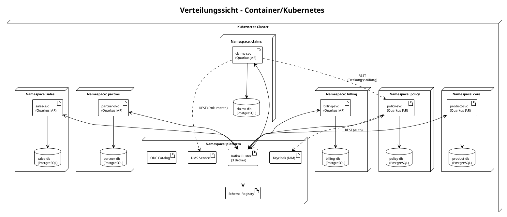

### 7.2 Lokale Entwicklungsumgebung (Podman Compose)

Alle Services laufen lokal via `podman compose up`. Ports und Abhängigkeiten:

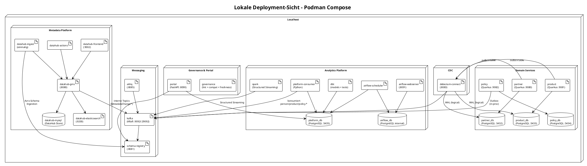

**Startup-Reihenfolge (docker-compose depends_on):**

1. `kafka` → `schema-registry`, `akhq`, `kafka-init`
2. `partner-db`, `product-db`, `policy-db` → je Domain-Service
3. `debezium-connect` (depends: kafka, partner-db, product-db) → `debezium-init`
4. `platform-db` → `platform-consumer`, `dbt`
5. `airflow-db` → `airflow-init` → `airflow-scheduler`, `airflow-webserver`
6. `portal`, `governance` (depends: schema-registry healthy, platform-db)
7. `datahub-mysql`, `datahub-elasticsearch` → `datahub-kafka-setup` → `datahub-upgrade` → `datahub-gms` → `datahub-frontend`, `datahub-actions`, `datahub-ingest`

---

## 8. Querschnittliche Konzepte

### 8.1 Data Mesh – Open Data Contracts

Jedes Kafka-Topic wird durch einen **Open Data Contract (ODC)** beschrieben und im ODC-Katalog registriert. Dies ist der verbindliche "Vertrag" zwischen Producer und Consumer.

**Beispiel ODC für `policy.v1.issued`:**

```yaml
# policy.v1.issued.odcontract.yaml
apiVersion: v1
kind: DataContract
metadata:
  name: policy.v1.issued
  version: "1.2.0"
  domain: policy
  description: Event published when a policy is successfully activated (DRAFT → ACTIVE)

spec:
  topic: policy.v1.issued
  format: AVRO
  schemaRegistry: http://schema-registry:8081
  schemaSubject: policy.v1.issued-value

  schema:
    fields:
      - name: eventId
        type: string
        format: uuid
        nullable: false
      - name: eventType
        type: string
        enum: ["PolicyIssued"]
        nullable: false
      - name: policyId
        type: string
        format: uuid
        nullable: false
        description: Unique policy identifier
      - name: policyNumber
        type: string
        nullable: false
        description: Human-readable policy number (e.g. POL-00042)
      - name: partnerId
        type: string
        format: uuid
        nullable: false
        description: Reference to Partner domain (person)
      - name: productId
        type: string
        format: uuid
        nullable: false
        description: Reference to Product domain
      - name: coverageStartDate
        type: string
        format: date
        nullable: false
      - name: premium
        type: string
        description: Annual premium in CHF
        nullable: false
      - name: timestamp
        type: string
        format: datetime
        nullable: false

  quality:
    - type: SodaCL
      checks: |
        checks for policy.v1.issued:
          - not_null:
              columns: [eventId, eventType, policyId, policyNumber, partnerId, productId, coverageStartDate, premium, timestamp]
          - no_duplicate_rows:
              columns: [eventId]

dataProduct:
  owner: team-policy@css.ch
  domain: policy
  outputPort: kafka
  sla:
    freshness: 5m
    availability: "99.9%"
    qualityScore: 0.98
  tags:
    - pii
```

### 8.2 Kafka Topic-Konvention

```
{domain}.v{version}.{event-name}

Beispiele:
  policy.v1.issued
  policy.v1.cancelled
  claims.v1.opened
  claims.v1.settled
  partner.v1.created
  product.v1.defined
```

**Breaking Changes** erfordern eine neue Major-Version (z.B. `policy.v2.issued`). Der alte Topic wird für eine Übergangsperiode parallel betrieben (Consumer-Driven Contract Testing).

### 8.3 Hexagonal Architecture – Schichtenstruktur (Quarkus)

```
{domain}/
├── src/main/java/ch/css/{domain}/
│   ├── domain/                    ← Reine Domänenlogik (kein Framework)
│   │   ├── model/                 ← Aggregate, Entities, Value Objects
│   │   ├── service/               ← Application Services
│   │   └── port/                  ← Interfaces (Input/Output Ports)
│   │       ├── in/                ← UseCasePorts (Commands/Queries)
│   │       └── out/               ← RepositoryPort, EventPublisherPort
│   └── infrastructure/            ← Adapter-Implementierungen
│       ├── persistence/           ← JPA/Hibernate Adapter
│       ├── messaging/             ← Kafka Producer/Consumer (SmallRye)
│       ├── api/                   ← REST Server/Client
│       └── web/                   ← Qute Templates + REST Controllers
├── src/main/resources/
│   ├── templates/                 ← Qute HTML-Templates (UI-Text auf Deutsch)
│   └── contracts/                 ← ODC YAML-Dateien
└── src/test/
    ├── domain/                    ← Unit Tests (reine Domäne, kein Framework)
    └── integration/               ← @QuarkusIntegrationTest (Testcontainers)
```

### 8.4 Event-Sourcing Light (Outbox Pattern)

Um Dual-Write-Probleme zu vermeiden (DB schreiben + Kafka publishen), wird das **Transactional Outbox Pattern** eingesetzt:

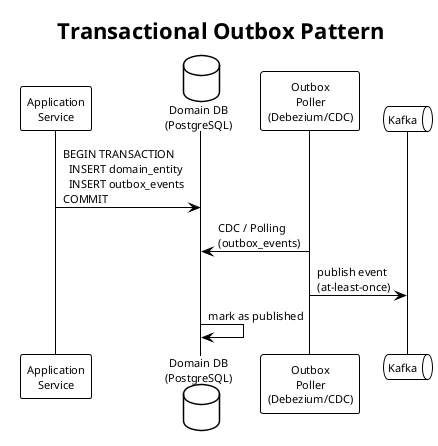

### 8.5 Authentifizierung und Autorisierung

- **IAM:** Keycloak (OIDC/OAuth2) – einzige synchrone Abhängigkeit via REST
- **Token-Propagation:** Bearer Tokens in allen HTTP-Requests (Quarkus OIDC)
- **RBAC:** Quarkus `@RolesAllowed` auf Application-Service-Ebene
- **Rollen:** `UNDERWRITER`, `CLAIMS_AGENT`, `BROKER`, `ADMIN`

### 8.6 Data Mesh Analytics- und Governance-Plattform

Die Plattformschicht konsumiert alle Domain-Events und stellt sie als analysierbares Data Warehouse bereit. Sie greift **nie direkt auf die operativen Domain-Datenbanken zu** (ADR-004: Data Inside vs. Data Outside).

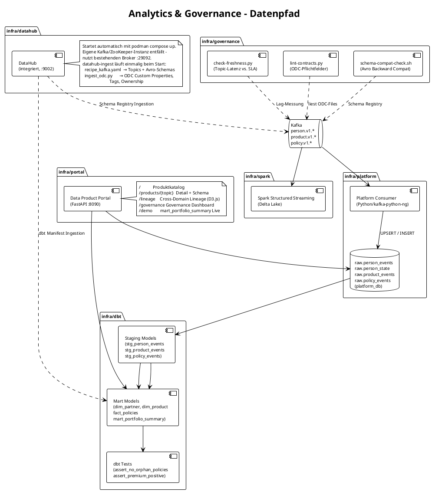

**dbt-Modellhierarchie:**

| Layer | Model | Quelle | Beschreibung |
| --- | --- | --- | --- |
| Staging | `stg_person_events` | `raw.person_events` | JSON-Parsing, typisierte Spalten |
| Staging | `stg_product_events` | `raw.product_events` | JSON-Parsing, typisierte Spalten |
| Staging | `stg_policy_events` | `raw.policy_events` | JSON-Parsing, typisierte Spalten |
| Mart | `dim_partner` | `stg_person_events` | Aktuellster Stand pro Person |
| Mart | `dim_product` | `stg_product_events` | Aktuellster Stand pro Produkt |
| Mart | `fact_policies` | `stg_policy_events` | Eine Zeile pro Police (aktiver Status) |
| Mart | `mart_portfolio_summary` | `fact_policies` + `dim_partner` + `dim_product` | Cross-Domain-Aggregation: aktive Policen pro Stadt und Produktlinie |

**Governance-Prüfungen (laufen beim Compose-Start):**

| Skript | Prüfung | Fehlverhalten |
| --- | --- | --- |
| `lint-contracts.py` | Alle ODC-Felder mandatory: owner, domain, outputPort, freshness, availability, qualityScore, tags | Exit 1 → Build fehlschlägt |
| `schema-compat-check.sh` | Avro-Schemas backward-kompatibel gegen Schema Registry | Exit 1 → Deployment blockiert |
| `check-freshness.py` | Topic-Lag ≤ SLA-Freshness (5m default) | Exit 1 → Alert im Portal |

### 8.7 Event-Carried State Transfer (ECST) – `person.v1.state`

Neben den Delta-Events (`person.v1.created`, `person.v1.updated`, …) publiziert der Partner-Service das Topic **`person.v1.state`** als **compacted Kafka Topic** (cleanup.policy=compact).

**Zweck:** Consumer können ihren lokalen Read-Model ohne vollständiges Event-Replay aufbauen – sie lesen nur den aktuellen State-Snapshot.

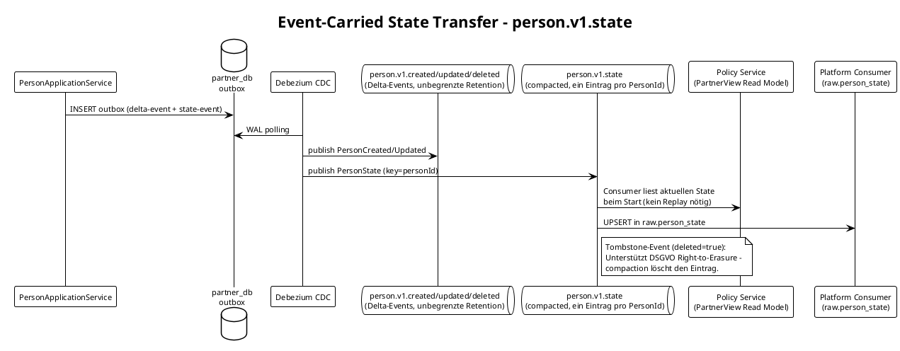

**ECST vs. Delta-Events – Vergleich:**

| Aspekt | Delta-Events (`person.v1.created`) | State-Topic (`person.v1.state`) |
| --- | --- | --- |
| Inhalt | Einzelne Mutation | Vollständiger aktueller Zustand |
| Retention | Unbegrenzt (7 Jahre) | Compacted (nur neuester Wert pro Key) |
| Verwendung | Audit Trail, Event Sourcing | Read-Model Bootstrap, Query |
| GDPR Erasure | Tombstone + Nachfolge-Events | Tombstone löscht Eintrag via Compaction |

---

## 9. Architekturentscheidungen (ADRs)

### ADR-001: Asynchrone Integration via Kafka

**Status:** Accepted

**Kontext:** Domänen müssen kommunizieren, ohne voneinander abhängig zu sein.

**Entscheidung:** Kafka ist der einzige Integrationskanal. Direkte DB-Zugriffe zwischen Domänen sind verboten.

**Konsequenzen:** Eventual Consistency muss akzeptiert werden. Kompensations-Events statt Rollbacks.

---

### ADR-002: Open Data Contract als verbindlicher Vertrag

**Status:** Accepted

**Kontext:** Ohne formale Verträge entstehen implizite Abhängigkeiten zwischen Teams.

**Entscheidung:** Jedes Kafka-Topic hat einen ODC. Breaking Changes erfordern neue Topic-Version und Abstimmung mit Consumern.

**Konsequenzen:** Initiale Mehrarbeit bei Produktdefinition. Langfristig weniger Integrationsprobleme.

---

### ADR-003: REST nur für synchrone Ausnahmen

**Status:** Accepted

**Kontext:** Deckungsprüfung bei Schadenmeldung braucht aktuelle Policy-Daten (Eventual Consistency reicht nicht).

**Entscheidung:** Claims -> Policy via REST für Deckungsprüfung. Alle anderen Integrationen via Kafka.

**Konsequenzen:** Policy-Service wird zu einer synchronen Abhängigkeit von Claims. Circuit Breaker notwendig.

---

### ADR-004: Shared Nothing – keine geteilten Datenbanken

**Status:** Accepted

**Kontext:** Geteilte Datenbanken schaffen implizite Kopplung zwischen Teams.

**Entscheidung:** Jede Domäne hat ihre eigene PostgreSQL-Instanz. Cross-Domain-Queries werden über Events oder REST abgebildet.

**Konsequenzen:** Kein JOIN über Domänengrenzen. Reporting-Bedarf wird durch dedizierte Read-Models (materialisierte Views aus Events) abgedeckt.

---

### ADR-006: Transactional Outbox Pattern via Debezium CDC (Partner Service)

**Status:** Accepted

**Kontext:** Der bisherige Ansatz im Partner Service publizierte Kafka-Events direkt nach dem Datenbank-Commit (Dual-Write). Fiel der Kafka-Publish fehl, war das Event verloren, obwohl die DB-Transaktion committed war. Dies verletzt das Prinzip der at-least-once Delivery und widerspricht dem architektonischen Qualitätsziel «Ausfallsicherheit».

**Entscheidung:** Der Partner Service schreibt Domain-Events atomar in eine `outbox`-Tabelle innerhalb derselben DB-Transaktion wie die Geschäftsdaten. Debezium Connect liest neue Zeilen via PostgreSQL WAL (logical replication) und publiziert sie an die Kafka-Topics. Der Application Service hat keine direkte Kafka-Abhängigkeit mehr.

```
PersonApplicationService
  └─ outbox INSERT (same TX as domain entity)
       └─ PostgreSQL WAL (wal_level=logical)
            └─ Debezium Connect (EventRouter SMT)
                 └─ Kafka topics  person.v1.*
```

**Konsequenzen:**
- Garantierte at-least-once Delivery (keine Events gehen verloren)
- Leichte Erhöhung der End-to-End-Latenz (WAL-Polling-Intervall von Debezium, typisch < 500ms)
- Debezium Connect ist eine neue Infrastrukturkomponente (eigener Container, Port 8083)
- PostgreSQL benötigt `wal_level=logical` (bereits in `docker-compose.yaml` konfiguriert)
- Der Partner Service hat keine `quarkus-messaging-kafka`-Abhängigkeit mehr

---

### ADR-005: Sprachpolitik – Code Englisch, UI Deutsch

**Status:** Accepted

**Kontext:** Das Projekt richtet sich an eine deutschsprachige Organisation (CSS), die Code jedoch international wartbar halten muss. Ohne klare Regel entstehen Mischsprachen im Codebase.

**Entscheidung:** Strikte Trennung nach Schicht:

| Schicht | Sprache | Beispiele |
| --- | --- | --- |
| Code (Klassen, Methoden, Felder, Logs, Exceptions) | Englisch | `PolicyRepository`, `coverageStartDate`, `PersonCreated` |
| UI (Qute-Templates, Labels, Buttons, Fehlermeldungen) | Deutsch | «Police ausstellen», «Bitte Vorname eingeben» |
| Dokumentation (`specs/`, `CLAUDE.md`) | Englisch | Dieses Dokument (Ausnahme: arc42 auf Deutsch) |
| Kafka Event Types | Englisch, PascalCase | `PolicyIssued`, nicht `PolicyAusgestellt` |

**Konsequenzen:**

- Domänenmodell vollständig in Englisch (`Person`, `Policy`, `Coverage`, `CoverageType.GLASS_BREAKAGE`)
- Qute-Templates vollständig in Deutsch (Benutzerinterface)
- Technische Schuld: Partner- und Policy-Service haben teilweise noch deutsche Feldnamen (R-6, R-7)

---

### ADR-007: Event-Carried State Transfer (ECST) via `person.v1.state`

**Status:** Accepted

**Kontext:** Consumer des Partner-Service müssen bei einem Neustart alle vergangenen Person-Events replay'en, um ihr lokales Read-Model zu befüllen. Bei hohem Eventvolumen ist das zeitintensiv und fehleranfällig.

**Entscheidung:** Der Partner-Service publiziert zusätzlich das compacted Topic `person.v1.state` (cleanup.policy=compact, 6 Partitionen). Bei jeder Personenmutation wird ein vollständiger State-Snapshot mit Key=personId publiziert. Kafka behält nur den neuesten Wert pro Key.

**Konsequenzen:**

- Consumer (z.B. Policy-Service) lesen beim Start nur den letzten State – kein vollständiges Replay
- Platform-Consumer maintained `raw.person_state` als UPSERT-Tabelle
- GDPR Right-to-Erasure: Tombstone-Event (deleted=true) → Compaction entfernt den Eintrag dauerhaft
- Zusätzliche Outbox-Einträge pro Mutation (ein Delta-Event + ein State-Event)

---

## 10. Qualitätsanforderungen

### 10.1 Qualitätsbaum

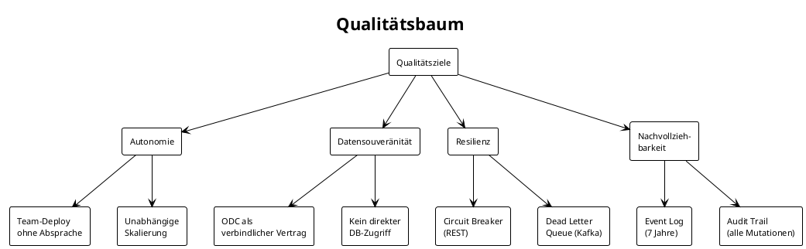

### 10.2 Qualitätsszenarien

| ID | Qualitätsmerkmal | Szenario | Reaktion | Messgrösse |
|----|-----------------|----------|----------|------------|
| QS-1 | Autonomie | Policy-Team deployed neue Version | Claims-Service läuft unverändert weiter | 0 Deployments anderer Teams nötig |
| QS-2 | Resilienz | Policy-Service nicht erreichbar | Claims zeigt Fehler, Kafka-Events werden gepuffert | Claims-Service erholt sich nach Policy-Recovery |
| QS-3 | Datensouveränität | Consumer will Policy-Daten ändern | Abweisung – nur Policy-Team ändert Policy-Daten | 0 direkte DB-Zugriffe von extern |
| QS-4 | Nachvollziehbarkeit | Audit-Anfrage zu Police XY | Vollständiger Ereignisverlauf aus Kafka | 100% der Mutationen im Log |
| QS-5 | Performance | 1000 gleichzeitige Schadenmeldungen | System verarbeitet alle innerhalb 30s | p99 < 3s response time |

---

## 11. Risiken und technische Schulden

| ID | Risiko | Auswirkung | Massnahme |
|----|--------|------------|-----------|
| R-1 | Eventual Consistency schwer verständlich für Entwickler | Fehler bei UI-Feedback ("Ist die Police schon aktiv?") | UI-Patterns für Async (optimistic updates, polling) |
| R-2 | Schema-Evolution (Avro) komplex | Breaking Changes unbemerkt | ODC Enforcement + Consumer-Driven Contract Tests |
| R-3 | Kafka Single Point of Failure | Alle Domänen betroffen | Multi-AZ Kafka Cluster, Replikationsfaktor 3 |
| R-4 | REST Claims->Policy synchrone Abhängigkeit | Claims bei Policy-Ausfall nicht nutzbar | Circuit Breaker (SmallRye Fault Tolerance) + Fallback |
| R-5 | Data Mesh Governance-Overhead | Teams umgehen ODC | Automatisierte ODC-Validierung in CI/CD-Pipeline |
| R-6 | **Sprachinkonsistenz: Partner-Service (TD)** | Domainmodell verwendet deutsche Feldnamen und Klassennamen (`vorname`, `Adresse`, `Geschlecht`, `gueltigVon` etc.) anstatt englischer (ADR-005-Verletzung) | Koordiniertes Refactoring + ODC-Versionsbump für geänderte Event-Felder. Details: [`partner/specs/business_spec.md#10`](../partner/specs/business_spec.md) |
| R-7 | **Sprachinkonsistenz: Policy-Service (TD)** | Domainmodell und Enums verwenden deutsche Bezeichner (`Deckung`, `Deckungstyp`, `ENTWURF`, `AKTIV`, `versicherungsbeginn` etc.) | Koordiniertes Refactoring über alle Consumer hinweg nötig. Details: [`policy/specs/business_spec.md#10`](../policy/specs/business_spec.md) |
