# arc42 Architekturdokumentation – Sachversicherung Datamesh

## 1. Einführung und Ziele

### 1.1 Aufgabenstellung

Aufbau einer modernen Versicherungsplattform für eine Sachversicherung auf Basis von:

- **Domain-Driven Design (DDD)** mit klar abgegrenzten Bounded Contexts
- **Hexagonal Architecture** (Ports & Adapters) pro Domäne
- **Self-Contained Systems (SCS)** – jede Domäne ist eine eigenständige Applikation
- **Data Mesh** – jede Domäne besitzt und publiziert ihre Daten als Produkt
- **Asynchrone Integration** via Apache Kafka als primäres Integrationsmuster

### 1.2 Qualitätsziele

| Priorität | Qualitätsmerkmal | Motivation |
|-----------|-----------------|------------|
| 1 | **Autonomie** | Teams entwickeln und deployen unabhängig voneinander |
| 2 | **Datensouveränität** | Jede Domäne ist Owner ihrer Daten (Data Mesh) |
| 3 | **Skalierbarkeit** | Kritische Domänen (Claims, Policy) skalieren unabhängig |
| 4 | **Ausfallsicherheit** | Ausfall einer Domäne beeinflusst andere minimal |
| 5 | **Nachvollziehbarkeit** | Vollständiger Audit-Trail aller Geschäftsvorfälle |

### 1.3 Stakeholder

| Stakeholder | Erwartung |
|-------------|-----------|
| Versicherungsnehmer | Einfache Antragstellung, transparente Schadensabwicklung |
| Underwriter | Risikobeurteilung und Vertragsführung |
| Schadensachbearbeiter | Effiziente Schadensabwicklung |
| IT-Architekten | Klare Schnittstellendefinitionen via ODC |
| Compliance | Vollständige Audit-Trails, DSGVO-Konformität |

---

## 2. Randbedingungen

### 2.1 Technische Randbedingungen

| Constraint | Beschreibung |
|------------|--------------|
| Java 25 | Alle Services in Java 25 mit Virtual Threads |
| Quarkus | Micro-Framework für schnellen Start und geringen Footprint |
| Apache Kafka | Einziger Kanal für asynchrone Domänenintegration |
| REST | Synchrone Kommunikation nur wo zwingend nötig |
| PostgreSQL | Relationale Persistenz pro Domäne (eigene DB-Instanz) |
| Qute + Bootstrap + htmx | Server-seitige UIs, kein SPA-Overhead |
| Open Data Contract (ODC) | Formale Beschreibung aller publizierten Datensätze |
| Hibernate Envers | Versionierung und Audit-Trails für Entities |

---

### 2.2 Organisatorische Randbedingungen

- Ein autonomes Team pro Domäne (Conway's Law bewusst genutzt)
- Jede Domäne deployed unabhängig (kein gemeinsamer Release-Zug)
- Data Contracts sind verbindliche API-Verträge für Kafka-Topics

---

## 3. Kontextabgrenzung

> **Fachliche Spezifikationen der implementierten Services:**
>
> - Partner/Customer Service → [`partner/specs/business_spec.md`](../partner/specs/business_spec.md)
> - Product Management Service → [`product/specs/business_spec.md`](../product/specs/business_spec.md)
> - Policy Management Service → [`policy/specs/business_spec.md`](../policy/specs/business_spec.md)
> - Billing & Collection Service → [`billing/specs/business_spec.md`](../billing/specs/business_spec.md)
>
> **Externe Systeme (COTS-Simulation):**
>
> - HR-System (Stub) → `hr-system/` *(OData v4 API + CRUD UI, Port 9085)*
> - HR-Integration (Camel) → `hr-integration/` *(OData → Kafka Bridge, Port 9086)*

### 3.1 Fachlicher Kontext (Context Map)

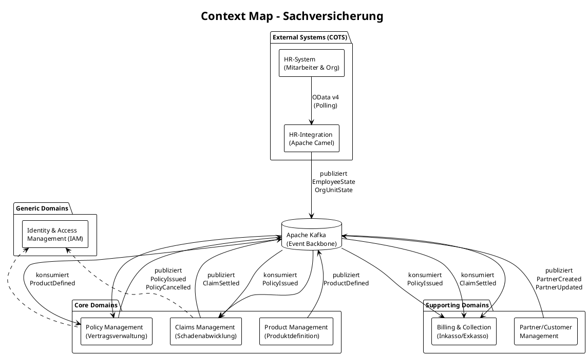

### 3.2 Technischer Kontext

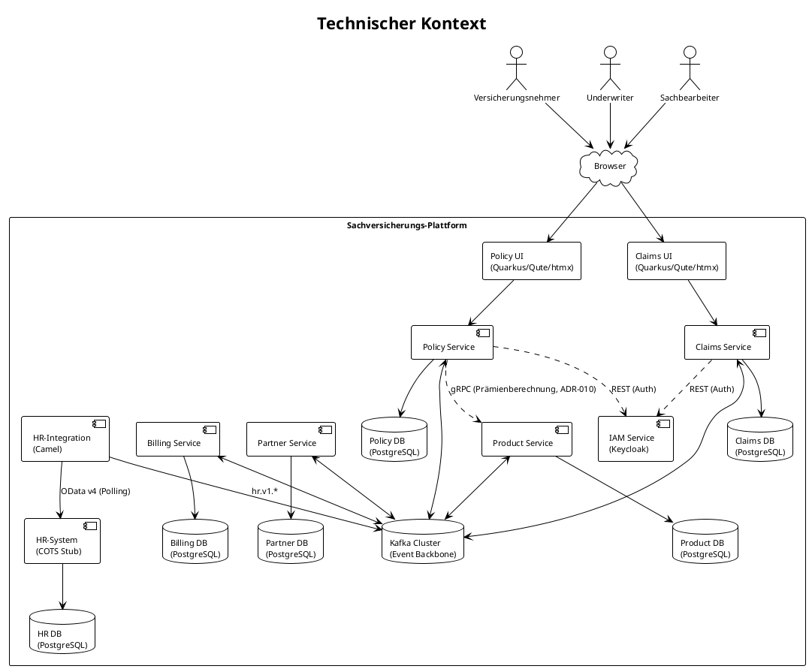

---

## 4. Lösungsstrategie

### 4.1 Architektur-Entscheidungen

| Entscheidung | Begründung |
|--------------|------------|
| **Self-Contained Systems** | Jede Domäne ist deploybar, testbar und skalierbar ohne andere Domänen |
| **Event-First (Kafka)** | Entkopplung in Raum und Zeit; natürliche Audit-Logs |
| **Data Mesh** | Domänen publishen Daten als Produkt mit Open Data Contract |
| **Hexagonal Architecture** | Domänenlogik ist unabhängig von Infrastruktur (DB, Kafka, UI) |
| **Shared Nothing** | Keine geteilten Datenbanken; kein direkter Service-zu-Service-Aufruf (Ausnahme: gRPC-Berechnungen, s. ADR-010) |
| **REST nur synchron** | Für zeitkritische Queries (z.B. IAM-Auth) als Ausnahme |
| **gRPC für Spezialfälle** | Synchrone Berechnung (z.B. Prämie) via gRPC mit mandatorischem Circuit Breaker (ADR-010) |

### 4.2 SCS UI-Integrationskonzept

Jede Domäne liefert ihre eigene UI (Quarkus Qute + Bootstrap + htmx) als Self-Contained System aus. Die Integration der Frontends erfolgt auf drei Ebenen:

| Ebene | Mechanismus | Verantwortung |
| ----- | ---------- | ------------- |
| **Routing** | Reverse Proxy (Nginx / Kubernetes Ingress) leitet Pfade pro Domäne weiter (`/partner/*`, `/policy/*`, `/claims/*`) | Ops-Team / Platform |
| **Navigation** | Gemeinsame Bootstrap-Navigationsleiste als statisches HTML-Fragment (shared layout per CDN/static hosting) | Jedes SCS bindet es per `<include>` ein |
| **Design-System** | Gemeinsame Bootstrap-Version + CSS Custom Properties im CDN; keine geteilten Quarkus-Abhängigkeiten | UI-Kapitel in CLAUDE.md |

**Prinzip:** Wechsel zwischen Domänen erfolgt via normale Hyperlinks (keine SPA-Navigation). Jede Domäne ist eine eigenständige Web-Applikation. Server-Side Rendering garantiert Funktionalität ohne JavaScript.

### 4.3 Data Mesh Prinzipien

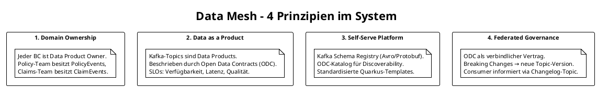

---

## 5. Bausteinsicht

> **Implementierte Services und ihre fachlichen Spezifikationen:**
>
> | Service | Fachspezifikation | Port | Status |
> |---|---|---|---|
> | Partner/Customer Management | [`partner/specs/business_spec.md`](../partner/specs/business_spec.md) | 9080 | Implementiert |
> | Product Management | [`product/specs/business_spec.md`](../product/specs/business_spec.md) | 9081 | Implementiert |
> | Policy Management | [`policy/specs/business_spec.md`](../policy/specs/business_spec.md) | 9082 | Implementiert |
> | Claims Management | [`claims/specs/business_spec.md`](../claims/specs/business_spec.md) | 9083 | Implementiert |
> | Billing & Collection | [`billing/specs/business_spec.md`](../billing/specs/business_spec.md) | 9084 | Implementiert |
> | HR-System (Extern) | — | 9085 | Implementiert – COTS-Stub mit OData v4 API + CRUD UI |
> | HR-Integration (Camel) | — | 9086 | Implementiert – OData → Kafka Bridge (ECST + Change Topics) |

### 5.1 Ebene 1 – Systemübersicht

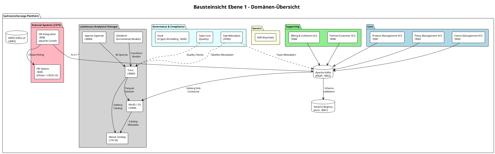

### 5.2 Ebene 2 – Policy Management SCS (Hexagonal)

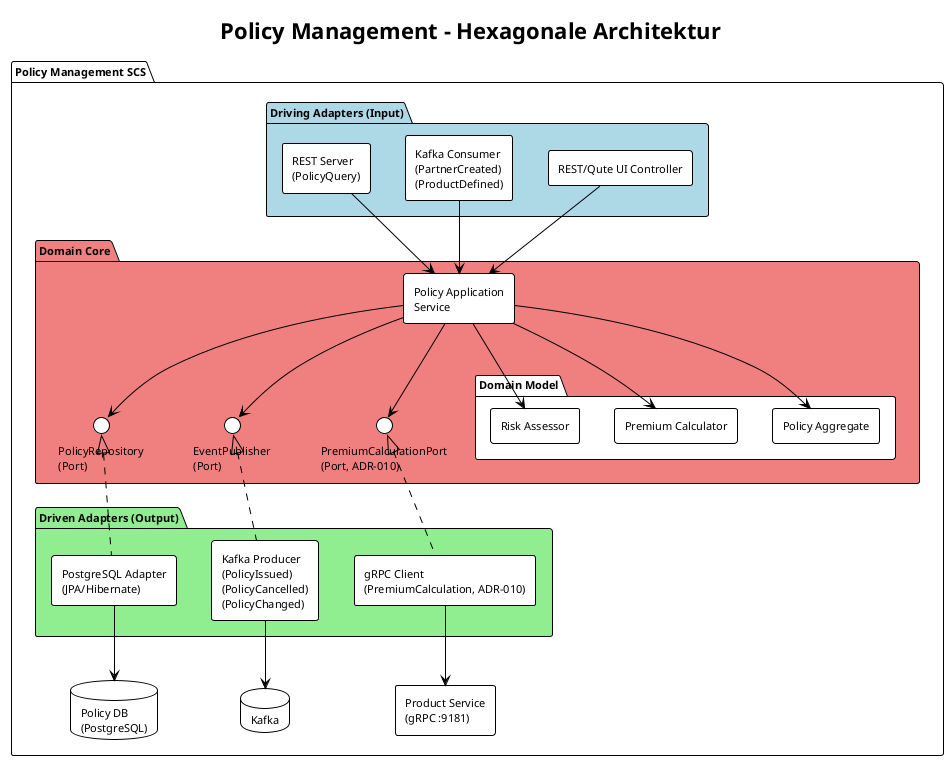

### 5.3 Ebene 2 – Claims Management SCS (Hexagonal)

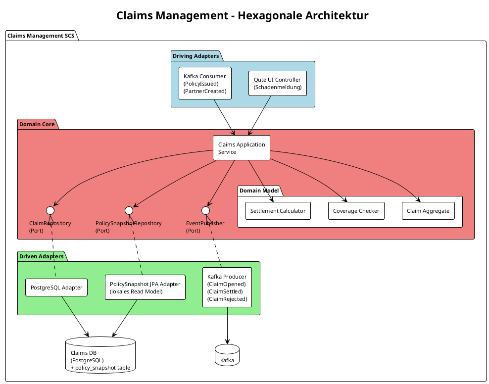

---

## 6. Laufzeitsicht

### 6.1 Szenario: Police ausstellen (Policy Issuance)

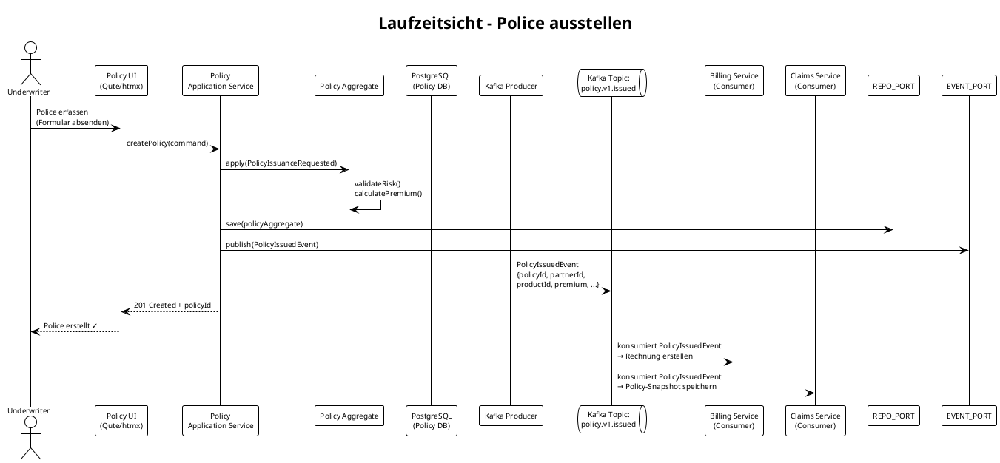

### 6.2 Szenario: Partner im Policy-Erfassungsformular suchen (Partner Picker)

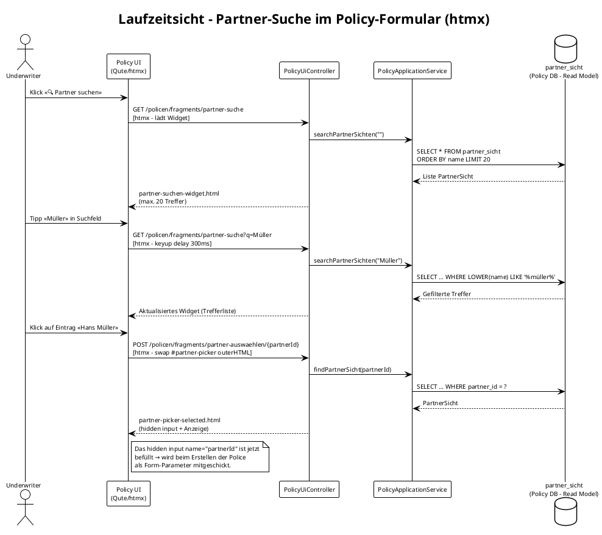

**Technische Umsetzung:**

| Schicht | Komponente | Verantwortung |
|---------|-----------|---------------|
| Port | `PartnerSichtRepository.search(nameQuery)` | Interface für Name-Suche (max 20 Treffer) |
| Adapter | `PartnerSichtJpaAdapter.search(nameQuery)` | JPA JPQL: `LOWER(name) LIKE :q` |
| Service | `PolicyApplicationService.searchPartnerSichten(q)` | Delegiert an Repository |
| Service | `PolicyApplicationService.findPartnerSicht(id)` | Lookup für Selektion |
| Controller | `GET /policen/fragments/partner-suche?q=` | Liefert Such-Widget (Qute-Fragment) |
| Controller | `POST /policen/fragments/partner-auswaehlen/{id}` | Liefert «Ausgewählt»-State des Pickers |
| Template | `partner-suchen-widget.html` | Live-Such-Panel mit Trefferliste |
| Template | `partner-picker-selected.html` | Picker im «Partner gewählt»-Zustand |

**Datenfluss (Data Mesh – keine direkte DB-Abhängigkeit):**  
Die `partner_sicht`-Tabelle im Policy-Service ist ein lokales Read Model, das ausschließlich durch Kafka-Events (`person.v1.created`, `person.v1.updated`) befüllt wird. Die Suche läuft vollständig gegen diese materialisierte Sicht – es gibt keine synchrone REST-Abhängigkeit zum Partner-Service (ADR-001).

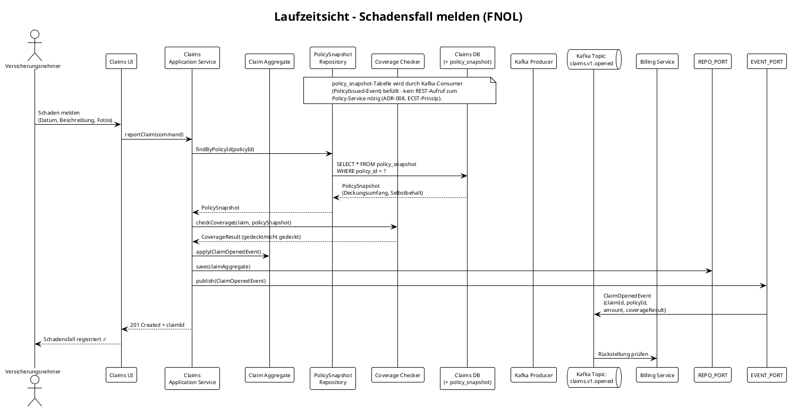

### 6.3 Szenario: Schadensfall abschliessen (Settlement)

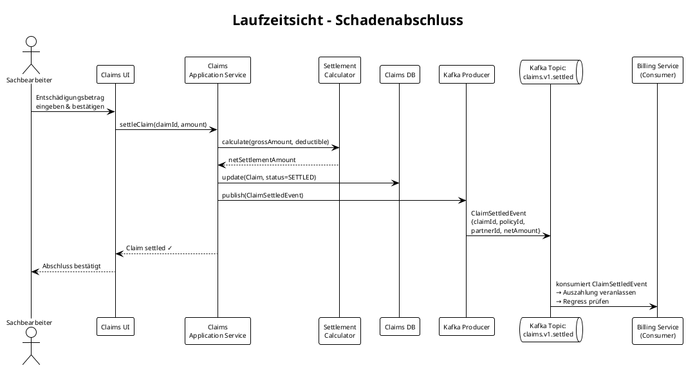

---

## 7. Verteilungssicht

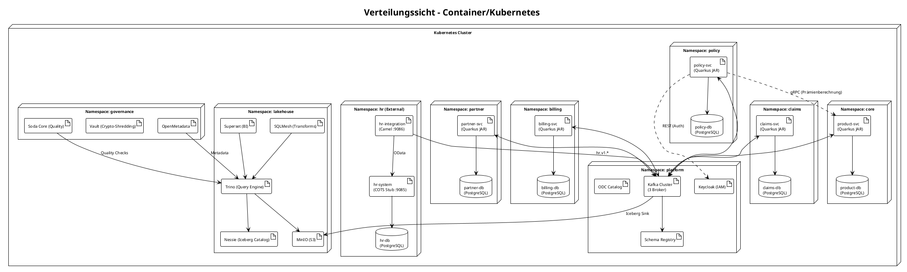

### 7.2 Lokale Entwicklungsumgebung (Podman Compose)

Alle Services laufen lokal via `podman compose up`. Ports und Abhängigkeiten:

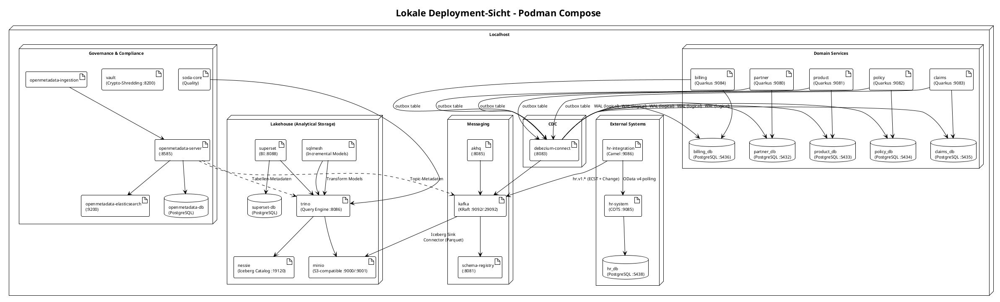

**Startup-Reihenfolge (docker-compose depends_on):**

1. `kafka` → `schema-registry`, `akhq`, `kafka-init`
2. `partner-db`, `product-db`, `policy-db`, `claims-db`, `billing-db`, `hr-db` → je Domain-/COTS-Service
3. `debezium-connect` (depends: kafka, alle domain-dbs) → `debezium-init`
4. `minio` → `minio-init` (creates warehouse bucket)
5. `nessie`, `minio` → `trino`
6. `debezium-connect`, `minio-init`, `nessie` → `iceberg-init` (registers Iceberg sink connectors)
7. `superset-db` → `superset-init` → `superset`
8. `trino` → `sqlmesh`, `soda-core`
9. `openmetadata-db`, `openmetadata-elasticsearch` → `openmetadata-migrate` → `openmetadata-server` → `openmetadata-ingestion`
10. `vault` → `vault-init` (dev mode)
11. `hr-db` → `hr-system` → `hr-integration` (depends: kafka, hr-system)

---

## 8. Querschnittliche Konzepte

### 8.1 Data Mesh – Open Data Contracts

Jedes Kafka-Topic wird durch einen **Open Data Contract (ODC)** beschrieben und im ODC-Katalog registriert. Dies ist der verbindliche "Vertrag" zwischen Producer und Consumer.

**Ausführungsort der SodaCL Quality Checks:** Die im ODC definierten Qualitätsprüfungen laufen **nachgelagert via Soda Core** gegen Trino (auf den Iceberg-Tabellen) – nicht im operativen Kafka-Strom. Sie blockieren **nicht** den Producer. Abweichungen sind im OpenMetadata Data Quality Dashboard sichtbar. Kritische Prüfungen (z.B. Null-Checks auf Pflichtfelder) werden zusätzlich als Avro-Schema-Constraints in der Schema Registry durchgesetzt (verhindert invalide Events bereits beim Publish).

**Beispiel ODC für `policy.v1.issued`:**

```yaml
# policy.v1.issued.odcontract.yaml
apiVersion: v1
kind: DataContract
metadata:
  name: policy.v1.issued
  version: "1.2.0"
  domain: policy
  description: Event published when a policy is successfully activated (DRAFT → ACTIVE)

spec:
  topic: policy.v1.issued
  format: AVRO
  schemaRegistry: http://schema-registry:8081
  schemaSubject: policy.v1.issued-value

  schema:
    fields:
      - name: eventId
        type: string
        format: uuid
        nullable: false
      - name: eventType
        type: string
        enum: ["PolicyIssued"]
        nullable: false
      - name: policyId
        type: string
        format: uuid
        nullable: false
        description: Unique policy identifier
      - name: policyNumber
        type: string
        nullable: false
        description: Human-readable policy number (e.g. POL-00042)
      - name: partnerId
        type: string
        format: uuid
        nullable: false
        description: Reference to Partner domain (person)
      - name: productId
        type: string
        format: uuid
        nullable: false
        description: Reference to Product domain
      - name: coverageStartDate
        type: string
        format: date
        nullable: false
      - name: premium
        type: string
        description: Annual premium in CHF
        nullable: false
      - name: timestamp
        type: string
        format: datetime
        nullable: false

  quality:
    - type: SodaCL
      checks: |
        checks for policy.v1.issued:
          - not_null:
              columns: [eventId, eventType, policyId, policyNumber, partnerId, productId, coverageStartDate, premium, timestamp]
          - no_duplicate_rows:
              columns: [eventId]

dataProduct:
  owner: team-policy@css.ch
  domain: policy
  outputPort: kafka
  sla:
    freshness: 5m
    availability: "99.9%"
    qualityScore: 0.98
  tags:
    - pii
```

### 8.2 Kafka Topic-Konvention

```
{domain}.v{version}.{event-name}

Beispiele:
  policy.v1.issued
  policy.v1.cancelled
  claims.v1.opened
  claims.v1.settled
  partner.v1.created
  product.v1.defined

Billing & Collection (implementiert):
  billing.v1.invoice-created
  billing.v1.payment-received
  billing.v1.dunning-initiated
  billing.v1.payout-triggered

HR-System (via Camel Integration):
  hr.v1.employee.state      (compacted – ECST)
  hr.v1.employee.changed    (delta event)
  hr.v1.org-unit.state      (compacted – ECST)
  hr.v1.org-unit.changed    (delta event)
  hr-integration-dlq        (dead-letter queue)
```

**Breaking Changes** erfordern eine neue Major-Version (z.B. `policy.v2.issued`). Der alte Topic wird für eine Übergangsperiode parallel betrieben (Consumer-Driven Contract Testing).

### 8.3 Hexagonal Architecture – Schichtenstruktur (Quarkus)

```
{domain}/
├── src/main/java/ch/yuno/{domain}/
│   ├── domain/                    ← Reine Domänenlogik (kein Framework)
│   │   ├── model/                 ← Aggregate, Entities, Value Objects
│   │   ├── service/               ← Application Services
│   │   └── port/                  ← Interfaces (Input/Output Ports)
│   │       ├── in/                ← UseCasePorts (Commands/Queries)
│   │       └── out/               ← RepositoryPort, EventPublisherPort
│   └── infrastructure/            ← Adapter-Implementierungen
│       ├── persistence/           ← JPA/Hibernate Adapter
│       ├── messaging/             ← Kafka Producer/Consumer (SmallRye)
│       ├── grpc/                  ← gRPC Server/Client Adapter (ADR-010)
│       ├── api/                   ← REST Server/Client
│       └── web/                   ← Qute Templates + REST Controllers
├── src/main/resources/
│   ├── templates/                 ← Qute HTML-Templates (UI-Text auf Deutsch)
│   └── contracts/                 ← ODC YAML-Dateien
└── src/test/
    ├── domain/                    ← Unit Tests (reine Domäne, kein Framework)
    └── integration/               ← @QuarkusIntegrationTest (Testcontainers)
```

### 8.4 Transactional Outbox Pattern zur Sicherstellung von At-Least-Once Delivery

> **Wichtig:** Dieses Pattern ist kein Event Sourcing. Die relationale Datenbank bleibt die **Source of Truth** (State-Driven Persistence). Das Outbox Pattern garantiert lediglich zuverlässiges Kafka-Publishing ohne Dual-Write-Risiko.

Um Dual-Write-Probleme zu vermeiden (DB schreiben + Kafka publishen), wird das **Transactional Outbox Pattern** eingesetzt:

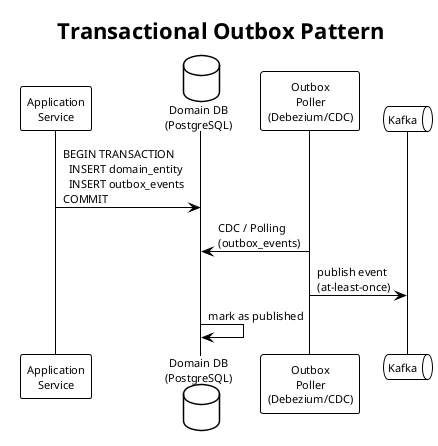

### 8.5 Authentifizierung und Autorisierung

- **IAM:** Keycloak (OIDC/OAuth2) – einzige synchrone Abhängigkeit via REST
- **Token-Propagation:** Bearer Tokens in allen HTTP-Requests (Quarkus OIDC)
- **RBAC:** Quarkus `@RolesAllowed` auf Application-Service-Ebene
- **Rollen:** `UNDERWRITER`, `CLAIMS_AGENT`, `BROKER`, `ADMIN`

### 8.6 Data Mesh Analytics- und Governance-Plattform

Alle Domain-Events werden via **Debezium Iceberg Sink Connector** als Parquet-Dateien in MinIO (S3-kompatibel) geschrieben und durch Apache Iceberg (via Nessie Catalog) versioniert. Trino dient als föderierter Query-Layer; SQLMesh transformiert die Rohdaten in analytische Modelle. Die Plattformschicht greift **nie direkt auf die operativen Domain-Datenbanken zu** (ADR-004).

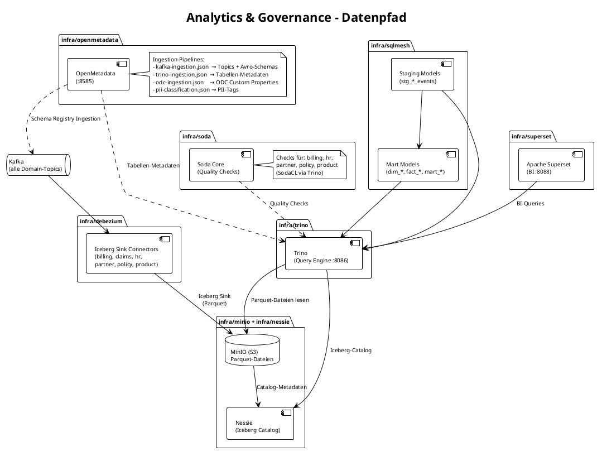

**SQLMesh-Modellhierarchie (`infra/sqlmesh/models/`):**

| Layer | Modelle | Quelle | Beschreibung |
| --- | --- | --- | --- |
| Staging | `stg_person_events` | Iceberg `person.v1.*` | JSON-Parsing, typisierte Spalten |
| Staging | `stg_address_events` | Iceberg `person.v1.*` | Adressen separat normalisiert |
| Staging | `stg_product_events` | Iceberg `product.v1.*` | Produktdefinitionen |
| Staging | `stg_policy_events` | Iceberg `policy.v1.*` | Policen-Mutationen |
| Staging | `stg_claims_events` | Iceberg `claims.v1.*` | Schadenfall-Mutationen |
| Staging | `stg_billing_events` | Iceberg `billing.v1.*` | Rechnungen, Zahlungen |
| Staging | `stg_employee_events` | Iceberg `hr.v1.*` | Mitarbeiter-State (HR) |
| Staging | `stg_org_unit_events` | Iceberg `hr.v1.*` | Org-Einheiten-State (HR) |
| Mart | `dim_partner` | `stg_person_events` | Aktuellster Stand pro Person |
| Mart | `dim_partner_address` | `stg_address_events` | Aktuelle Adresse pro Partner |
| Mart | `dim_product` | `stg_product_events` | Aktuellster Stand pro Produkt |
| Mart | `dim_employee` | `stg_employee_events` | Aktuellster Mitarbeiter-Stand |
| Mart | `dim_org_unit` | `stg_org_unit_events` | Aktuellste Org-Einheit |
| Mart | `fact_policies` | `stg_policy_events` | Eine Zeile pro Police |
| Mart | `fact_claims` | `stg_claims_events` | Eine Zeile pro Schadenfall |
| Mart | `fact_invoices` | `stg_billing_events` | Eine Zeile pro Rechnung |
| Mart | `mart_portfolio_summary` | `fact_policies` + `dim_*` | Aktive Policen pro Stadt/Produktlinie |
| Mart | `mart_financial_summary` | `fact_invoices` + `fact_claims` | Einnahmen- und Schadensübersicht |
| Mart | `mart_policy_detail` | `fact_policies` + `dim_*` | Police-Detail mit allen Dimensionen |
| Mart | `mart_management_kpi` | alle Facts + Dims | Management-KPIs |
| Mart | `mart_org_hierarchy` | `dim_org_unit` + `dim_employee` | Vollständige Org-Hierarchie |

**Soda-Core-Qualitätsprüfungen (`infra/soda/checks/`):**

| Check-Datei | Domäne | Art der Prüfung |
| --- | --- | --- |
| `partner.yml` | Partner | Nicht-null, Eindeutigkeit, Feldformate |
| `product.yml` | Product | Nicht-null, Prämienbereiche |
| `policy.yml` | Policy | Status-Werte, Fremdschlüssel-Konsistenz |
| `billing.yml` | Billing | Betragsvalidierung, keine Negativwerte |
| `hr.yml` | HR | Mitarbeiter- und Org-Unit-Vollständigkeit |

### 8.7 Event-Carried State Transfer (ECST) – `person.v1.state`

Neben den Delta-Events (`person.v1.created`, `person.v1.updated`, …) publiziert der Partner-Service das Topic **`person.v1.state`** als **compacted Kafka Topic** (cleanup.policy=compact).

**Zweck:** Consumer können ihren lokalen Read-Model ohne vollständiges Event-Replay aufbauen – sie lesen nur den aktuellen State-Snapshot.

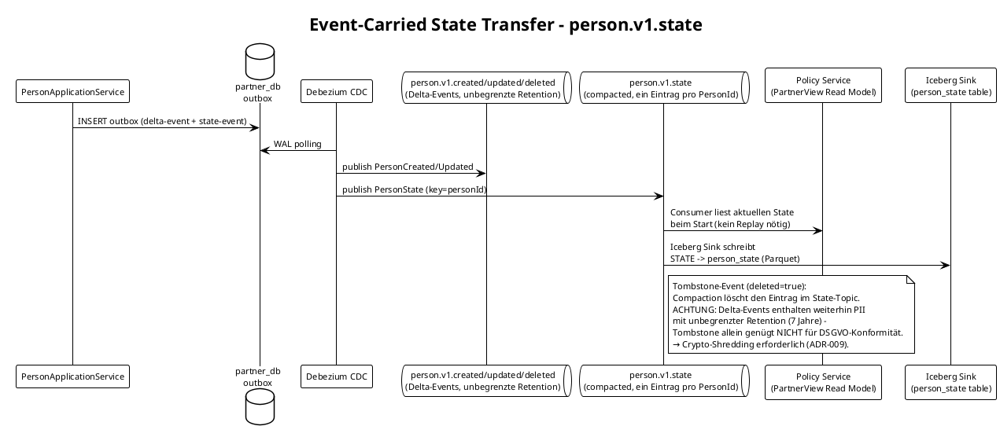

**ECST vs. Delta-Events – Vergleich:**

| Aspekt | Delta-Events (`person.v1.created`) | State-Topic (`person.v1.state`) |
| --- | --- | --- |
| Inhalt | Einzelne Mutation | Vollständiger aktueller Zustand |
| Retention | Unbegrenzt (7 Jahre) | Compacted (nur neuester Wert pro Key) |
| Verwendung | Audit Trail, Event Sourcing | Read-Model Bootstrap, Query |
| GDPR Erasure | PII-Felder via Crypto-Shredding unbrauchbar (ADR-009) | Tombstone löscht Eintrag via Compaction (State-Topic) |

---

## 9. Architekturentscheidungen (ADRs)

### ADR-001: Asynchrone Integration via Kafka

**Status:** Accepted

**Kontext:** Domänen müssen kommunizieren, ohne voneinander abhängig zu sein.

**Entscheidung:** Kafka ist der einzige Integrationskanal. Direkte DB-Zugriffe zwischen Domänen sind verboten.

**Konsequenzen:** Eventual Consistency muss akzeptiert werden. Kompensations-Events statt Rollbacks.

---

### ADR-002: Open Data Contract als verbindlicher Vertrag

**Status:** Accepted

**Kontext:** Ohne formale Verträge entstehen implizite Abhängigkeiten zwischen Teams.

**Entscheidung:** Jedes Kafka-Topic hat einen ODC. Breaking Changes erfordern neue Topic-Version und Abstimmung mit Consumern.

**Konsequenzen:** Initiale Mehrarbeit bei Produktdefinition. Langfristig weniger Integrationsprobleme.

---

### ADR-003: REST nur für IAM-Authentifizierung

**Status:** Updated (ersetzt ursprüngliche Fassung)

**Kontext:** Die ursprüngliche Fassung erlaubte REST auch für die synchrone Deckungsprüfung (Claims → Policy). Dies wurde durch ADR-008 ersetzt: Die Deckungsprüfung erfolgt nun vollständig gegen das lokale Policy-Snapshot-Read-Model im Claims-Service (Event-Carried State Transfer).

**Entscheidung:** REST ist ausschliesslich für IAM-Authentifizierung (Keycloak) erlaubt. Alle Domänen-Integrationen laufen via Kafka.

**Konsequenzen:** Claims-Service ist vollständig autonom – kein Ausfall durch Policy-Service-Unavailability.

---

### ADR-004: Shared Nothing – keine geteilten Datenbanken

**Status:** Accepted

**Kontext:** Geteilte Datenbanken schaffen implizite Kopplung zwischen Teams.

**Entscheidung:** Jede Domäne hat ihre eigene PostgreSQL-Instanz. Cross-Domain-Queries werden über Events oder REST abgebildet.

**Konsequenzen:** Kein JOIN über Domänengrenzen. Reporting-Bedarf wird durch dedizierte Read-Models (materialisierte Views aus Events) abgedeckt.

---

### ADR-006: Transactional Outbox Pattern via Debezium CDC (Partner Service)

**Status:** Accepted

**Kontext:** Der bisherige Ansatz im Partner Service publizierte Kafka-Events direkt nach dem Datenbank-Commit (Dual-Write). Fiel der Kafka-Publish fehl, war das Event verloren, obwohl die DB-Transaktion committed war. Dies verletzt das Prinzip der at-least-once Delivery und widerspricht dem architektonischen Qualitätsziel «Ausfallsicherheit».

**Entscheidung:** Der Partner Service schreibt Domain-Events atomar in eine `outbox`-Tabelle innerhalb derselben DB-Transaktion wie die Geschäftsdaten. Debezium Connect liest neue Zeilen via PostgreSQL WAL (logical replication) und publiziert sie an die Kafka-Topics. Der Application Service hat keine direkte Kafka-Abhängigkeit mehr.

```
PersonApplicationService
  └─ outbox INSERT (same TX as domain entity)
       └─ PostgreSQL WAL (wal_level=logical)
            └─ Debezium Connect (EventRouter SMT)
                 └─ Kafka topics  person.v1.*
```

**Konsequenzen:**

- Garantierte at-least-once Delivery (keine Events gehen verloren)
- Leichte Erhöhung der End-to-End-Latenz (WAL-Polling-Intervall von Debezium, typisch < 500ms)
- Debezium Connect ist eine neue Infrastrukturkomponente (eigener Container, Port 8083)
- PostgreSQL benötigt `wal_level=logical` (bereits in `docker-compose.yaml` konfiguriert)
- Der Partner Service hat keine `quarkus-messaging-kafka`-Abhängigkeit mehr

---

### ADR-005: Sprachpolitik – Code Englisch, UI Deutsch

**Status:** Accepted

**Kontext:** Das Projekt richtet sich an eine deutschsprachige Organisation (Yuno), die Code jedoch international wartbar halten muss. Ohne klare Regel entstehen Mischsprachen im Codebase.

**Entscheidung:** Strikte Trennung nach Schicht:

| Schicht | Sprache | Beispiele |
| --- | --- | --- |
| Code (Klassen, Methoden, Felder, Logs, Exceptions) | Englisch | `PolicyRepository`, `coverageStartDate`, `PersonCreated` |
| UI (Qute-Templates, Labels, Buttons, Fehlermeldungen) | Deutsch | «Police ausstellen», «Bitte Vorname eingeben» |
| Dokumentation (`specs/`, `CLAUDE.md`) | Englisch | Dieses Dokument (Ausnahme: arc42 auf Deutsch) |
| Kafka Event Types | Englisch, PascalCase | `PolicyIssued`, nicht `PolicyAusgestellt` |

**Konsequenzen:**

- Domänenmodell vollständig in Englisch (`Person`, `Policy`, `Coverage`, `CoverageType.GLASS_BREAKAGE`)
- Qute-Templates vollständig in Deutsch (Benutzerinterface)
- Technische Schuld: Partner- und Policy-Service haben teilweise noch deutsche Feldnamen (R-6, R-7)

---

### ADR-008: Deckungsprüfung via lokalem Policy-Snapshot (kein REST)

**Status:** Accepted

**Kontext:** Die ursprüngliche Architektur (ADR-003 alt) sah vor, dass der Claims-Service bei einer Schadenmeldung den Policy-Service via REST abfragt (synchrone Deckungsprüfung). Dies erzeugt eine Laufzeit-Kopplung: Ein Ausfall des Policy-Service blockiert die Schadenmeldung vollständig und widerspricht dem SCS-Autonomieprinzip.

**Entscheidung:** Der Claims-Service konsumiert das `policy.v1.issued`-Event und speichert einen **lokalen Policy-Snapshot** in seiner eigenen Datenbank (`policy_snapshot`-Tabelle). Die Deckungsprüfung bei FNOL läuft vollständig gegen dieses Read-Model – kein REST-Aufruf zum Policy-Service.

```text
PolicyIssued (Kafka) → Claims Kafka Consumer → policy_snapshot (Claims DB)
                                                        ↓
FNOL → ClaimsApplicationService → PolicySnapshotRepository → Deckungsprüfung
```

**Konsequenzen:**

- Claims-Service ist vollständig autonom; kein Ausfall durch Policy-Unavailability
- Eventual Consistency: Snapshot kann kurzzeitig veraltet sein (< SLA-Freshness des policy.v1.issued-Topics)
- `policy_snapshot` muss bei Schema-Änderungen am PolicyIssued-Event migriert werden (konsumiert durch ODC-Versionierung gehandhabt)

---

### ADR-009: Crypto-Shredding für PII-Felder in Kafka-Events

**Status:** Proposed

**Kontext:** Partner-Events (`person.v1.created/updated`) enthalten personenbezogene Daten (PII: Name, Adresse, Geburtsdatum). Die Delta-Events werden 7 Jahre aufbewahrt. Ein Tombstone-Event im State-Topic löscht historische PII im Delta-Log nicht – dies ist ein DSGVO-Verstoss (Art. 17 Right to Erasure).

**Entscheidung:** PII-Felder in allen Kafka-Events werden mit einem **partner-individuellen Datenverschlüsselungsschlüssel (DEK)** verschlüsselt. Der DEK wird in einem **Key Management Service (KMS)** gespeichert. Bei einer Löschanfrage (GDPR Erasure) wird ausschliesslich der DEK gelöscht – alle historischen Events bleiben physisch vorhanden, sind aber dauerhaft unlesbar (kryptografische Löschung).

```text
Partner-Event Publisher:
  plaintext PII → AES-256-GCM(DEK[partnerId]) → encrypted payload in Kafka

GDPR Erasure Request:
  KMS.deleteKey(partnerId) → alle Events mit diesem partnerId sind dauerhaft unlesbar
```

**Konsequenzen:**

- Alle Consumer müssen vor dem Lesen PII-Felder entschlüsseln (DEK-Lookup im KMS)
- KMS wird zur neuen Infrastrukturabhängigkeit (High Availability erforderlich)
- Performance-Overhead durch Verschlüsselung/Entschlüsselung (typisch < 1ms pro Event)
- Breaking Change in allen bestehenden Consumers bei Einführung → koordiniertes Rollout

---

### ADR-007: Event-Carried State Transfer (ECST) via `person.v1.state`

**Status:** Accepted

**Kontext:** Consumer des Partner-Service müssen bei einem Neustart alle vergangenen Person-Events replay'en, um ihr lokales Read-Model zu befüllen. Bei hohem Eventvolumen ist das zeitintensiv und fehleranfällig.

**Entscheidung:** Der Partner-Service publiziert zusätzlich das compacted Topic `person.v1.state` (cleanup.policy=compact, 6 Partitionen). Bei jeder Personenmutation wird ein vollständiger State-Snapshot mit Key=personId publiziert. Kafka behält nur den neuesten Wert pro Key.

**Konsequenzen:**

- Consumer (z.B. Policy-Service) lesen beim Start nur den letzten State – kein vollständiges Replay
- Platform-Consumer maintained `raw.person_state` als UPSERT-Tabelle
- GDPR Right-to-Erasure: Tombstone-Event (deleted=true) → Compaction entfernt den Eintrag dauerhaft
- Zusätzliche Outbox-Einträge pro Mutation (ein Delta-Event + ein State-Event)

---

### ADR-010: gRPC für synchrone Domänen-Calls in Spezialfällen

**Status:** Accepted

**Kontext:** Die Prämienberechnung (Policy → Product) erfordert eine synchrone Antwort vor dem Speichern einer Police. Ein asynchrones Pattern (Event → Antwort-Event) ist für diesen Request-Reply-Use-Case überengineered und UX-inakzeptabel (der Benutzer muss die berechnete Prämie sehen, bevor er die Police bestätigt). REST wäre möglich, aber gRPC bietet binäres Protokoll (effizienter), Schema-First-Design (Protobuf) und erstklassigen Quarkus-Support.

**Entscheidung:** gRPC ist als synchrones Kommunikationsprotokoll für Spezialfälle erlaubt, wenn **alle** folgenden Bedingungen erfüllt sind:

1. **Request-Reply-Semantik zwingend** – der Aufrufer benötigt die Antwort vor dem nächsten Verarbeitungsschritt
2. **Circuit Breaker & Timeout mandatory** – MicroProfile Fault Tolerance (`@CircuitBreaker`, `@Timeout`, `@Retry`) auf jedem gRPC-Client
3. **Graceful Degradation** – bei Nichterreichbarkeit wird der Use Case mit einer benutzerfreundlichen Fehlermeldung abgebrochen (kein Fallback-Wert)
4. **Kein Write auf dem Server** – der gRPC-Call ist eine reine Query/Berechnung. Schreibende Operationen laufen weiterhin über Kafka

**Anwendungsfälle:**

| Call | Client → Server | Protokoll | Bedingungen erfüllt |
|------|----------------|-----------|---------------------|
| Prämienberechnung | Policy → Product | gRPC | ✅ Query, CB+Timeout, Graceful Degradation |
| IAM-Authentifizierung | Alle → Keycloak | REST/OIDC | ✅ (ADR-003, bestehend) |

**Konsequenzen:**

- Product-Service exponiert gRPC-Server auf Port 9181 (zusätzlich zu REST auf 9081)
- Policy-Service hat eine Laufzeit-Abhängigkeit zum Product-Service für Prämienberechnung
- Bei Product-Service-Ausfall können keine neuen Policen erstellt werden (akzeptabler Tradeoff, Graceful Degradation mit Benutzerhinweis)
- Proto-Dateien werden in beiden Services gepflegt (kein Shared Module, um SCS-Autonomie zu wahren)

---

## 10. Qualitätsanforderungen

### 10.1 Qualitätsbaum

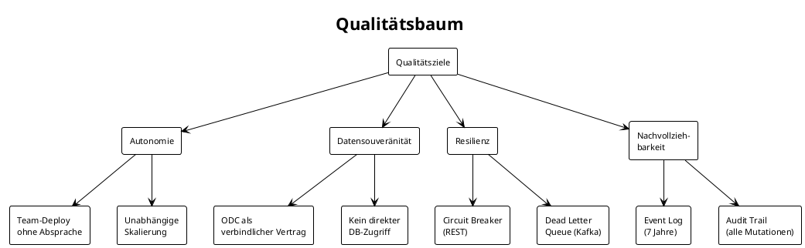

### 10.2 Qualitätsszenarien

| ID | Qualitätsmerkmal | Szenario | Reaktion | Messgrösse |
|----|-----------------|----------|----------|------------|
| QS-1 | Autonomie | Policy-Team deployed neue Version | Claims-Service läuft unverändert weiter | 0 Deployments anderer Teams nötig |
| QS-2 | Resilienz | Policy-Service nicht erreichbar | Claims zeigt Fehler, Kafka-Events werden gepuffert | Claims-Service erholt sich nach Policy-Recovery |
| QS-3 | Datensouveränität | Consumer will Policy-Daten ändern | Abweisung – nur Policy-Team ändert Policy-Daten | 0 direkte DB-Zugriffe von extern |
| QS-4 | Nachvollziehbarkeit | Audit-Anfrage zu Police XY | Vollständiger Ereignisverlauf aus Kafka | 100% der Mutationen im Log |
| QS-5 | Performance | 1000 gleichzeitige Schadenmeldungen | System verarbeitet alle innerhalb 30s | p99 < 3s response time |

---

## 11. Risiken und technische Schulden

| ID | Risiko | Auswirkung | Massnahme |
|----|--------|------------|-----------|
| R-1 | Eventual Consistency schwer verständlich für Entwickler | Fehler bei UI-Feedback ("Ist die Police schon aktiv?") | UI-Patterns für Async (optimistic updates, polling) |
| R-2 | Schema-Evolution (Avro) komplex | Breaking Changes unbemerkt | ODC Enforcement + Consumer-Driven Contract Tests |
| R-3 | Kafka Single Point of Failure | Alle Domänen betroffen | Multi-AZ Kafka Cluster, Replikationsfaktor 3 |
| R-4 | ~~REST Claims->Policy synchrone Abhängigkeit~~ | ~~Claims bei Policy-Ausfall nicht nutzbar~~ | **Mitigiert durch ADR-008**: Deckungsprüfung erfolgt jetzt über lokalen Policy-Snapshot (kein REST). |
| R-5 | Data Mesh Governance-Overhead | Teams umgehen ODC | Automatisierte ODC-Validierung in CI/CD-Pipeline |
| R-8 | **DSGVO-Compliance: PII in Delta-Events** | Tombstone im State-Topic löscht keine historischen PII-Daten im Delta-Log (7 Jahre Retention) | Crypto-Shredding implementieren (ADR-009): PII-Felder mit partnerindividuellem Schlüssel verschlüsseln; Löschung = Schlüssel-Invalidierung im KMS |
| R-9 | **Synchrone Abhängigkeit Policy → Product (gRPC)** | Bei Product-Service-Ausfall können keine neuen Policen erstellt werden | Mitigiert durch ADR-010: Circuit Breaker + Timeout + Retry. Graceful Degradation mit Benutzerhinweis «Versuchen Sie es später». Product-Service hat hohe Verfügbarkeit (>99.9%). |
