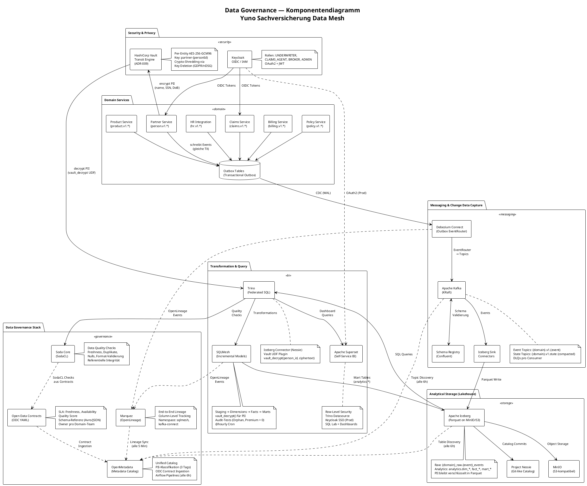

# Data Governance Spezifikation — Yuno Sachversicherung

> **Version:** 1.0.0 | **Stand:** 2026-03-23 | **Status:** Living Document

## 1. Zielsetzung

Die Data Governance der Yuno Sachversicherungs-Plattform stellt sicher, dass Daten über alle Domain-Grenzen hinweg **auffindbar, vertrauenswürdig, nachvollziehbar und datenschutzkonform** sind. Die Architektur folgt dem Data-Mesh-Prinzip: Jede Domain besitzt ihre Daten (Sovereignty) und stellt sie über standardisierte Data Contracts als Data Products bereit.

### Governance-Prinzipien

| Prinzip | Umsetzung |
|---|---|
| **Data Sovereignty** | Jede Domain besitzt ihre operationale DB und publiziert Events via Transactional Outbox |
| **Federated Governance** | Zentrale Standards (ODC, PII-Tags, SodaCL), dezentrale Verantwortung pro Domain |
| **Self-Service** | OpenMetadata Catalog, Superset BI, Trino SQL Lab — jeder Stakeholder kann Daten finden und nutzen |
| **Privacy by Design** | Vault Transit Encryption (ADR-009), Crypto-Shredding, PII-Klassifikation |
| **Quality as Code** | SodaCL Checks und SQLMesh Audit-Tests sind versioniert und automatisiert |

---

## 2. Komponentenübersicht (PlantUML)



---

## 3. Governance-Komponenten im Detail

### 3.1 OpenMetadata — Unified Metadata Catalog

| Eigenschaft | Wert |
|---|---|
| **Version** | 1.6.13 |
| **Port** | 8585 |
| **Search Backend** | OpenSearch 2.11.1 |
| **Ingestion Engine** | Airflow (eingebettet) |
| **Update-Intervall** | Alle 6 Stunden (`0 */6 * * *`) |

**Funktionen:**
- **Asset Discovery**: Automatische Erkennung aller Kafka-Topics, Iceberg-Tabellen und Trino-Schemas
- **PII-Klassifikation**: Drei Tags (`Sensitive`, `PersonIdentifier`, `Address`) werden automatisch auf Partner-Datenassets angewendet
- **ODC Contract Ingestion**: Liest `*.odcontract.yaml` Dateien und mappt SLA, Owner und Quality-Metriken als Custom Properties auf Topics/Tabellen
- **Lineage Visualization**: Synchronisiert Marquez-Lineage alle 5 Minuten mit Column-Level-Granularität
- **Search & Discovery**: Volltextsuche über alle Assets, Glossar, Tags

**Ingestion Pipelines:**

| Pipeline | Quelle | Assets | Schedule |
|---|---|---|---|
| Kafka Metadata | Schema Registry + Broker | Topics, Schemas | `0 */6 * * *` |
| Trino Metadata | Trino Catalog | Iceberg-Tabellen, Views | `0 */6 * * *` |
| Marquez Lineage | Marquez API | Lineage Edges | Alle 5 Min |
| ODC Contracts | YAML Dateien | Custom Properties | Bei Deployment |

**PII-Klassifikation:**

| Tag | Betroffene Felder | Bedeutung |
|---|---|---|
| `PII.Sensitive` | `name`, `firstName`, `dateOfBirth` | Erfordert Crypto-Shredding (ADR-009) |
| `PII.PersonIdentifier` | `personId`, `socialSecurityNumber` | Key-Löschung macht Daten unlesbar |
| `PII.Address` | `street`, `city`, `postalCode` | Recht auf Löschung (nDSG Art. 32) |

**Retention Policy:** 7 Jahre (2555 Tage) für Versicherungs-Audit-Compliance, danach Crypto-Shredding via Vault Key Deletion.

---

### 3.2 Marquez / OpenLineage — Data Lineage

| Eigenschaft | Wert |
|---|---|
| **API Port** | 5050 |
| **Web UI Port** | 3001 |
| **Namespaces** | `sqlmesh`, `kafka-connect` |

**Lineage-Quellen:**

| Emitter | Namespace | Events |
|---|---|---|
| SQLMesh | `sqlmesh` | Model Runs (Staging → Mart Transformationen) |
| Debezium Connect | `kafka-connect` | CDC: Outbox → Kafka, Kafka → Iceberg |
| Claims Service | `claims-service` | Consumer Lineage (Kafka → Read Model) |

**Lineage-Kette (Beispiel Partner):**
```
partner-db.outbox
  → [Debezium CDC] → person.v1.state (Kafka)
    → [Iceberg Sink] → partner_raw.person_events (Parquet)
      → [SQLMesh VIEW] → analytics.stg_person_events (vault_decrypt)
        → [SQLMesh FULL] → analytics.dim_partner
          → [SQLMesh FULL] → analytics.mart_policy_detail
```

---

### 3.3 Soda Core — Data Quality

| Eigenschaft | Wert |
|---|---|
| **Datasource** | Trino (`iceberg` Catalog, `analytics` Schema) |
| **Ausführung** | On-Demand (Docker, `tools` Profil) |

**Quality Checks pro Domain:**

| Domain | Layer | Checks |
|---|---|---|
| **Partner** | Raw (`person_events`) | `row_count > 0`, keine Duplikate (`event_id`), keine Nulls (`person_id`), `freshness < 24h` |
| **Partner** | Mart (`dim_partner`) | Keine Duplikate (`person_id`), `insured_number` Format: `VN-\d{8}` |
| **Policy** | Raw (`policy_events`) | `row_count > 0`, keine Duplikate, keine Nulls, `freshness < 24h` |
| **Product** | Raw (`product_events`) | `row_count > 0`, keine Duplikate, keine Nulls, `freshness < 24h` |
| **Billing** | Raw (`billing_events`) | `row_count > 0`, keine Duplikate, keine Nulls, `freshness < 24h` |
| **HR** | Raw + Mart | Freshness, Duplikate, `employment_status` Valid Values, E-Mail Regex |

**SQLMesh Audit-Tests (zusätzlich):**

| Test | Beschreibung |
|---|---|
| `assert_no_orphan_policies` | Jede Policy muss einen Partner in `dim_partner` haben |
| `assert_premium_positive` | Prämie muss > 0 sein |
| `assert_no_orphan_employees` | Jeder Mitarbeiter muss einer `org_unit` zugeordnet sein |

---

### 3.4 HashiCorp Vault — Crypto-Shredding (ADR-009)

| Eigenschaft | Wert |
|---|---|
| **Port** | 8200 |
| **Engine** | Transit (AES-256-GCM96) |
| **Key-Schema** | `partner-{personId}` |

**Verschlüsselte Felder:**

| Feld | PII-Typ | Verschlüsselt | Wo entschlüsselt |
|---|---|---|---|
| `name` | Sensitive | Ja | Claims Consumer, Trino UDF |
| `firstName` | Sensitive | Ja | Claims Consumer, Trino UDF |
| `dateOfBirth` | Sensitive | Ja | Claims Consumer, Trino UDF |
| `socialSecurityNumber` | PersonIdentifier | Ja | Claims Consumer, Trino UDF |
| `insuredNumber` | — | **Nein** | — (kein PII) |
| `street`, `city`, `postalCode` | Address | Ja | Trino UDF |

**Crypto-Shredding Ablauf (GDPR/nDSG Recht auf Löschung):**

```
1. DELETE /api/crypto-shredding/persons/{personId}
2. Vault: deletion_allowed = true → DELETE /transit/keys/partner-{personId}
3. Ergebnis:
   - Kafka Events: name = "vault:v1:XXXX" → nicht mehr entschlüsselbar
   - Iceberg Parquet: name = "vault:v1:XXXX" → nicht mehr entschlüsselbar
   - Trino UDF: vault_decrypt() → NULL (graceful degradation)
   - Superset: Partner-Name = NULL
   - Operationale DBs: Partner gelöscht (CASCADE)
```

**Zwei Entschlüsselungspfade:**

| Pfad | Komponente | Zweck |
|---|---|---|
| **Operativ** | Claims `VaultPiiDecryptor` | Kafka Consumer materialisiert Read Model mit Klartext |
| **Analytisch** | Trino `vault_decrypt()` UDF | SQLMesh Staging-Models entschlüsseln at query-time |

---

### 3.5 Open Data Contracts (ODC)

| Eigenschaft | Wert |
|---|---|
| **Standard** | Open Data Contract (YAML) |
| **Speicherort** | `{domain}/src/main/resources/contracts/` |
| **Anzahl** | 27 Contracts (über 6 Domains) |

**Contract-Struktur:**

```yaml
apiVersion: v1
kind: DataContract
metadata:
  name: {domain}.v1.{event}
  version: "1.0.0"
  domain: {domain}
spec:
  topic: {domain}.v1.{event}
  format: JSON
  schemaFile: schemas/{Event}.schema.json
  schema:
    fields: [...]
  quality:
    - type: SodaCL
      checks: |
        checks for {topic}:
          - not_null: [eventId, ...]
          - no_duplicate_rows: [eventId]
dataProduct:
  owner: team-{domain}@yuno.ch
  sla:
    freshness: 5m
    availability: "99.9%"
    qualityScore: 0.98
```

**Contracts pro Domain:**

| Domain | Anzahl | Topics |
|---|---|---|
| Partner | 8 | `person.v1.created`, `.updated`, `.deleted`, `.state`, `.address-added`, `.address-updated`, `partner.v1.created`, `.updated` |
| Product | 4 | `product.v1.defined`, `.updated`, `.deprecated`, `.state` |
| Policy | 5 | `policy.v1.issued`, `.changed`, `.cancelled`, `.coverage-added`, `.coverage-removed` |
| Billing | 4 | `billing.v1.invoice-created`, `.payment-received`, `.dunning-initiated`, `.payout-triggered` |
| Claims | 2 | `claims.v1.opened`, `.settled` |
| HR | 4 | `hr.v1.employee.changed`, `.state`, `hr.v1.org-unit.changed`, `.state` |

**Companion Files:**
- **Avro Schemas** (`.avsc`): Kafka Schema Registry, Namespace `ch.yuno.{domain}.events`
- **JSON Schemas** (`.schema.json`): OpenMetadata Ingestion, Schema-Validierung

---

### 3.6 Schema Registry

| Eigenschaft | Wert |
|---|---|
| **Version** | Confluent 7.5.0 |
| **Port** | 8081 |
| **Subject Strategy** | TopicNameStrategy (`{topic}-value`) |

**Registrierung:**
- Script `scripts/register-schemas.sh` entdeckt `.schema.json` Dateien und registriert sie via REST API
- Läuft automatisch im `build.sh` nach Compose-Start
- AKHQ (Port 8085) bietet UI für Schema-Browsing

---

### 3.7 Keycloak — Identity & Access Management

| Eigenschaft | Wert |
|---|---|
| **Version** | 24.0 |
| **Port** | 8180 |
| **Realm** | `yuno` |
| **Protokoll** | OpenID Connect |

**Rollen:**

| Rolle | Berechtigungen |
|---|---|
| `UNDERWRITER` | Policen-Erstellung und -verwaltung |
| `CLAIMS_AGENT` | Schadenmeldungen bearbeiten, Partner suchen |
| `BROKER` | Eingeschränkter Zugriff auf Policen und Partner |
| `ADMIN` | Vollzugriff auf alle Services |

**Integration:**
- Alle Domain-Services authentifizieren via OIDC (`quarkus-oidc`)
- JWT-Token enthalten Rollen als Realm-Roles
- Superset: Aktuell `AUTH_DB`, geplant `AUTH_OAUTH` mit Keycloak

---

### 3.8 Apache Superset — Self-Service BI

| Eigenschaft | Wert |
|---|---|
| **Port** | 8088 |
| **Datasource** | `trino://trino@trino:8086/iceberg` |
| **Row-Level Security** | Aktiviert (`FEATURE_FLAGS.ROW_LEVEL_SECURITY = True`) |

**Governance-Features:**
- **Row-Level Security (RLS):** SQL-Filter pro Dataset und Rolle (z.B. Claims Agent sieht nur eigene Schadenfälle)
- **SQL Lab:** Ad-hoc-Queries auf alle Iceberg-Tabellen
- **PII in Dashboards:** Dank `vault_decrypt()` UDF im Staging-Layer sieht Superset Klartext-Namen. Nach Crypto-Shredding: `NULL`

---

### 3.9 Debezium — Change Data Capture

| Eigenschaft | Wert |
|---|---|
| **Port** | 8083 |
| **Connector-Typ** | PostgreSQL + Iceberg Sink |
| **OpenLineage** | Namespace `kafka-connect` → Marquez |

**Outbox-Connectoren (5):**
- Pro Domain ein Connector: `{domain}-outbox-connector`
- Liest `public.outbox` via WAL (pgoutput Plugin)
- `EventRouter` SMT routet Events anhand des `topic`-Feldes

**Iceberg-Sink-Connectoren (6):**
- Pro Domain: `iceberg-sink-{domain}`
- Topic-Regex: `{domain}\\.v1\\..*`
- Auto-Create + Schema Evolution aktiviert
- Commit-Intervall: 10 Sekunden

---

### 3.10 SQLMesh — Transformation Governance

| Eigenschaft | Wert |
|---|---|
| **Gateway** | Trino (`iceberg` Catalog) |
| **Schedule** | `@hourly` (Default) |
| **Lineage** | OpenLineage → Marquez |

**Datenmodell-Schichten:**

| Schicht | Art | Beispiel | Governance-Rolle |
|---|---|---|---|
| **Staging** | VIEW | `stg_person_events` | PII-Entschlüsselung, JSON-Parsing, Typisierung |
| **Dimension** | FULL | `dim_partner` | Last-Write-Wins, Deduplizierung |
| **Fact** | FULL | `fact_policies` | Aggregation, Status-Tracking |
| **Mart** | FULL | `mart_policy_detail` | Cross-Domain Joins, KPI-Berechnung |
| **Audit** | AUDIT | `assert_no_orphan_policies` | Referentielle Integrität, Business Rules |

---

## 4. Datenfluss End-to-End

```
┌────────────────────────────────────────────────────────────────┐
│  OPERATIONALE SCHICHT                                          │
│                                                                │
│  Domain Service ──TX──▶ Outbox Table                           │
│       │                     │                                  │
│       ▼                     ▼                                  │
│  Vault Transit        Debezium CDC ──OpenLineage──▶ Marquez    │
│  (encrypt PII)        (EventRouter)                            │
└────────────────────────────┬───────────────────────────────────┘
                             │
                             ▼
┌────────────────────────────────────────────────────────────────┐
│  MESSAGING SCHICHT                                             │
│                                                                │
│  Kafka Topics ◀──Schema──▶ Schema Registry                     │
│  {domain}.v1.{event}        (Avro/JSON Validation)             │
│  {domain}.v1.state          ◀──Metadata──▶ OpenMetadata        │
│  (compacted)                                                   │
└────────────────────────────┬───────────────────────────────────┘
                             │
               ┌─────────────┴─────────────┐
               ▼                           ▼
┌──────────────────────────┐  ┌──────────────────────────────────┐
│  OPERATIVER CONSUMER     │  │  ANALYTISCHE SCHICHT             │
│                          │  │                                  │
│  Claims Service          │  │  Iceberg Sink ──OL──▶ Marquez    │
│  VaultPiiDecryptor       │  │       │                          │
│  → partner_search_view   │  │       ▼                          │
│    (Klartext, lokal)     │  │  Raw Iceberg Tables              │
│                          │  │  (PII = Ciphertext)              │
└──────────────────────────┘  │       │                          │
                              │       ▼                          │
                              │  Trino + vault_decrypt() UDF     │
                              │       │                          │
                              │       ▼                          │
                              │  SQLMesh ──OL──▶ Marquez         │
                              │  Staging (decrypt) → Mart        │
                              │       │                          │
                              │       ▼                          │
                              │  Soda Core                       │
                              │  (Quality Checks)                │
                              │       │                          │
                              │       ▼                          │
                              │  Superset (BI)                   │
                              │  (RLS, Dashboards)               │
                              └──────────────────────────────────┘
```

---

## 5. Governance-Matrix

| Aspekt | Verantwortlich | Tool | Automatisierung |
|---|---|---|---|
| **Datenkatalog** | Platform Team | OpenMetadata | Airflow (6h) |
| **PII-Klassifikation** | Platform Team + Domain Owner | OpenMetadata Tags | init-openmetadata.sh |
| **Datenqualität (Raw)** | Domain Owner | Soda Core | On-Demand / CI |
| **Datenqualität (Mart)** | Analytics Team | SQLMesh Audit Tests | @hourly |
| **Data Contracts** | Domain Owner | ODC YAML + Schema Registry | Git-versioniert |
| **Lineage** | Automatisch | Marquez / OpenLineage | Real-time |
| **Verschlüsselung** | Partner Domain | Vault Transit | Bei jedem Event |
| **Entschlüsselung (op.)** | Consumer Domain | VaultPiiDecryptor | Bei Kafka-Consume |
| **Entschlüsselung (ana.)** | Platform Team | Trino vault_decrypt() | At Query-Time |
| **Crypto-Shredding** | Partner Domain | Vault Key Deletion | GDPR-Request |
| **Zugriffskontrolle** | Platform Team | Keycloak + Superset RLS | Realm-Config |
| **Schema-Evolution** | Domain Owner | Schema Registry + Iceberg | Automatisch |
| **Retention** | Platform Team | OpenMetadata Policy | 7 Jahre |

---

## 6. Compliance-Referenz

### nDSG / GDPR Mapping

| Anforderung | Umsetzung | Komponente |
|---|---|---|
| **Art. 25 (Privacy by Design)** | PII wird bei Erstellung verschlüsselt | Vault Transit, PersonEventPayloadBuilder |
| **Art. 30 (Verzeichnis)** | Alle Datenassets katalogisiert | OpenMetadata |
| **Art. 32 (Recht auf Löschung)** | Crypto-Shredding via Key Deletion | Vault, CryptoShreddingResource |
| **Art. 33 (Datenportabilität)** | Standardisierte Schemas (Avro, ODC) | Schema Registry, ODC Contracts |
| **Art. 35 (DSFA)** | PII-Tags, Lineage, Retention Policy | OpenMetadata, Marquez |
| **Audit Trail** | Hibernate Envers auf allen Domain-Entities | claim_aud, policy_aud etc. |

### Topic-Naming-Konvention

```
{domain}.v1.{event_type}
```

| Segment | Bedeutung | Beispiel |
|---|---|---|
| `domain` | Bounded Context | `person`, `policy`, `billing` |
| `v1` | Schema-Version (Breaking Change = v2) | `v1` |
| `event_type` | Domänenevent oder `state` (compacted) | `created`, `issued`, `state` |

---

## 7. Betriebshandbuch

### Governance-Checks ausführen

```bash
# Soda Core Quality Checks (alle Domains)
docker compose run --rm soda-core scan -d iceberg -c /config/configuration.yml /checks/

# Einzelne Domain prüfen
docker compose run --rm soda-core scan -d iceberg -c /config/configuration.yml /checks/partner.yml

# SQLMesh Audit-Tests
docker compose run --rm sqlmesh plan --auto-apply
```

### OpenMetadata Neuindexierung

```bash
# Manuelle Ingestion auslösen
scripts/init-openmetadata.sh
```

### Crypto-Shredding (GDPR-Löschung)

```bash
# Person löschen + Vault Key vernichten
curl -X DELETE http://localhost:9080/api/crypto-shredding/persons/{personId}

# Verifizierung: Trino UDF gibt NULL zurück
docker compose exec trino trino --execute \
  "SELECT vault_decrypt('{personId}', 'vault:v1:...') FROM system.runtime.nodes LIMIT 1"
```

### Consumer-Group Reset (nach Consumer-Fix)

```bash
docker compose stop {service}
docker compose exec kafka kafka-consumer-groups \
  --bootstrap-server localhost:29092 \
  --group {group-id} --topic {topic} \
  --reset-offsets --to-earliest --execute
docker compose start {service}
```
